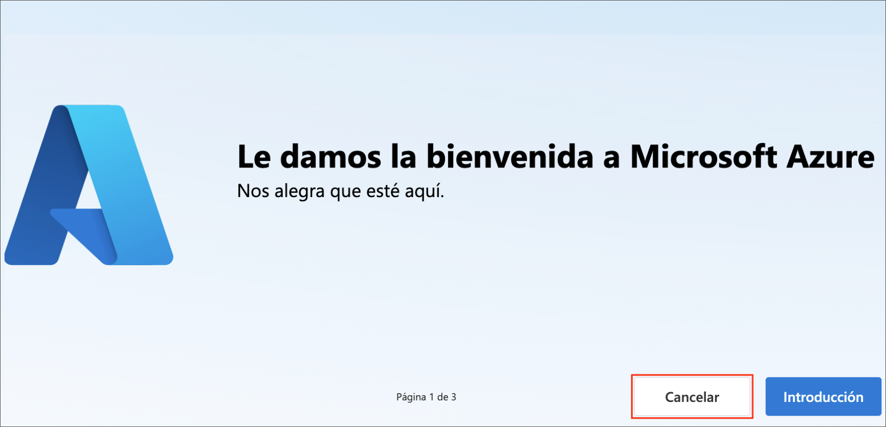
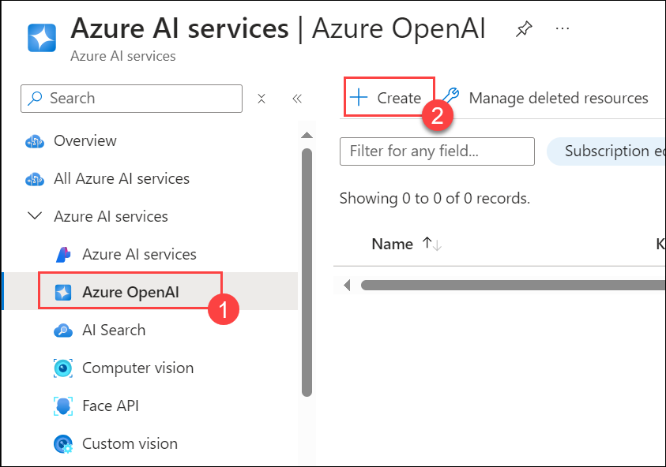
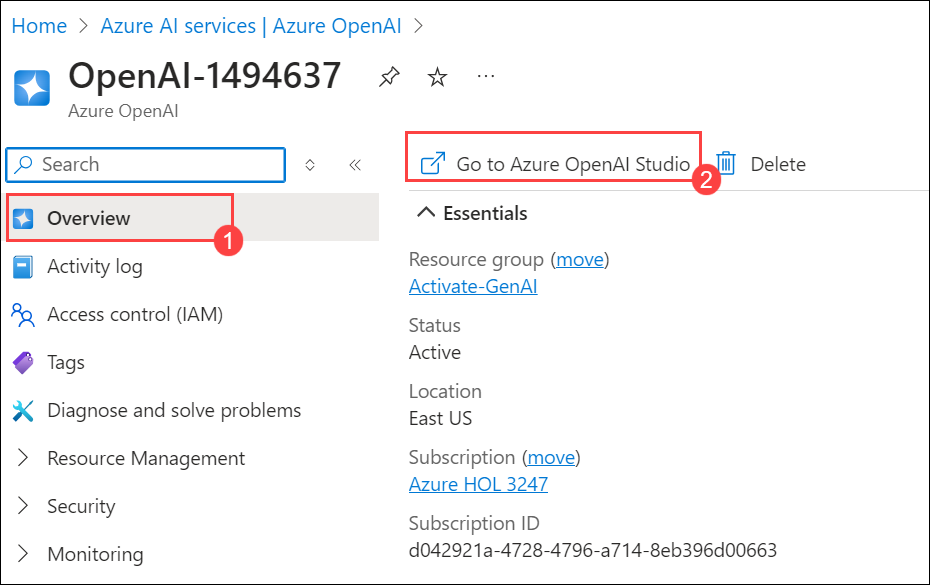
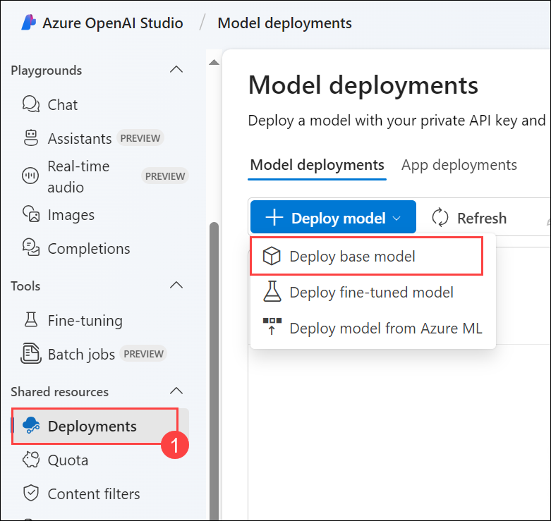
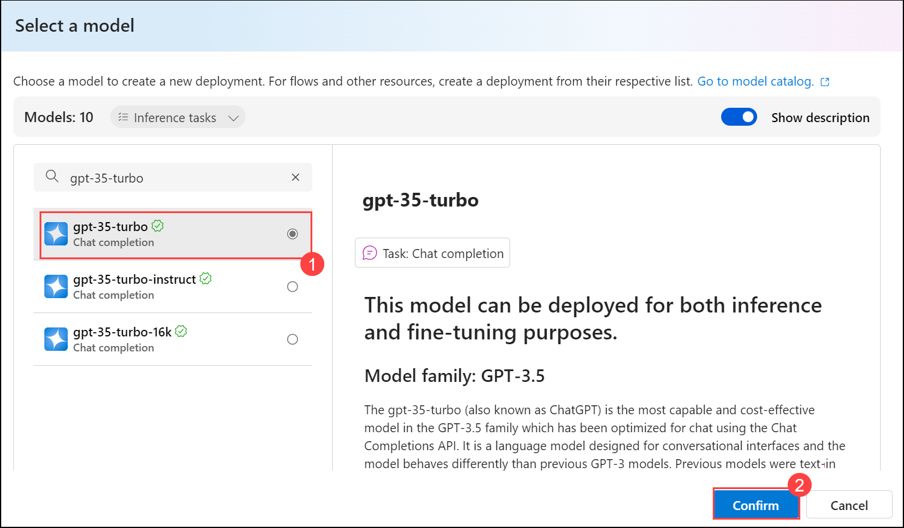
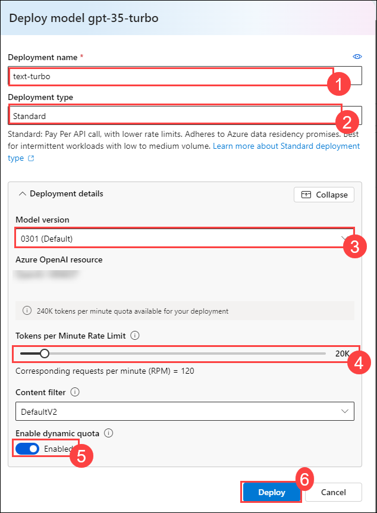
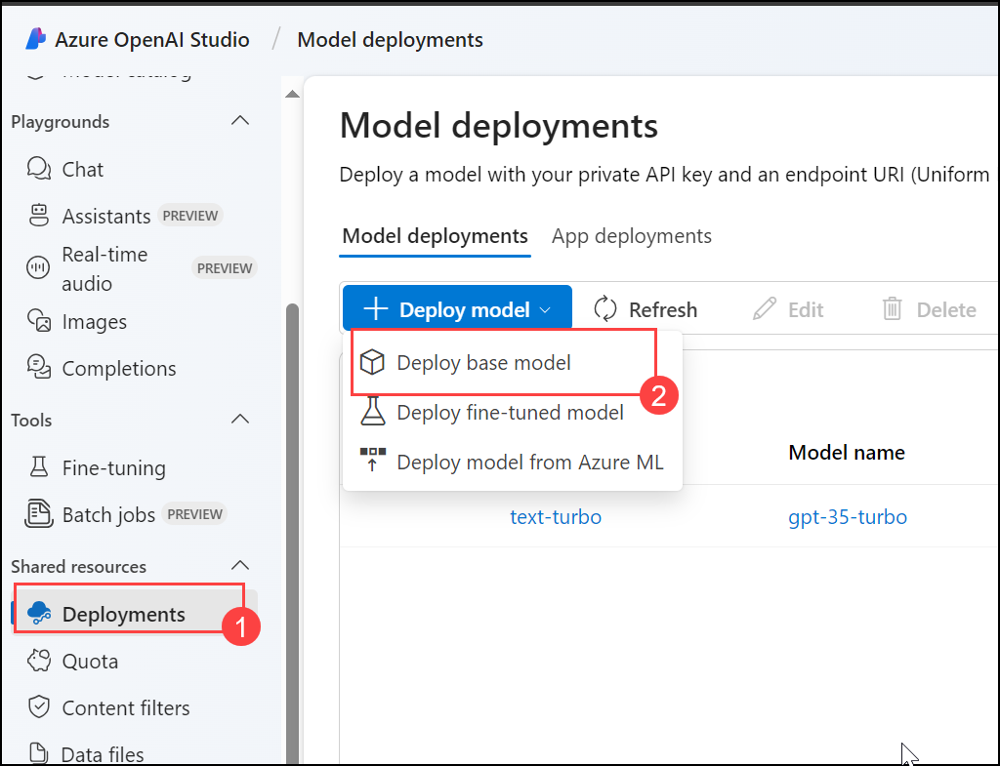
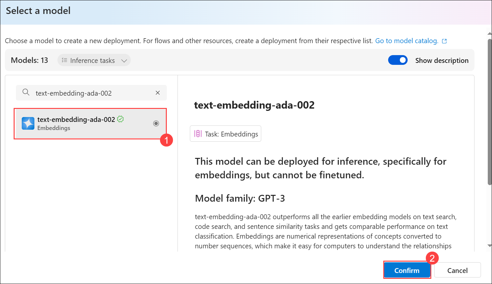
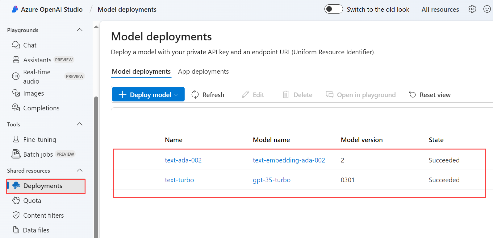

# Challenge 01: Deploy Azure OpenAI Service and LLM Models
### Estimated Time: 30 minutes
## Introduction

Welcome to the Deploy Azure OpenAI Service Challenge! This challenge is designed to test your skills in deploying the Azure OpenAI Service and its Large Language Models (LLM). The goal is to set up the OpenAI Service and deploy LLM models.

**Azure OpenAI Service** provides REST API access to OpenAI's powerful language models, including the GPT-4, GPT-4 Turbo with Vision, `gpt-35-turbo`, and Embeddings model series. In addition, the new `GPT-4` and `gpt-35-turbo` model series have now reached general availability.

A **Large Language Model (LLM)** is a deep learning algorithm that can perform a variety of natural language processing (NLP) tasks. Large language models use transformer models and are trained using massive datasets—hence, large. This enables them to recognize, translate, predict, or generate text or other content.

**Contoso Ltd.**, a leading technological firm, is seeking to enhance its product support operations. They receive a vast number of queries daily, which results in longer waiting times and decreased customer satisfaction. To address this, Contoso is planning to implement an AI-powered solution that can handle customer inquiries effectively and efficiently.

They have chosen to deploy Azure OpenAI Service along with its Large Language Models (LLM), like `gpt-35-turbo` and `text-embedding-ada-002`. These models are known for their capability of processing and generating human-like text, making them ideal for this application.

As a part of this challenge, your task is to create an Azure OpenAI service and deploy Large Language Models (LLM). The Large Language Models include **gpt-35-turbo** and **text-embedding-ada-002**.

## Description

Your task is to deploy the Azure OpenAI Service and deploy Large Language Models (LLM).

### Accessing the Azure portal

>**Important**: You can find the Username and Password within the environment by navigating to the **Environment** **(1)** tab in the left pane then copy the **Azure Username** **(2)** and **Azure Password** **(3)**, which will be required for signing into the Azure portal in later steps and you can record the **Deployment Id** **(4)**, which can be used to provide a unique name to the resources during deployment.

>**Note**: Numbers and ID's values may vary kindly ignore values in screenshots and copy values from **Environment** tab.

 
 .png)

1. To access the Azure portal, within labvm open **Microsoft Edge** and browser to the [Azure Portal](https://portal.azure.com/).

1. On the **Sign into Microsoft Azure tab**, you will see a login screen. Enter the following email/username, and then click on **Next**
   
   - **Email/Username:** <inject key="AzureAdUserEmail"></inject>

     

1. Now enter the following password and click on **Sign in**.

   - **Password:** <inject key="AzureAdUserPassword"></inject>

      

1. When **Action Required** window pop up click on **Ask Later**.

    
   
1. If you see the pop-up **Stay Signed in?**, click **No**.

    

1. If a **Welcome to Microsoft Azure** pop-up window appears, click **Cancel** to skip the tour.

    

## Prerequisites

- [Azure Subscription](https://azure.microsoft.com/en-us/free/)
- [Azure OpenAI](https://aka.ms/oai/access) access is available with the following models:
  - gpt-35-turbo
  - text-embedding-ada-002

## Solution Guide

### Task 1: Deploy an Azure Open AI Service

In this task you'll learn the process of setting up and deploying the Azure OpenAI service within the Azure Portal.

1. On Azure Portal page, in Search resources, services and docs (G+/) box at the top of the portal, enter **Azure OpenAI (1)**, and then select **Azure OpenAI (2)** under services.

    

1. On **Azure AI Services | Azure OpenAI (1)** blade, click on **+ Create (2)**.

   

1. Specify the following details to deploy the Azure Open AI service and click **Next** thrice.

   | **Option**         | **Value**                                              |
   | ------------------ | -----------------------------------------------------  |
   | Subscription       | Leave default                                          |
   | Resource Group     | **Activate-GenAI**                 |
   | Region             | Use the same location as the resource group            |
   | Name               | Use the format **OpenAI-xxxxxx** (replace **xxxxxx** with the **Deployment ID**) |
   | Pricing tier       | **Standard S0**                                        | 

   >**Note**: Here, xxxxxx refers to the **deployment ID** which you recorded in last task.

    

1. Once validation is successful on the **Review + submit** tab, click **Create** and wait for the deployment to complete.

     

### Task 2: Deploy a model

Azure OpenAI provides a web-based portal named Azure OpenAI Studio, that you can use to deploy, manage, and explore models. You'll start your exploration of Azure OpenAI by using Azure OpenAI Studio to deploy a model.

1. On Azure Portal page, in Search resources, services and docs (G+/) box at the top of the portal, enter **Azure OpenAI (1)**, and then select **Azure OpenAI (2)** under services.

   

1. On **Azure AI Services | Azure OpenAI (1)** blade, select **OpenAI-<inject key="Deployment-id" enableCopy="false"></inject> (2)**.

    

1. In the Azure OpenAI resource pane, select **Overview (1)** from the left-hand menu, then click on **Go to Azure OpenAI Studio (2)**. This will navigate you to Azure AI Studio.

   

   >**Note :** If the pop-up Discover an even better Azure AI Studio experience appears, click Close to dismiss it.

1. Click on **Deployments (1)** under **Shared Resources**, then select **+ Deploy Model**. Next, **choose Deploy Base Model (2)**.

    

1. Search for **gpt-35-turbo** and click on **Confirm**.

    

1. Within the Deploy model pop-up interface, click on **Customize** and enter the following details:
      - Deployment name: **text-turbo (1)**
      - Deployment type: **Standard (2)**
      - Model version: **0301(Default) (3)**
      - Tokens per Minute Rate Limit (thousands): **20K (4)**
      - Enable dynamic quota: **Enabled (5)**
      - Click on **Deploy (6)**
        
     

     >**Note:** If the **Customize** option doesn't appear, you can directly enter the model deployment details. 

1. Back on the **Deployments** page again, then select **+ Deploy Model**. Next, **choose Deploy Base Model (2)**.

     

1. Search for **text-embedding-ada-002** and click on **Confirm**.

     

1. Within the Deploy model pop-up interface, click on **Customize** and enter the following details:
      - Deployment name: **text-ada-002 (1)**
      - Deployment type: **Standard (2)**
      - Model version: Use the **default version (3)**
      - Tokens per Minute Rate Limit (thousands): **20K (4)**
      - Enable dynamic quota: **Enabled (5)**
      - Click on **Deploy (6)**
        
     

     >**Note:** If the **Customize** option doesn't appear, you can directly enter the model deployment details. 

1. Back on the Deployments page, you should see the deployment models **text-turbo** and **text-ada-002** created.

     

## Success Criteria:

- Successful deployment of the Azure OpenAI Service.

- Deploying Large Language Models (LLM) with the OpenAI Service.

## Additional Resources:

- Refer to the [Azure OpenAI Service documentation](https://learn.microsoft.com/en-us/azure/ai-services/openai/) for guidance on deploying the service.

## Proceed with the next Challenge by clicking on **Next**>>.
