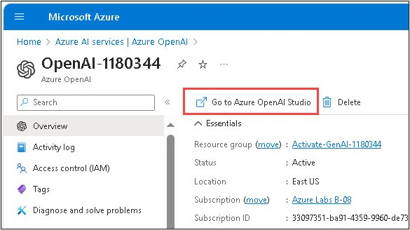
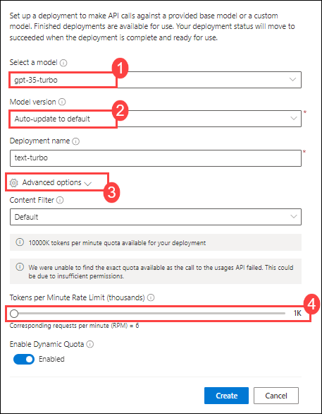

# Challenge 01: Deploy Azure OpenAI Service

## Introduction

Welcome to the Deploy Azure OpenAI Service Challenge! This challenge is designed to test your skills in deploying the Azure OpenAI Service and it's Large Language Models (LLM) . The goal is to set up the OpenAI Service, and deploy LLM models.

## Description

Your task is to deploy the Azure OpenAI Service, and deploy Large Language Models (LLM).

### Accessing Azure portal

1. To access the Azure portal, open a private/incognito window in your browser and navigate to Azure Portal.

1. On the **Sign into Microsoft Azure tab** you will see a login screen, enter the following email/username and then click on **Next**.

   - **Email/Username:** <inject key="AzureAdUserEmail"></inject>

1. Now enter the following password and click on **Sign in**.

   - **Password:** <inject key="AzureAdUserPassword"></inject>

1. If you see the pop-up **Stay Signed in?**, click No.

1. If you see the pop-up **You have free Azure Advisor recommendations!** close the window to continue the lab.

1. If a **Welcome to Microsoft Azure** popup window appears, click **Maybe Later** to skip the tour.

## Prerequisites

- [Azure Subscription](https://azure.microsoft.com/en-us/free/)
- [Azure OpenAI](https://aka.ms/oai/access) access with the following models
  - gpt-35-turbo
  - text-embedding-ada-002

## Solution Guide
### Task 1: Deploy an Azure open AI Service

1. In the Azure Portal, search for **Azure OpenAI** and select it.

  

2. On **Azure AI Services | Azure OpenAI** blade, click on the **create** enter the details required and deploy the Azure Open AI service.

  

### Task 2: Deploy a model

 1. In the Azure Portal, search for **Azure OpenAI** and select it.

     

2. On **Azure AI Services | Azure OpenAI** blade, select **OpenAI-<inject key="Deployment-id" enableCopy="false"></inject>**

    

3. In the Azure OpenAI resource pane, click on **Go to Azure OpenAI Studio** it will navigate to **Azure AI Studio**.

   

4. In **Welcome to Azure OpenAI Service** page, click on **Create new deployment**.

   

5. In the **Deployments** page, click on **+ Create new deployment**.

6. Within the **Deploy model** pop-up interface, enter the following details and then click on **Advanced options (3)** followed by scaling down the **Tokens per Minute Rate Limit (thousands) (4)**:
    - **Select a model**: gpt-35-turbo (1)
    - **Model version**: *Use the default version* (2)
    - **Deployment name**: text-turbo
    - **Tokens per Minute Rate Limit (thousands)**: 40K
  
         

7. Click on the **Create** button to deploy a model which you will be playing around with as you proceed.

1. In the **Deployments** page again, click on **+ Create new deployment**.

1. Within the **Deploy model** pop-up interface, enter the following details and then click on **Advanced options (3)** followed by scaling down the **Tokens per Minute Rate Limit (thousands) (4)**:
    - **Select a model**: text-embedding-ada-002 (1)
    - **Model version**: *Use the default version* (2)
    - **Deployment name**: text-embedding-ada-002
    - **Tokens per Minute Rate Limit (thousands)**: 40K
  
         

1. Click on the **Create** button to deploy a model which you will be playing around with as you proceed.

## Success Criteria:

- Successful deployment of Azure OpenAI Service.
- Deploying Large Language Model (LLM) with the OpenAI Service.

## Additional Resources:

- Refer to the [Azure OpenAI Service documentation](https://learn.microsoft.com/en-us/azure/ai-services/openai/) for guidance on deploying the service.

