# Desafio 02: Implementar Document Search usando o Azure AI Search

### Tempo Estimado: 120 minutos

## Introdução:

Todas as organizações dependem de informações para tomar decisões, responder perguntas e funcionar de forma eficiente. O problema para a maioria das organizações não é a falta de informações, mas o desafio de encontrar e extrair as informações do enorme conjunto de documentos, bancos de dados e outras fontes nas quais as informações são armazenadas.

Por exemplo, suponha que *Margie's Travel* seja uma agência de viagens especializada em organizar viagens para cidades ao redor do mundo. Ao longo do tempo, a empresa acumulou uma enorme quantidade de informações em documentos como brochuras, bem como avaliações de hotéis enviadas por clientes. Esses dados são uma fonte valiosa de insights para agentes de viagens e clientes à medida que planejam viagens, mas o grande volume de dados pode dificultar a localização de informações relevantes para responder a uma pergunta específica do cliente.

Para lidar com esse desafio, a Margie's Travel pode usar o Azure AI Search para implementar uma solução na qual os documentos são indexados e enriquecidos usando habilidades de IA para torná-los mais fáceis de pesquisar.

## Guia da Solução

### Tarefa 1: Clonar o repositório para este curso

Se você ainda não clonou o repositório de código **AI-102-AIEngineer** para o ambiente em que está trabalhando neste laboratório, siga estas etapas para fazer isso. Caso contrário, abra a pasta clonada no Visual Studio Code.

1. Abra o **Visual Studio Code** na área de trabalho da VM do laboratório clicando duas vezes nele.

1. No **Visual Studio Code**, no menu superior esquerdo, selecione as reticências **(...) (1)** > **Terminal (2)** e escolha **New Terminal (3)**.

    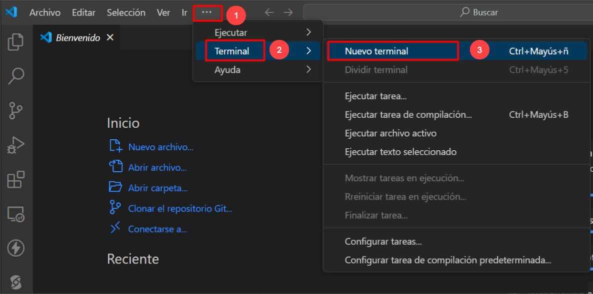

1. Execute o seguinte comando no terminal para clonar o repositório para uma pasta local: (não importa qual pasta).

    ```
    git clone https://github.com/MicrosoftLearning/AI-102-AIEngineer
    ```

    

1. Quando o repositório tiver sido clonado, abra a pasta no Visual Studio Code seguindo estas etapas:

    - No menu do canto superior esquerdo, selecione **File (1)** > **Open Folder... (2)**.

        

    - No explorador de arquivos em **Acesso rápido**, selecione **AI-102-AIEngineer (1)** e clique em **Selecionar pasta (2)**.

        .png)

    - Se **Do you trust the authors of the files in this folder?** for solicitado, clique em **Yes, I trust the authors**.

        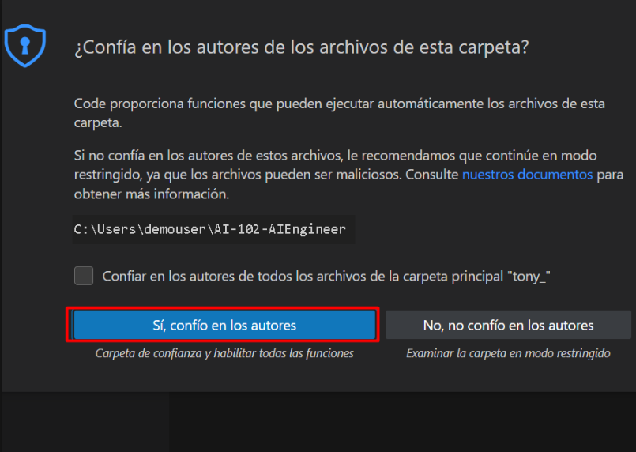 

        > **Observação**: se você for solicitado a adicionar os ativos necessários para compilar e depurar, consulte **Not now**.

### Tarefa 2: Create Azure resources

To create the solution for Margie's Travel, you will need the following resources in your Azure subscription:

- Um recurso do **Azure AI Search** que gerenciará a indexação e a consulta.
- Um recurso do **Azure AI Services** que fornece serviços de IA para habilidades que sua solução de pesquisa pode usar para enriquecer os dados na fonte de dados com insights gerados por IA.
- Uma **Conta de armazenamento** com um contêiner de blob no qual os documentos a serem pesquisados ​​são armazenados.

  > **Importante**: seus recursos do Azure AI Search e do Azure AI Services devem estar no mesmo local.

#### Tarefa 2.1: Criar um recurso do Azure AI Search

Nesta tarefa, você aprenderá a criar um recurso do **Azure AI Search** no portal do Azure.

1. Em um navegador da Web, entre no portal do Azure usando `https://portal.azure.com`.

1. Retorne à página inicial do portal do Azure e clique no botão **&#65291;Criar um recurso**.

    .png)

1. Pesquise e selecione **Azure AI Search** na lista na página Criar um recurso.

    .png)

1. Na página **Mercado**, selecione **Azure AI Search**.

    .png)

1. Na página **Azure AI Search**, clique em **Criar**.

    .png)

1. Especifique os seguintes detalhes para criar um serviço **Pesquisa de IA do Azure** e clique na aba **Revisar + Criar (6)**.

    | **Opção** | **Valor** |
    | ------------------ | ----------------------------------------------------- |
    | Assinatura | Deixar padrão **(1)** |
    | Grupo de Recursos | **Activate-GenAI** **(2)** |
    | Nome | *Digite um nome exclusivo* para seu serviço de pesquisa ou use o formato **searchservice-xxxxxx** (substitua **xxxxxx** pelo **Deployment ID** registrado no **Challenge 01**) **(3)** |
    | Local | Use o mesmo local que o grupo de recursos **(4)** |
    | Camada de preços | Básico **(5)** |

    >**Observação**: aqui, xxxxxx se refere ao ID de implantação.
    
    >**Observação**: se você encontrar o erro **Não é possível obter custos para assinatura**, ignore-o e prossiga para a próxima etapa.

    .png)

1. Assim que a validação for bem-sucedida na guia **Revisar + criar**, clique em **Criar** e aguarde a conclusão da implantação, depois clique em **Ir para o recurso**.

    .png)

    .png)

1. Revise a página **Visão geral** na lâmina para seu recurso do Azure AI Search no portal do Azure. Aqui, você pode usar uma interface visual para criar, testar, gerenciar e monitorar os vários componentes de uma solução de pesquisa, incluindo fontes de dados, índices, indexadores e conjuntos de habilidades.

#### Tarefa 2.2: Criar um recurso do Azure AI Services

Nesta tarefa, você aprenderá a criar um recurso do Azure AI Search no portal do Azure. Sua solução de pesquisa usará esse recurso para enriquecer os dados no armazenamento de dados com insights gerados por IA.

1. Na página do Portal do Azure, na caixa Pesquisar recursos, serviços e documentos (G+/) na parte superior do portal, insira **Azure AI Services (1)** e selecione **Azure AI services (2)** em serviços.

    .png)

1. Na página **Azure AI Services**, clique em **+ Criar**.

    .png)

1. Especifique os seguintes detalhes para criar um **Azure AI Services** e clique na aba **Examinar + criar**.

    | **Opção** | **Valor** |
    | ------------------ | ----------------------------------------------------- |
    | Assinatura | Deixar padrão |
    | Grupo de Recursos | **Activate-GenAI** |
    | Region | Use o mesmo local que o grupo de recursos |
    | Nome | *Digite um nome exclusivo* para seus Azure AI Services ou use o formato **challengeservice-xxxxxx** (substitua **xxxxxx** pelo **Deployment ID** registrado no **Challenge 01**) |
    | Tipo de preço | Standard S0 |

    >**Observação**: aqui, xxxxxx se refere ao ID de implantação

    .png)

1. Assim que a validação for bem-sucedida na guia **Examinar + criar**, clique em **Criar** e aguarde a conclusão da implantação, depois clique em **Ir para o recurso**.

    .png)

    .png)

#### Tarefa 2.3: Criar uma conta de armazenamento

Nesta tarefa, você aprenderá a criar um recurso de **Conta de armazenamento** no portal do Azure e, nas próximas etapas, criará um contêiner de blobs onde os documentos a serem pesquisados ​​serão armazenados.

1. Na página do Portal do Azure, na caixa Pesquisar recursos, serviços e documentos (G+/) na parte superior do portal, insira **Conta de armazenamento** **(1)** e selecione **Conta de armazenamento** **(2)** em serviços.

    .png)

1. Clique em **+ Criar**.

    .png)

1. Especifique os seguintes detalhes para criar uma conta de armazenamento do Azure e clique na guia Avançar **Próximo (7)**.

    | **Opção** | **Valor** |
    | ------------------ | ----------------------------------------------------- |
    | Assinatura | Deixe o padrão **(1)** |
    | Grupo de recursos | **Activate-GenAI** **(2)** |
    | Nome da conta de armazenamento | *Digite um nome exclusivo* para seus Serviços de IA do Azure ou use o formato **challengeservice-xxxxxx** (substitua **xxxxxx** pelo **ID de implantação** registrado no **Desafio 01**) **(3)** |
    | Região | Use o mesmo local do grupo de recursos **(4)** |
    | Desempenho | Standard **(5)** |
    | Redundância | **LRS (armazenamento com redundância local)** **(6)**|

    >**Observação**: aqui, xxxxxx se refere ao ID de implantação

    .png)

1. Na aba **Avançado**, marque a caixa ao lado de **Permitir acesso anônimo em contêineres individuais (1)** e clique em **Revisar + criar (2)**

    .png)

1. Assim que a validação for bem-sucedida em **Revisar + criar**, clique em **Criar** e aguarde a conclusão da implantação, clique em **Ir para o recurso**.

    .png)

    .png)

1. Na página **Visão geral**, observe o **ID da Assinatura**; ele identifica a assinatura para a qual a conta de armazenamento é provisionada.

    .png)

    > **Dica**: mantenha a lâmina **Conta de armazenamento** aberta; você precisará do ID da assinatura e de uma das chaves no próximo procedimento.

### Tarefa 3 e Tarefa 4: Carregar documentos no Armazenamento do Azure e executar o script carregado

Nesta tarefa, você navegará entre o Visual Studio Code e o portal do Azure para recuperar as credenciais necessárias, atualizar um arquivo em lote e usar o CLI do Azure para carregar documentos em um contêiner de blob na sua conta de armazenamento.

>**Importante**: Agora que você tem os recursos necessários, pode carregar alguns documentos na sua conta do Armazenamento do Azure.

1. Navegue de volta para o Visual Studio Code, no painel **Explorer**, expanda a pasta **22-create-a-search-solution (1)** e selecione **UploadDocs.cmd (2)**.

    

1. Navegue de volta para a aba do navegador exibindo **portal do Azure**, recupere o **ID da assinatura (1)**, **nome da conta de armazenamento do Azure (2)** e **chave da conta de armazenamento do Azure** clicando na opção **Mostrar** > **Área de transferência (3)** da conta de armazenamento criada recentemente e registre os valores no bloco de notas.

    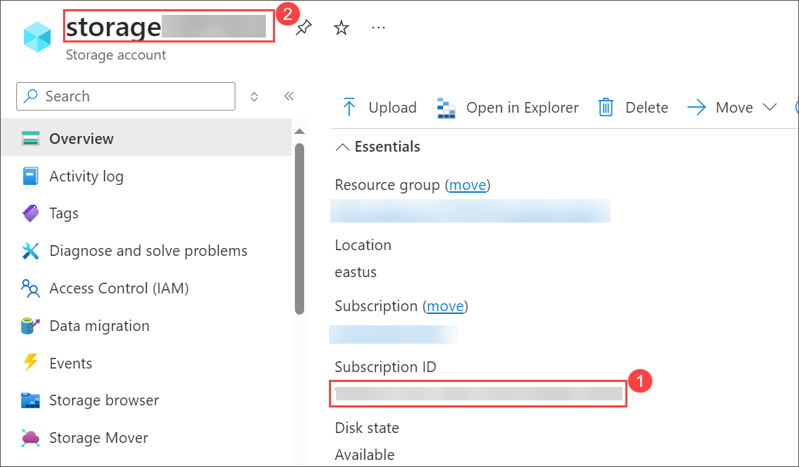

    

1. Retorne ao código do VS e edite o arquivo em lote para substituir os espaços reservados **YOUR_SUBSCRIPTION_ID**, **YOUR_AZURE_STORAGE_ACCOUNT_NAME** e **YOUR_AZURE_STORAGE_KEY** pelos valores correspondentes que você registrou na etapa anterior.

    

1. Salve suas alterações e clique com o botão direito do mouse na pasta **22-create-a-search-solution (1)** > **abra um terminal integrado (2)**.

    

1. Insira o seguinte comando para entrar na sua assinatura do Azure usando o Azure CLI:

    > **Observação**: certifique-se de ter instalado o Azure CLI e a extensão Azure CLI Tools no Visual Studio Code.

    >**Observação**: certifique-se de substituir <seu-nome-de-usuário> <sua-senha> por **nome-de-usuário-do-Azure** e **senha** que você está usando no desafio-1.

    ```
    az login --username <seu-nome-de-usuário> --password <sua-senha>
    ```

    

    > **Observação**: se uma guia do navegador da Web abrir e solicitar que você faça login no Azure, faça login, feche a guia do navegador e retorne ao Visual Studio Code.

1. Insira o seguinte comando para executar o arquivo em lote. Isso criará um contêiner de blob na sua conta de armazenamento e carregará os documentos na pasta **data** para ele.

    ```
    .\UploadDocs
    ```

    

### Tarefa 5: Data Import and Indexing:
#### Tarefa 5.1: Index the documents

In this task, you'll learn how to create a search solution by indexing documents that are already in place. Navigating to your Azure AI Search resource in the Azure portal, configure the data source to utilize Azure Blob Storage, integrate cognitive skills for enrichment, customize the target index, and set up an indexer to process and index the documents effectively.

>**Note**: Now that you have the documents in place, you can create a search solution by indexing them.

1. In the Azure portal, browse to your **Azure AI Search** resource. Then, on its **Overview** page, select **Import data**.

   

1. On the **Connect to your data** page, in the **Data Source** list, select **Azure Blob Storage**. Then complete the data store details with the following values:
    
    - **Data Source**: Azure Blob Storage (1)
    - **Data source name**: margies-data  (2)
    - **Data to extract**: Content and metadata (3)
    - **Parsing mode**: Default (4)
    - **Subscription**: Leave default (5)  
    - **Connection string**: Select **Choose an existing connection (6)**. Then select your storage account (7), and finally select the **margies (8)** container that 
       was created by the UploadDocs.cmd script. then click on **Select (9)**.

        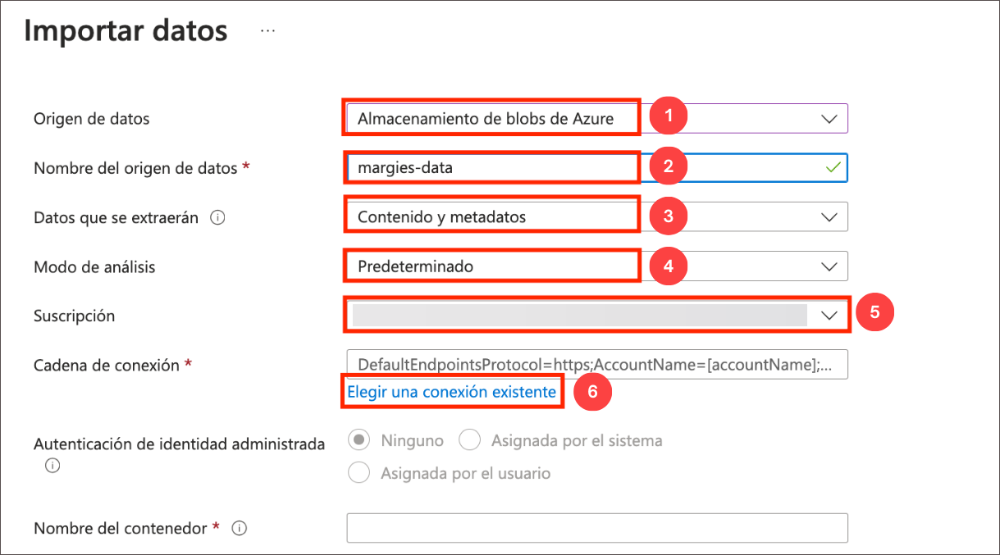

        

        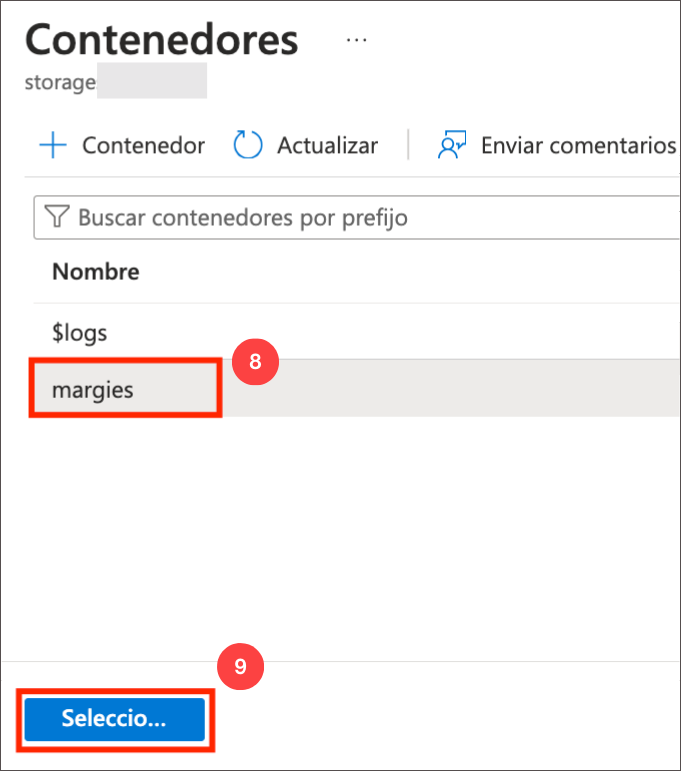
      
    - **Managed identity authentication**: None (10)
    - **Container name**: margies (11)
    - **Blob folder**: *Leave this blank.* (12)
    - **Description**: Brochures and reviews in Margie's Travel web site. (13)
    - Click on **Add cognitive skills(Optional) (14)**

       

1. On **Add cognitive skills (Optional)** tab expand **Attach AI Services(1)**, within the section  select your **Azure AI Services (2)** resource.

     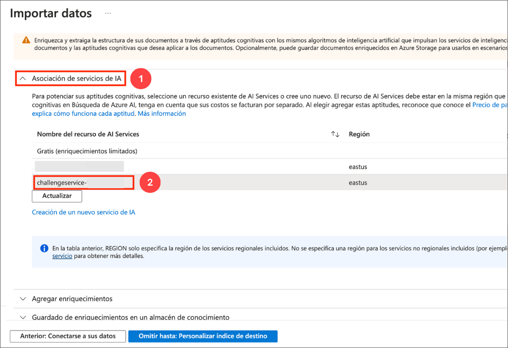
   
1. Scroll down and expand **Add enrichments (1)** section and specify the following :
    
    - Change the **Skillset name** to **margies-skillset (2)**.
    - Select the checkbox for **Enable OCR and merge all text into merged_content field (3)**.
    - Ensure that the **Source data field** is set to **merged_content (4)**.
    - Leave the **Enrichment granularity level** as the **Source field (5)**, which sets the entire contents of the document being indexed, but note that you can change this to extract information at more granular levels, like pages or sentences.
  
      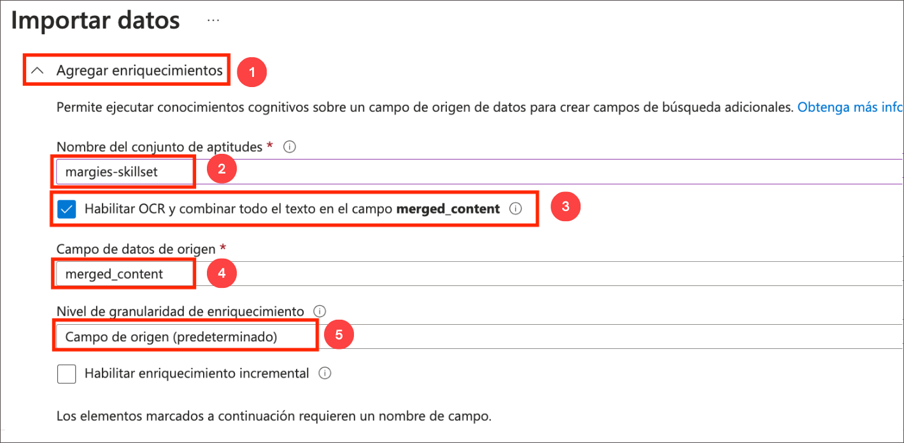

    - Select the following enriched fields:

        | Cognitive Skill | Parameter | Field name |
        | --------------- | ---------- | ---------- |
        | Extract location names | | locations |
        | Extract key phrases | | keyphrases |
        | Detect language | | language |
        | Generate tags from images | | imageTags |
        | Generate captions from images | | imageCaption |

        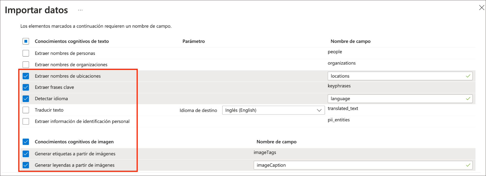
      
1. Double-check your selections (it can be difficult to change them later). Then proceed to the next step (*Customize target index*).

   
  
1. On **Customize target index** tab change the **Index name** to **margies-index (1)**.
   
1. Ensure that the **Key** is set to **metadata_storage_path (2)** and leave the **Suggester name** blank and **Search mode (3)** at its default value.

    
   
1. Make the following changes to the index fields, leaving all other fields with their default settings (**IMPORTANT**: you may need to scroll to the right to see the entire table):

    | Field name | Retrievable | Filterable | Sortable | Facetable | Searchable |
    | ---------- | ----------- | ---------- | -------- | --------- | ---------- |
    | metadata_storage_size | &nbsp;&nbsp;&nbsp;&nbsp;&nbsp;&nbsp;&#10004; | &nbsp;&nbsp;&nbsp;&nbsp;&nbsp;&nbsp;&#10004; | &nbsp;&nbsp;&nbsp;&nbsp;&nbsp;&nbsp;&#10004; | | |
    | metadata_storage_last_modified | &nbsp;&nbsp;&nbsp;&nbsp;&nbsp;&nbsp;&#10004; | &nbsp;&nbsp;&nbsp;&nbsp;&nbsp;&nbsp;&#10004; | &nbsp;&nbsp;&nbsp;&nbsp;&nbsp;&nbsp;&#10004; | | |
    | metadata_storage_name | &nbsp;&nbsp;&nbsp;&nbsp;&nbsp;&nbsp;&#10004; | &nbsp;&nbsp;&nbsp;&nbsp;&nbsp;&nbsp;&#10004; | &nbsp;&nbsp;&nbsp;&nbsp;&nbsp;&nbsp;&#10004; | | &nbsp;&nbsp;&nbsp;&nbsp;&nbsp;&nbsp;&#10004; |
    | metadata_author | &nbsp;&nbsp;&nbsp;&nbsp;&nbsp;&nbsp;&#10004; | &nbsp;&nbsp;&nbsp;&nbsp;&nbsp;&nbsp;&#10004; | &nbsp;&nbsp;&nbsp;&nbsp;&nbsp;&nbsp;&#10004; | &nbsp;&nbsp;&nbsp;&nbsp;&nbsp;&nbsp;&#10004; | &nbsp;&nbsp;&nbsp;&nbsp;&nbsp;&nbsp;&#10004; |
    | locations | &nbsp;&nbsp;&nbsp;&nbsp;&nbsp;&nbsp;&#10004; | &nbsp;&nbsp;&nbsp;&nbsp;&nbsp;&nbsp;&#10004; | | | &nbsp;&nbsp;&nbsp;&nbsp;&nbsp;&nbsp;&#10004; |
    | keyphrases | &nbsp;&nbsp;&nbsp;&nbsp;&nbsp;&nbsp;&#10004; | &nbsp;&nbsp;&nbsp;&nbsp;&nbsp;&nbsp;&#10004; | | | &nbsp;&nbsp;&nbsp;&nbsp;&nbsp;&nbsp;&#10004; |
    | language | &nbsp;&nbsp;&nbsp;&nbsp;&nbsp;&nbsp;&#10004; | &nbsp;&nbsp;&nbsp;&nbsp;&nbsp;&nbsp;&#10004; | | | |

    Use the below image to cross verify the option. 

     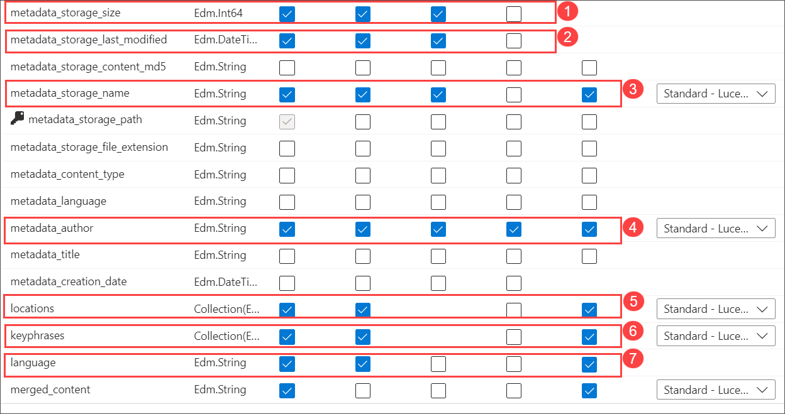
   
1. Double-check your selections, paying particular attention to ensure that the correct **Retrievable**, **Filterable**, **Sortable**, **Facetable**, and **Searchable** options are selected for each field  (it can be difficult to change them later). Then proceed to the next step by clicking on **Next: Create an indexer**.

1. On the **Create an indexer** tab specify the following
      - Change the **Indexer name** to **margies-indexer (1)**.
      - Leave the **Schedule** set to **Once (2)**.
      - Expand the **Advanced options (3)** and ensure that the **Base-64 encode keys (4)** option is selected (generally, encoding keys make the index more efficient).
      
      - Select **Submit (5)** to create the data source, skillset, index, and indexer. The indexer is run automatically and runs the indexing pipeline, which:
          
          1. Extracts the document metadata fields and content from the data source.
          2. Runs the skillset of cognitive skills to generate additional enriched fields.
          3. Maps the extracted fields to the index.
      
            

1. On **Azure AI Search** resource page, expand **Search management (1)** select **Indexers (2)** which should show the newly created **margies-indexer (3)**.

   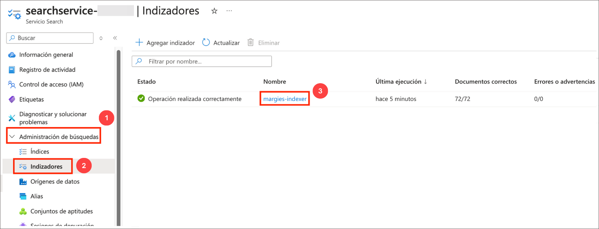  

1. Select **margies-indexer** . Wait a few minutes, and click **&orarr; Refresh** until the **Status** indicates success.

     

#### Tarefa 5.2: Search the index

In this task, you'll learn to search and query the index created earlier:

1. At the top of the **Overview** page for your Azure AI Search resource, select **Search explorer**.

    
   
1. In Search explorer, in the **Query string** box, enter `*` (a single asterisk), and then select **Search**.

    

   >**Note**: This query retrieves all documents in the index in JSON format. Examine the results and note the fields for each document, which contain document content, metadata, and enriched data extracted by the cognitive skills you selected.

1. In the **View** menu, select **JSON view**.

   

1. Note that the JSON request for the search is shown, like this:

    ```json
    {
      "search": "*"
    }
    ```
   
   
1. Modify the JSON request to include the **count** parameter, as shown here:

    ```json
    {
      "search": "*",
      "count": true
    }
    ```

1. Submit the modified search. This time, the results include a **@odata.count** field at the top of the results that indicates the number of documents returned by the search.

1. Try the following query:

    ```json
    {
      "search": "*",
      "count": true,
      "select": "metadata_storage_name,metadata_author,locations"
    }
    ```

    >**Note**: This time, the results include only the file name, author, and any locations mentioned in the document content. The file name and author are in the **metadata_storage_name** and **metadata_author** fields, which were extracted from the source document. The **locations** field was generated by a cognitive skill.

1. Now try the following query string:

    ```json
    {
      "search": "New York",
      "count": true,
      "select": "metadata_storage_name,keyphrases"
    }
    ```

    >**Note**: This search finds documents that mention "New York" in any of the searchable fields and returns the file name and key phrases in the document.

1. Let's try one more query:

    ```json
    {
      "search": "New York",
      "count": true,
      "select": "metadata_storage_name",
      "filter": "metadata_author eq 'Reviewer'"
    }
    ```

    >**Note**: This query returns the filename of any documents authored by *Reviewer* that mention "New York".

       
  
### Tarefa 6: Explore and modify the definitions of search components

The components of the search solution are based on JSON definitions, which you can view and edit in the Azure portal.

While you can use the portal to create and modify search solutions, it's often desirable to define the search objects in JSON and use the Azure AI Service REST interface to create and modify them.

#### Tarefa 6.1: Get the endpoint and key for your Azure AI Search resource

In this task, you're preparing to execute CURL commands in Visual Studio Code to interact with Azure AI Service's REST interface:

1. In the Azure portal, return to the **Overview** page for your **Azure AI Search** resource, and in the top section of the page, find the **Url** for your resource (which looks like **https://resource_name.search.windows.net**) and copy it to the clipboard.

    
   
1. In Visual Studio Code, in the Explorer pane, expand the **22-create-a-search-solution (1)** folder and its **modify-search (2)** subfolder, and select **modify-search.cmd (3)** to open it. You will use this script file to run *CURL* commands that submit JSON to the Azure AI Service REST interface.

     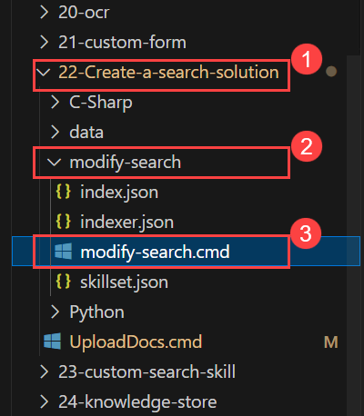
   
1. In **modify-search.cmd**, replace the **YOUR_SEARCH_URL** placeholder with the URL you copied to the clipboard.

     
     
1. In the Azure portal, back to **Overview** page for your **Azure AI Search** resource expand **Settings** and select **Keys** and copy the **Primary admin key** to the clipboard.

    
   
1. Back  to **Visual Studio Code**, replace the **YOUR_ADMIN_KEY** placeholder with the key you copied to the clipboard.

      
   
1. Save the changes to **modify-search.cmd** (but don't run it yet!)

     
   
#### Tarefa 6.2: Review and modify the skillset

In this task, you will be configuring a skillset (skillset.json) in Visual Studio Code to integrate Azure AI Services with Azure AI Search:

1. In Visual Studio Code, in the **modify-search** folder, open **skillset.json**. This shows a JSON definition for **margies-skillset**.

      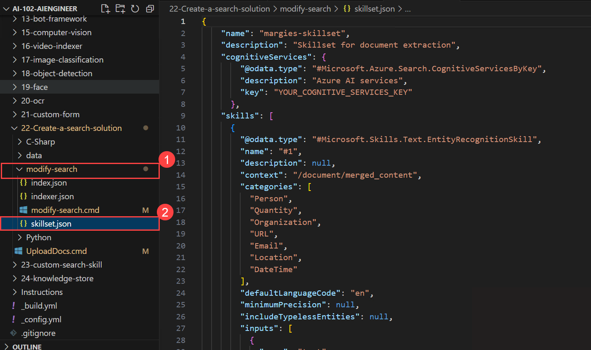
   
1. At the top of the skillset definition, note the **cognitiveServices** object, which is used to connect your Azure AI Services resource to the skillset.

1. In the Azure portal, open your Azure AI Services resource (<u>not</u> your Azure AI Search resource!)

1. On **Azure AI Services** overview page, from the left navigation pane expand **Resource Management** select **Keys and Endpoints**. Then copy **Key 1** to the clipboard.

    
   
1. In Visual Studio Code, in **skillset.json**, replace the **YOUR_COGNITIVE_SERVICES_KEY** placeholder with the Azure AI Services key you copied to the clipboard.

   
   
1. Scroll through the JSON file, noting that it includes definitions for the skills you created using the Azure AI Search user interface in the Azure portal. At the bottom of the list of skills, an additional skill has been added with the following definition:

    ```
    {
        "@odata.type": "#Microsoft.Skills.Text.V3.SentimentSkill",
        "defaultLanguageCode": "en",
        "name": "get-sentiment",
        "description": "New skill to evaluate sentiment",
        "context": "/document",
        "inputs": [
            {
                "name": "text",
                "source": "/document/merged_content"
            },
            {
                "name": "languageCode",
                "source": "/document/language"
            }
        ],
        "outputs": [
            {
                "name": "sentiment",
                "targetName": "sentimentLabel"
            }
        ]
    }
    ```

   >**Note**: The new skill is named **get-sentiment**, and for each **document** level in a document, it will evaluate the text found in the **merged_content** field of the document being indexed (which includes the source content as well as any text extracted from images in the content). It uses the extracted **language** of the document (with a default of English) and evaluates a label for the sentiment of the content. Values for the sentiment label can be "positive", "negative", "neutral", or "mixed". This label is then output as a new field named **sentimentLabel**.

1. Save the changes you've made to **skillset.json**.

#### Tarefa 6.3 : Review and modify the index

In this task, you will review the index.json file in Visual Studio Code which shows a JSON definition for **margies-index**

1. In Visual Studio Code, in the **modify-search** folder, open **index.json**. This shows a JSON definition for **margies-index**.

     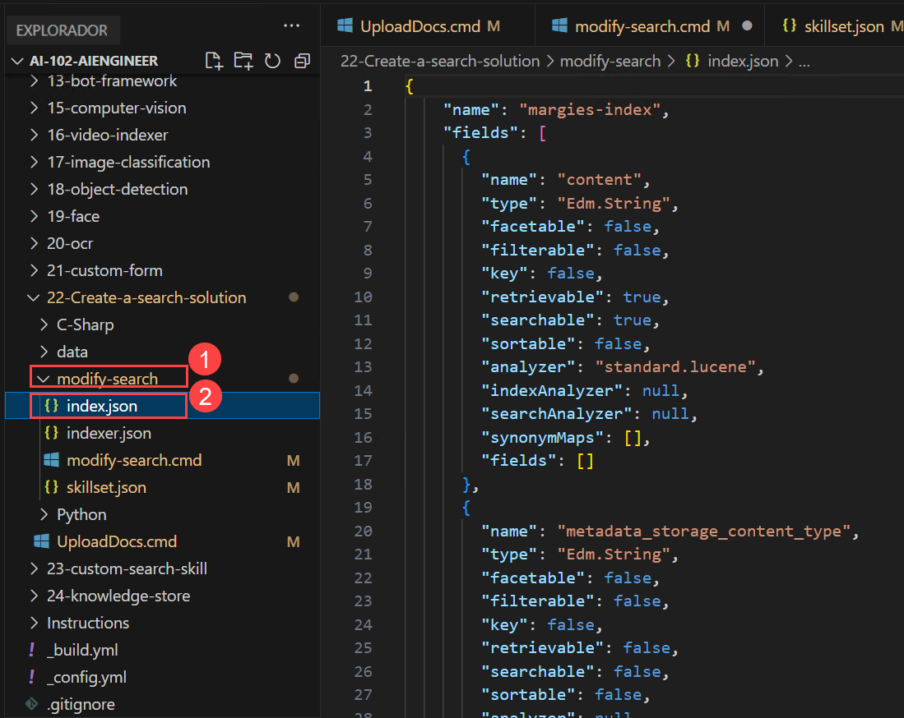
   
1. Scroll through the index and view the field definitions. Some fields are based on metadata and content in the source document, and others are the results of skills in the skillset.
1. At the end of the list of fields that you defined in the Azure portal, note that two additional fields have been added:

    ```
    {
        "name": "sentiment",
        "type": "Edm.String",
        "facetable": false,
        "filterable": true,
        "retrievable": true,
        "sortable": true
    },
    {
        "name": "url",
        "type": "Edm.String",
        "facetable": false,
        "filterable": true,
        "retrievable": true,
        "searchable": false,
        "sortable": false
    }
    ```

1. The **sentiment** field will be used to add the output from the **get-sentiment** skill that was added to the skillset. The **url** field will be used to add the URL for each indexed document to the index, based on the **metadata_storage_path** value extracted from the data source. Note that the index already includes the **metadata_storage_path** field, but it's used as the index key and Base-64 encoded, making it efficient as a key but requiring client applications to decode it if they want to use the actual URL value as a field. Adding a second field for the unencoded value resolves this problem.

#### Tarefa 6.4: Review and modify the indexer

In this task, you will review the **indexer.json** file in Visual Studio Code which shows a JSON definition for **margies-index**

1. In Visual Studio Code, in the **modify-search** folder, open **indexer.json**. This shows a JSON definition for **margies-indexer**, which maps fields extracted from document content and metadata (in the **fieldMappings** section) and values extracted by skills in the skillset (in the **outputFieldMappings** section) to fields in the index.

     
    
1. In the **fieldMappings** list, note the mapping for the **metadata_storage_path** value to the base-64 encoded key field. This was created when you assigned the **metadata_storage_path** as the key and selected the option to encode the key in the Azure portal. Additionally, a new mapping explicitly maps the same value to the **url** field, but without the Base-64 encoding:

    ```
    {
        "sourceFieldName" : "metadata_storage_path",
        "targetFieldName" : "url"
    }
    
    ```

    > **Note**: All of the other metadata and content fields in the source document are implicitly mapped to fields of the same name in the index.

1. Review the **ouputFieldMappings** section, which maps outputs from the skills in the skillset to index fields. Most of these reflect the choices you made in the user interface, but the following mapping has been added to map the **sentimentLabel** value extracted by your sentiment skill to the **sentiment** field you added to the index:

    ```
    {
        "sourceFieldName": "/document/sentimentLabel",
        "targetFieldName": "sentiment"
    }
    ```

#### Tarefa 6.5 : Use the REST API to update the search solution

In this task, you will update JSON definitions in Visual Studio Code for Azure AI Search to include new fields like sentiment analysis results and document URLs. Run modify-search.cmd to apply changes and start indexing. Monitor progress in Azure portal's Indexers section for completion and document size warnings during sentiment analysis.

1. Right-click the **modify-search** folder and select **open an integrated terminal**.

     
   
1. In the terminal pane for the **modify-search** folder, enter the following command to run the **modify-search.cmd** script, which submits the JSON definitions to the REST interface and initiates the indexing.

    ```
    .\modify-search
    ```

1. When the script has finished, return to the **Overview** page for your **Azure AI Search** from the left navigation pane expand **Search management** and select **Indexers**. Then periodically select **Refresh** to track the progress of the indexing operation. It may take a minute or so to complete.

   

    >**Note**: There may be some warnings for a few documents that are too large to evaluate sentiment. Often, sentiment analysis is performed at the page or sentence level rather than the full document, but in this scenario, most of the documents, particularly the hotel reviews, are short enough for useful document-level sentiment scores to be evaluated.

#### Tarefa 6.6 : Query the modified index
In this task, you'll perform a query in Azure AI Search to retrieve URLs, sentiment, and key phrases for documents mentioning "London" with positive sentiment, authored by "Reviewer".

1. At the top of the blade for your Azure AI Search resource, select **Search explorer**.
1. In Search explorer, in the **Query string** box, submit the following JSON query:

    ```json
    {
      "search": "London",
      "select": "url,sentiment,keyphrases",
      "filter": "metadata_author eq 'Reviewer' and sentiment eq 'positive'"
    }
    ```

    This query retrieves the **url**, **sentiment**, and **keyphrases** for all documents that mention *London* authored by *Reviewer* that has a positive **sentiment** label (in other words, positive reviews that mention London).

1. Close the **Search explorer** page to return to the **Overview** page.

### Tarefa 7: Create a search client application

Now that you have a useful index, you can use it from a client application. You can do this by consuming the REST interface, submitting requests, and receiving responses in JSON format over HTTP, or you can use the software development kit (SDK) for your preferred programming language. In this exercise, we'll use the SDK.

> **Note**: You can choose to use the SDK for either **C#** or **Python**. In the steps below, perform the actions appropriate for your preferred language.

#### Tarefa 7.1 : Get the endpoint and keys for your search resource

In this task, you'll retrieve the endpoint URL and keys for your Azure AI Search resource from the Azure portal, essential for managing and querying your search resources in upcoming tasks.

1. In the Azure portal, navigate back to **Azure AI Search**. On the Overview page for the **Azure AI Search** resource, note the url value, which should be similar to **https://your_resource_name.search.windows.net**. Please record this value in Notepad as it will be required in upcoming tasks.

    
   
1. From the left navigation expand **Settings** select **Keys**, note that there are two **admin** keys and a single **Manage query keys** key.

   >**Note**: An *admin* key is used to create and manage search resources
   >**Note**: An *Manage query keys* key is used by client applications that only need to perform search queries.

    

1.  Please copy the **Manage query keys** to the clipboard and record it in Notepad, as it will be needed for upcoming tasks.

     
    
#### Tarefa 7.2 : Prepare to use the Azure AI Search SDK

In this task, you'll prepare your development environment in Visual Studio Code to integrate with Azure AI Search SDK by installing the necessary packages (Azure.Search.Documents for C# or azure-search-documents for Python) and configuring endpoint URL and query key in the respective configuration files.

1. In Visual Studio Code, in the **Explorer** pane, browse to the **22-create-a-search-solution** folder and expand the **C-Sharp** or **Python** folder depending on your language preference.
1. Right-click the **margies-travel** folder and open an integrated terminal. Then install the Azure AI Search SDK package by running the appropriate command for your language preference:
   > **Note**: Please ensure the necessary extensions are already installed in the VS Code.

    **C#**
    
    ```
    dotnet add package Azure.Search.Documents --version 11.1.1
    ```
    **Python**
    
    ```
    pip install azure-search-documents==11.0.0
    ```
    
1. View the contents of the **margies-travel** folder, and note that it contains a file for configuration settings:
    - **C#**: appsettings.json
    - **Python**: .env

1. Open the configuration file and update the **YOUR_SEARCH_ENDPOINT**  with the **Azure AI Search** *Endpoint URL* link and  **YOUR_SEARCH_QUERY_KEY** values with **Manage query keys** which you recorded in previous tasks and save the changes.

    - **C#**: appsettings.json

       

    - **Python**: .env
  
      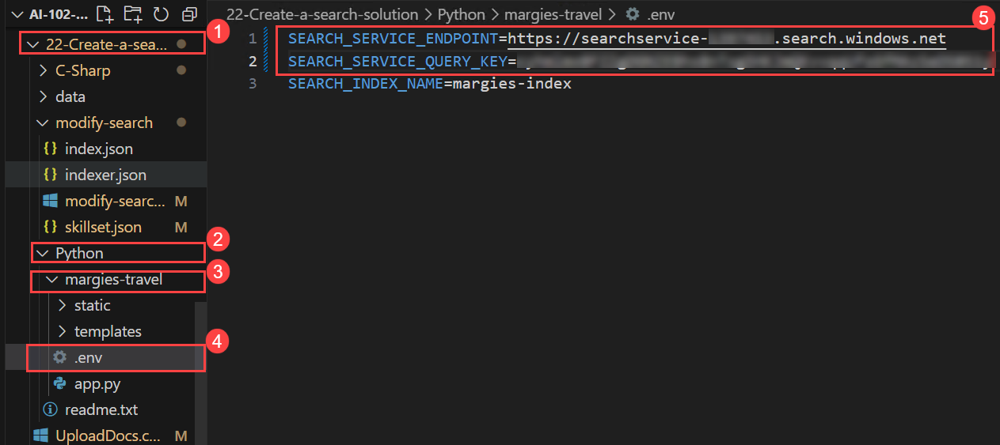

#### Tarefa 7.3 : Explore code to search an index

In this task, you'll explore the code for a web application (C# ASP.NET Razor or Python Flask) within the margies-travel folder. You'll review how it interacts with Azure AI Search SDK to perform search queries, configure search clients, and manage search results, including filtering, sorting, and highlighting content fields.

The **margies-travel** folder contains code files for a web application (a Microsoft C# *ASP.NET Razor* web application or a Python *Flask* application), which includes search functionality.

1. Open the following code file in the web application, depending on your choice of programming language:
    - **C#**:Pages/Index.cshtml.cs
    - **Python**: app.py

1. Near the top of the code file, find the comment **Import search namespaces**, and note the namespaces that have been imported to work with the Azure AI Search SDK:

1. In the **search_query** function, find the comment **Create a search client**, and note that the code creates a **SearchClient** object using the endpoint and query key for your Azure AI Search resource:
   
1. In the **search_query** function, find the comment **Submit search query** and review the code to submit a search for the specified text with the following options:
    - A *search mode* that requires **all** of the individual words in the search text to be found.
    - The total number of documents found by the search is included in the results.
    - The results are filtered to include only documents that match the provided filter expression.
    - The results are sorted into the specified sort order.
    - Each discrete value of the **metadata_author** field is returned as a *facet* that can be used to display pre-defined values for filtering.
    - Up to three extracts of the **merged_content** and **imageCaption** fields with the search terms highlighted are included in the results.
    - The results include only the fields specified.

#### Tarefa 7.4 : Explore code to render search results

In this task, you'll delve into the web application's code (either C# ASP.NET Razor or Python Flask) to understand how it presents search results:

The web app already includes code to process and render the search results.

1. Open the following code file in the web application, depending on your choice of programming language:
    - **C#**:Pages/Index.cshtml
    - **Python**: templates/search.html
1. Examine the code, which renders the page on which the search results are displayed. Observe that:
    - The page begins with a search form that the user can use to submit a new search (in the Python version of the application, this form is defined in the **base.html** template), which is referenced at the beginning of the page.
    - A second form is then rendered, enabling the user to refine the search results. The code for this form:
        - Retrieves and displays the count of documents from the search results.
        - Retrieves the facet values for the **metadata_author** field and displays them as an option list for filtering.
        - Creates a drop-down list of sort options for the results.
    - The code then iterates through the search results, rendering each result as follows:
        - Display the **metadata_storage_name** (file name) field as a link to the address in the **url** field.
        - Displaying *highlights* for search terms found in the **merged_content** and **imageCaption** fields to help show the search terms in context.
        - Display the **metadata_author**, **metadata_storage_size**, **metadata_storage_last_modified**, and **language** fields.
        - Display the **sentiment** label for the document. Can be positive, negative, neutral, or mixed.
        - Display the first five **keyphrases** (if any).
        - Display the first five **locations** (if any).
        - Display the first five **imageTags** (if any).

#### Tarefa 7.5 : Run the web app

In this task, you'll be running the Margie's Travel web application locally, searching for specific terms like "London hotel" and "quiet hotel in New York", refining search results using filters and sorting options based on sentiment, observing keyword and location identification in documents.


 1. Return to the integrated terminal for the **margies-travel** folder and enter the following command to run the program:
    
    **C#**
    
    ```
    dotnet run
    ```
    > **Note:** If the command fails, click on the provided link in the error message to download the latest version of the Microsoft ASP.NET Core Shared Framework. After that, download and install .NET Core, and then run the command again.
        
    **Python**
     
    ```
    flask run
    ```
    > **Note:** If the command fails, **run pip Install python-dotenv** command and then run the command again.

1. Open the another tab in edge browse following the link (*http://localhost:5000/* or *http://127.0.0.1:5000/*) to open the **Margie's Travel** site in a web browser.

    
   
1. On the **Margie's Travel** website, enter **London hotel (1)** into the search box and click **Search (2)**.

    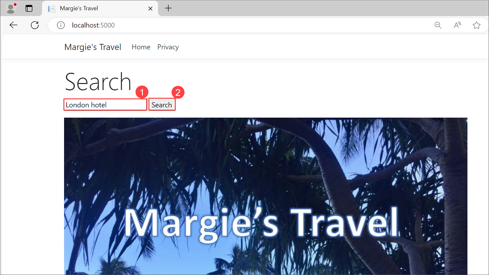
   
1. Review the search results. They include the file name (with a hyperlink to the file URL), an extract of the file content with the search terms (*London* and *hotel*) emphasized, and other attributes of the file from the index fields.

    
   
1. Observe that the results page includes some user interface elements that enable you to refine the results. These include:
    
    - A *Filter by author* based on a facet value for the **metadata_author** field. This demonstrates how you can use *facetable* fields to return a list of *facets* - fields with a small set of discrete values that can be displayed as potential filter values in the user interface.
    
    - A **Sort by** ability to *order* the results based on a specified field and sort direction (ascending or descending). The default order is based on *relevancy*, which is calculated as a **search.score()** value based on  a *scoring profile* that evaluates the frequency and importance of search terms in the index fields.

1. Select the **Reviewer** filter and the **Positive to negative** sort option, and then select **Refine Results**.

     
   
1. Observe that the results are filtered to include only reviews and sorted based on the sentiment label.
   
   
1. On the **Margie's Travel** website, enter **quiet hotel in New York (1)** into the search box and click **Search (2)**.

    
   
1. Try the following search terms:
    - **Tower of London** (observe that this term is identified as a *key phrase* in some documents).
    - **skyscraper** (observe that this word doesn't appear in the actual content of any documents but is found in the *image captions* and *image tags* that were generated for images in some documents).
    - **Mojave desert** (observe that this term is identified as a *location* in some documents).

1. Close the browser tab containing Margie's Travel website and return to Visual Studio Code. Then, in the Python terminal for the **margies-travel** folder (where the dotnet or flask application is running), enter Ctrl+C to stop the app.


## Critério de Sucesso:


To successfully complete this challenge, you must:

   - Deploy the Azure Search Service and Azure Storage Account.
   - Add data to the storage account.
   - Index the documents in Azure AI Search using the Azure portal.
   - Customize the index and configure the indexer in Azure AI Search.
   - Modify and explore search components using JSON definitions.
   - Utilize the Azure AI Search SDK to create a client application for search.
   - Run the web application locally, perform searches, and refine search results effectively.


## Recursos Adicionais:

- Refer to [What is Azure AI Search](https://learn.microsoft.com/en-us/azure/search/search-what-is-azure-search) for reference.
- [What are Indexes in Azure AI Search?](https://learn.microsoft.com/en-us/azure/search/search-what-is-an-index)
- [Searching document text at scale using Azure Cognitive Search](https://benalexkeen.com/searching-document-text-at-scale-using-azure-cognitive-search/)

To learn more about Azure AI Search, see the [Azure AI Search documentation](https://docs.microsoft.com/azure/search/search-what-is-azure-search).

## Prossiga para o próximo Desafio clicando em **Next**>>.
