# Challenge 02: Implement Document Search with Azure AI Search

### Estimated Time: 120 minutes

## Introduction:

All organizations rely on information to make decisions, answer questions, and function efficiently. The problem for most organizations is not a lack of information but the challenge of finding and  extracting the information from the massive set of documents, databases, and other sources in which the information is stored.

For example, suppose *Margie's Travel* is a travel agency that specializes in organizing trips to cities around the world. Over time, the company has amassed a huge amount of information in documents such as brochures as well as reviews of hotels submitted by customers. This data is a valuable source of insights for travel agents and customers as they plan trips, but the sheer volume of data can make it difficult to find relevant information to answer a specific customer question.

To address this challenge, Margie's Travel can use Azure AI Search to implement a solution in which the documents are indexed and enriched by using AI skills to make them easier to search.

## Solution Guide

### Task 1: Clone the repository for this course

If you have not already cloned the **AI-102-AIEngineer** code repository to the environment where you're working on this lab, follow these steps to do so. Otherwise, open the cloned folder in Visual Studio Code.

1. Open **Visual Studio Code** from the Lab VM desktop by double-clicking on it.

1. In **Visual Studio Code**, from the top left menu, select the **(...) (1)** ellipses > **Terminal (2)**, then choose **New Terminal (3)**.

   

1. Execute the following command in the terminal to clone the repository to a local folder: (it doesn't matter which folder).

   ```
   git clone https://github.com/CloudLabsAI-Azure/mslearn-knowledge-mining.git
   ```
    

1. When the repository has been cloned, open the folder in Visual Studio Code by following these steps:

    - From the top left corncer menu select **File (1)** >  **Open Folder (2)**.

       
      
    - Within the file explorer in **Quick access** select **mslearn-knowledge-mining (1)** then click on **Select folder (2)**.

       
      
    - If **Do you trust the authors of the files in this folder?** prompted click on **Yes, I trust the authors**.

         

       > **Note**: If you are prompted to add required assets to build and debug, select **Not Now**.

### Task 2: Create Azure resources

To create the solution for Margie's Travel, you will need the following resources in your Azure subscription:

- An **Azure AI Search** resource that will manage indexing and querying.
- An **Azure AI Services** resource that provides AI services for skills that your search solution can use to enrich the data in the data source with AI-generated insights.
- A **Storage account** with a blob container in which the documents to be searched are stored.
  > **Important**: Your Azure AI Search and Azure AI Services resources must be in the same location.

#### Task 2.1: Create an Azure AI Search resource

In this task, you'll learn how to create an **Azure AI Search** resource in the Azure portal.

1. In a web browser, sign in to Azure portal using `https://portal.azure.com`.

1. Return to the Azure portal home page, and then click the **&#65291;Create a resource** button.

    
     
1. Search for and select **Azure AI Search** from the list on Create a resource page.

   

1. On the **Marketplace** page, select **Azure AI Search**.

   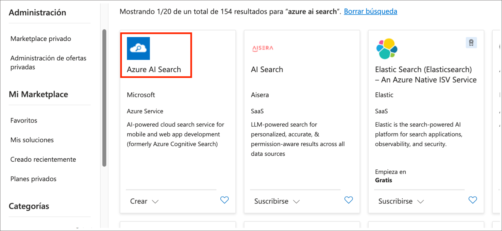
    
1. On the **Azure AI Search** page, click on **Create**. 

   
   
1. Specify the following details to create an **Azure AI Search** service then click on **Next** untill you reach **Review + Create (6)** tab.
   
   | **Option**         | **Value**                                              |
   | ------------------ | -----------------------------------------------------  |
   | Subscription       | Leave default  **(1)**                                 |
   | Resource Group     | **ODL-GenAI-CL-xxxxxx-Activate-GenAI** **(2)**                |
   | Name               | *Enter a unique name* for your search service or use the format **searchservice-xxxxxx** (replace **xxxxxx** with the **Deployment ID** recorded in **Challenge 01**) **(3)** |
   | Location           | Use the same location as the resource group **(4)**           |
   | Pricing tier       | Basic   **(5)**                                               | 

    >**Note**: Here, xxxxxx refers to the deployment ID
    >**Note**: If you encounter the error **Cannot get costs for subscription**, please ignore it and proceed with the next step.
    >**Note**: If you face any issues while deploying the search service in selected region. please select different region to deploy the search service. 
    
    
   
1. Once validation is successful on the **Review + create** tab, click **Create** and wait for the deployment to complete then click on **Go to the resource**.

   

   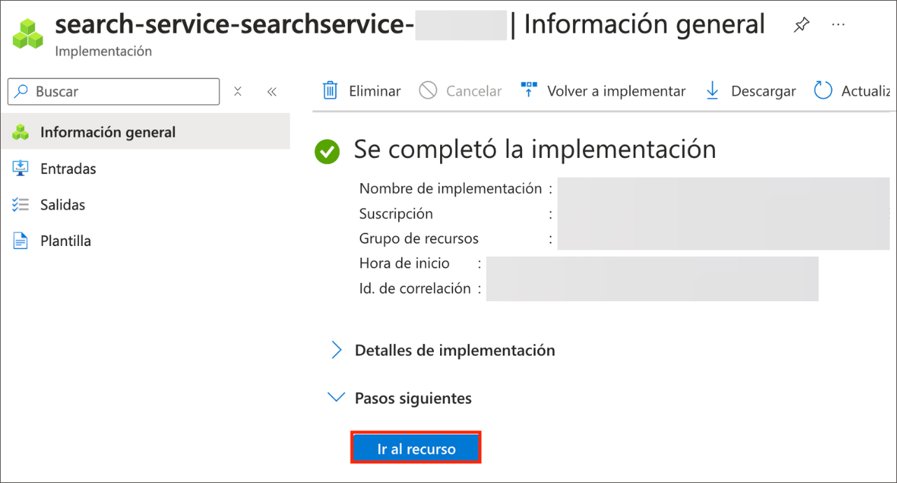

1. Review the **Overview** page on the blade for your Azure AI Search resource in the Azure portal. Here, you can use a visual interface to create, test, manage, and monitor the various components of a search solution, including data sources, indexes, indexers, and skillsets.

#### Task 2.2: Create an Azure AI Services resource

In this task, you'll learn how to create an Azure AI Search resource in the Azure portal. Your search solution will use this resource to enrich the data in the datastore with AI-generated insights.

1. Return to the Azure portal home page, and then click the **&#65291;Create a resource** button.

    
     
1. Search for and select **Azure AI Services (1) (2)** from the list then on the **Marketplace** page, select **Azure AI Services (3)**.

   

   
    
1. On the **Azure AI Services** page, click on **Create**. 

   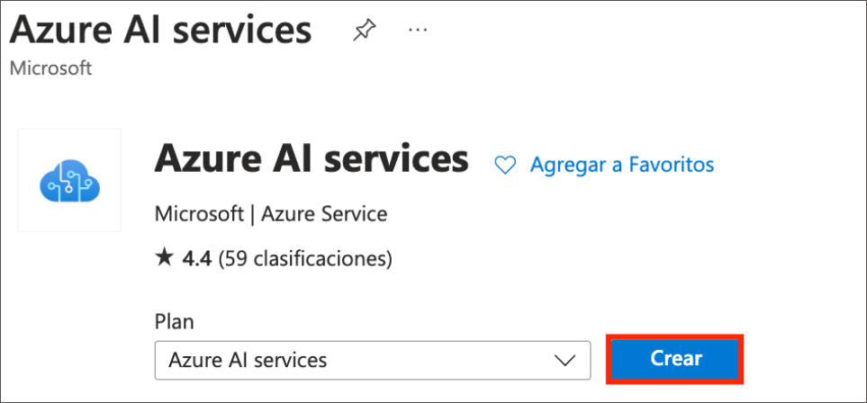
   
1. Specify the following details to create an **Azure AI Service** then click on **Review + Create (7)** tab.
   
   | **Option**         | **Value**                                              |
   | ------------------ | -----------------------------------------------------  |
   | Subscription       | Leave default  **(1)**                                 |
   | Resource Group     | **ODL-GenAI-CL-xxxxxx-Activate-GenAI**  **(2)**        |
   | Name               | *Enter a unique name* for your Azure AI Services or use the format **challengeservice-xxxxxx** (replace **xxxxxx** with the **Deployment ID** recorded in **Challenge 01**) **(3)** |
   | Location           | Use the same location as the resource group  **(4)**          |
   | Pricing tier       | Standard S0     **(5)**                                        |
   | By checking this box I acknowledge that I have read and understood all the terms below | Select the **Checkbox** **(6)**| 

    >**Note**: Here, xxxxxx refers to the deployment ID

    > **Note**: Ensure to use the same region as the Azure AI Search resource created previously.
    
      .png)
   
1. Once validation is successful on the **Review + create** tab, click **Create** and wait for the deployment to complete then click on **Go to the resource**.

#### Task 2.3: Create a storage account

In this task, you'll learn how to create a **Storage account** resource in the Azure portal, and in next steps will be creating blob container where the documents to be searched are stored.

1. On Azure Portal page, in Search resources, services and docs (G+/) box at the top of the portal, enter **Storage account** **(1)**, and then select **Storage account** **(2)** under services.

    

1. Click on **Create**.

    
   
1. Specify the following details to create an Azure **Storage account** then click on **Next** **(7)**  tab.
   
   | **Option**            | **Value**                                              |
   | ------------------    | -----------------------------------------------------  |
   | Subscription          | Leave default **(1)**                                  |
   | Resource Group        | **ODL-GenAI-CL-xxxxxx-Activate-GenAI** **(2)**         |
   | Storage account name  | *Enter a unique name* for your Storage account or use the format **storagexxxxxx** (replace **xxxxxx** with the **Deployment ID** recorded in **Challenge 01**) **(3)** |
   | Region                | Use the same location as the resource group **(4)**    |
   | Performance           | Standard **(5)**                                       |
   | Replication           | Locally redundant storage (LRS) **(6)**                | 

   

1. On the **Advanced** tab, check the box next to **Allow enabling anonymous access on individual containers** and click on **Review + create**

   

1. Once validation is successful on  **Review + create**, click **Create** and wait for the deployment to complete click on **Go to resource**.
      
   
      
   
1. On the **Overview** page, note the **Subscription ID**; this identifies the subscription for which the storage account is provisioned.

   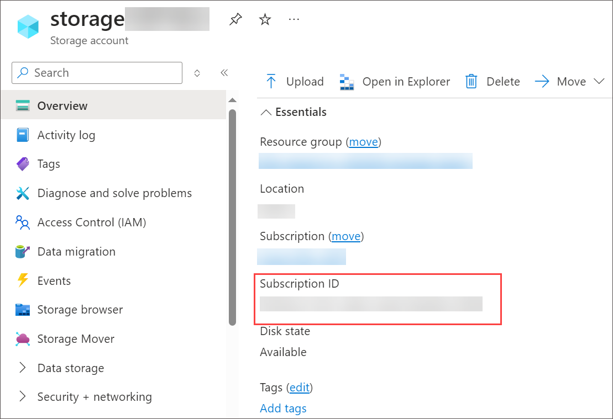

    > **Tip**: Keep the **Storage Account** blade open; you will need the subscription ID and one of the keys in the next procedure.

### Task 3 and Task 4: Upload documents to Azure Storage and execute the uploaded script

In this task, you'll navigate between Visual Studio Code and the Azure portal to retrieve necessary credentials, update a batch file, and use the Azure CLI to upload documents to a blob container in your storage account.

>**Important**: Now that you have the required resources, you can upload some documents to your Azure Storage account.

1. Navigate back to Visual Studio Code, under the **Explorer** pane, expand the **labfiles** folder, then expand **01-azure-search (1)** and select **UploadDocs.cmd (2)**.

    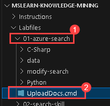
   
1. Navigate back to browser tab displaying **Azure portal**, retrieve the **subscription ID (1)**, **Azure storage account name (2)**, and **Azure storage account key** by clicking **Show** > **Clipboard (3)** option from the recently created storage account and record the values in notepad.

      
   
      
   
1. Return to VS code and edit the batch file to replace placeholders **YOUR_SUBSCRIPTION_ID**, **YOUR_AZURE_STORAGE_ACCOUNT_NAME**, and **YOUR_AZURE_STORAGE_KEY** with the corresponding values which you recorded in previous step.

    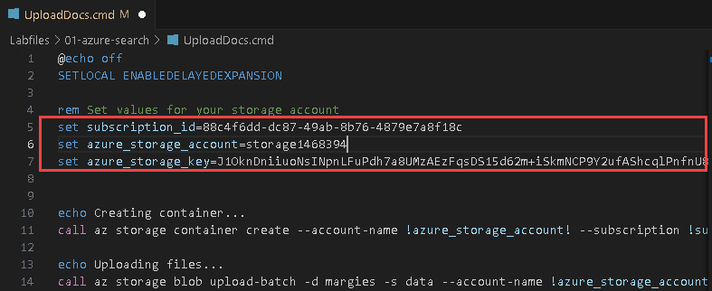
   
1. Save your changes, and then right-click the **01-azure-search (1)** folder > **open an integrated terminal (2)**.

    

1. Enter the following command to sign into your Azure subscription by using the Azure CLI:

   > **Note**: Ensure we have installed the Azure CLI and the Azure CLI Tools extension in Visual Studio Code.

   >**Note**: Make sure to replace <your-username> <your-password> with **Azure username** and **password** which you using from challenge-1.
   
    ```
    az login --username <your-username> --password <your-password>
    ```

    
      
   > **Note**: If a web browser tab opens and prompts you to sign in to Azure, please sign in, then close the browser tab and return to Visual Studio Code.

1. Enter the following command to run the batch file. This will create a blob container in your storage account and upload the documents in the **data** folder to it.

    ```
    .\UploadDocs
    ```

   

### Task 5: Data Import and Indexing:
#### Task 5.1: Index the documents

In this task, you'll learn how to create a search solution by indexing documents that are already in place. Navigating to your Azure AI Search resource in the Azure portal, configure the data source to utilize Azure Blob Storage, integrate cognitive skills for enrichment, customize the target index, and set up an indexer to process and index the documents effectively.

>**Note**: Now that you have the documents in place, you can create a search solution by indexing them.

1. In the Azure portal, browse to your **Azure AI Search** resource. Then, on its **Overview** page, select **Import data**.

   

1. On the **Connect to your data** page, in the **Data Source** list, select **Azure Blob Storage**. Then complete the data store details with the following values:
    
    - **Data Source**: Azure Blob Storage (1)
    - **Data source name**: margies-data  (2)
    - **Data to extract**: Content and metadata (3)
    - **Parsing mode**: Default (4)
    - **Subscription**: Leave default (5)  
    - **Connection string**: Select **Choose an existing connection (6)**. Then select your storage account (7), and finally select the **margies (8)** container that 
       was created by the UploadDocs.cmd script. then click on **Select (9)**.

        

        

        
      
    - **Managed identity authentication**: None (10)
    - **Container name**: margies (11)
    - **Blob folder**: *Leave this blank.* (12)
    - **Description**: Brochures and reviews in Margie's Travel web site. (13)
    - Click on **Add cognitive skills(Optional) (14)**

       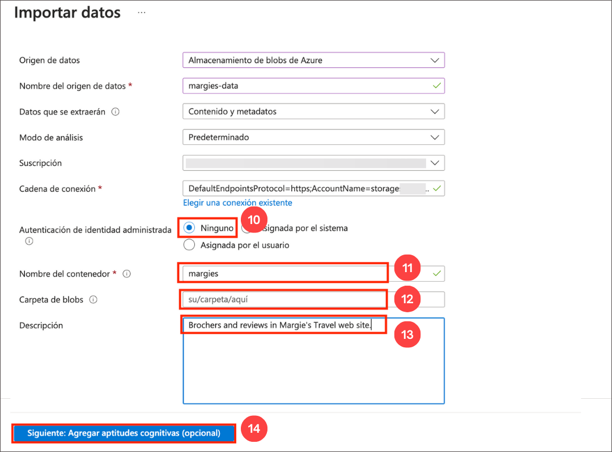

1. On **Add cognitive skills (Optional)** tab expand **Attach AI Services(1)**, within the section  select your **Azure AI Services (2)** resource.

     
   
1. Scroll down and expand **Add enrichments (1)** section and specify the following :
    
    - Change the **Skillset name** to **margies-skillset (2)**.
    - Select the checkbox for **Enable OCR and merge all text into merged_content field (3)**.
    - Ensure that the **Source data field** is set to **merged_content (4)**.
    - Leave the **Enrichment granularity level** as the **Source field (5)**, which sets the entire contents of the document being indexed, but note that you can change this to extract information at more granular levels, like pages or sentences.
  
      

    - Select the following enriched fields:

        | Cognitive Skill | Parameter | Field name |
        | --------------- | ---------- | ---------- |
        | Extract location names | | locations |
        | Extract key phrases | | keyphrases |
        | Detect language | | language |
        | Generate tags from images | | imageTags |
        | Generate captions from images | | imageCaption |

        
      
1. Double-check your selections (it can be difficult to change them later). Then proceed to the next step (*Customize target index*).

   
  
1. On **Customize target index** tab change the **Index name** to **margies-index (1)**.
   
1. Ensure that the **Key** is set to **metadata_storage_path (2)** and leave the **Suggester name** blank and **Search mode (3)** at its default value.

    
   
1. Make the following changes to the index fields, leaving all other fields with their default settings (**IMPORTANT**: you may need to scroll to the right to see the entire table):

    | Field name | Retrievable | Filterable | Sortable | Facetable | Searchable |
    | ---------- | ----------- | ---------- | -------- | --------- | ---------- |
    | metadata_storage_size | &nbsp;&nbsp;&nbsp;&nbsp;&nbsp;&nbsp;&#10004; | &nbsp;&nbsp;&nbsp;&nbsp;&nbsp;&nbsp;&#10004; | &nbsp;&nbsp;&nbsp;&nbsp;&nbsp;&nbsp;&#10004; | | |
    | metadata_storage_last_modified | &nbsp;&nbsp;&nbsp;&nbsp;&nbsp;&nbsp;&#10004; | &nbsp;&nbsp;&nbsp;&nbsp;&nbsp;&nbsp;&#10004; | &nbsp;&nbsp;&nbsp;&nbsp;&nbsp;&nbsp;&#10004; | | |
    | metadata_storage_name | &nbsp;&nbsp;&nbsp;&nbsp;&nbsp;&nbsp;&#10004; | &nbsp;&nbsp;&nbsp;&nbsp;&nbsp;&nbsp;&#10004; | &nbsp;&nbsp;&nbsp;&nbsp;&nbsp;&nbsp;&#10004; | | &nbsp;&nbsp;&nbsp;&nbsp;&nbsp;&nbsp;&#10004; |
    | metadata_author | &nbsp;&nbsp;&nbsp;&nbsp;&nbsp;&nbsp;&#10004; | &nbsp;&nbsp;&nbsp;&nbsp;&nbsp;&nbsp;&#10004; | &nbsp;&nbsp;&nbsp;&nbsp;&nbsp;&nbsp;&#10004; | &nbsp;&nbsp;&nbsp;&nbsp;&nbsp;&nbsp;&#10004; | &nbsp;&nbsp;&nbsp;&nbsp;&nbsp;&nbsp;&#10004; |
    | locations | &nbsp;&nbsp;&nbsp;&nbsp;&nbsp;&nbsp;&#10004; | &nbsp;&nbsp;&nbsp;&nbsp;&nbsp;&nbsp;&#10004; | | | &nbsp;&nbsp;&nbsp;&nbsp;&nbsp;&nbsp;&#10004; |
    | keyphrases | &nbsp;&nbsp;&nbsp;&nbsp;&nbsp;&nbsp;&#10004; | &nbsp;&nbsp;&nbsp;&nbsp;&nbsp;&nbsp;&#10004; | | | &nbsp;&nbsp;&nbsp;&nbsp;&nbsp;&nbsp;&#10004; |
    | language | &nbsp;&nbsp;&nbsp;&nbsp;&nbsp;&nbsp;&#10004; | &nbsp;&nbsp;&nbsp;&nbsp;&nbsp;&nbsp;&#10004; | | | |

    Use the below image to cross verify the option. 

     
   
1. Double-check your selections, paying particular attention to ensure that the correct **Retrievable**, **Filterable**, **Sortable**, **Facetable**, and **Searchable** options are selected for each field  (it can be difficult to change them later). Then proceed to the next step by clicking on **Next: Create an indexer**.

1. On the **Create an indexer** tab specify the following
      - Change the **Indexer name** to **margies-indexer (1)**.
      - Leave the **Schedule** set to **Once (2)**.
      - Expand the **Advanced options (3)** and ensure that the **Base-64 encode keys (4)** option is selected (generally, encoding keys make the index more efficient).
      
      - Select **Submit (5)** to create the data source, skillset, index, and indexer. The indexer is run automatically and runs the indexing pipeline, which:
          
          1. Extracts the document metadata fields and content from the data source.
          2. Runs the skillset of cognitive skills to generate additional enriched fields.
          3. Maps the extracted fields to the index.
      
            

1. On **Azure AI Search** resource page, expand **Search management (1)** select **Indexers (2)** which should show the newly created **margies-indexer (3)**.

     

1. Select **margies-indexer** . Wait a few minutes, and click **&orarr; Refresh** until the **Status** indicates success.

     

#### Task 5.2: Search the index

In this task, you'll learn to search and query the index created earlier:

1. At the top of the **Overview** page for your Azure AI Search resource, select **Search explorer**.

    
   
1. In Search explorer, in the **Query string** box, enter `*` (a single asterisk), and then select **Search**.

    

   >**Note**: This query retrieves all documents in the index in JSON format. Examine the results and note the fields for each document, which contain document content, metadata, and enriched data extracted by the cognitive skills you selected.

1. In the **View** menu, select **JSON view**.

   

1. Note that the JSON request for the search is shown, like this:

    ```json
    {
      "search": "*"
    }
    ```
   
   
1. Modify the JSON request to include the **count** parameter, as shown here:

    ```json
    {
      "search": "*",
      "count": true
    }
    ```

1. Submit the modified search. This time, the results include a **@odata.count** field at the top of the results that indicates the number of documents returned by the search.

1. Try the following query:

    ```json
    {
      "search": "*",
      "count": true,
      "select": "metadata_storage_name,metadata_author,locations"
    }
    ```

    >**Note**: This time, the results include only the file name, author, and any locations mentioned in the document content. The file name and author are in the **metadata_storage_name** and **metadata_author** fields, which were extracted from the source document. The **locations** field was generated by a cognitive skill.

1. Now try the following query string:

    ```json
    {
      "search": "New York",
      "count": true,
      "select": "metadata_storage_name,keyphrases"
    }
    ```

    >**Note**: This search finds documents that mention "New York" in any of the searchable fields and returns the file name and key phrases in the document.

1. Let's try one more query:

    ```json
    {
      "search": "New York",
      "count": true,
      "select": "metadata_storage_name",
      "filter": "metadata_author eq 'Reviewer'"
    }
    ```

    >**Note**: This query returns the filename of any documents authored by *Reviewer* that mention "New York".

      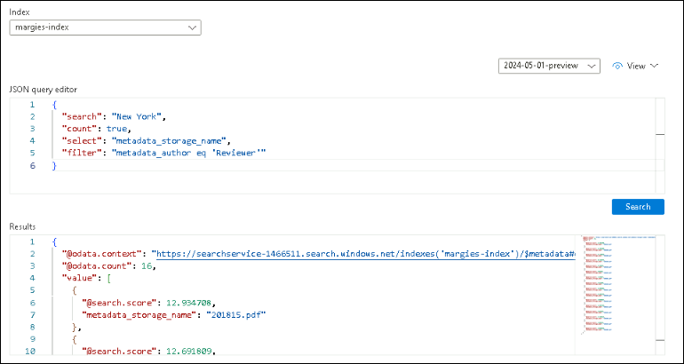 
  
### Task 6: Explore and modify the definitions of search components

The components of the search solution are based on JSON definitions, which you can view and edit in the Azure portal.

While you can use the portal to create and modify search solutions, it's often desirable to define the search objects in JSON and use the Azure AI Service REST interface to create and modify them.

#### Task 6.1: Get the endpoint and key for your Azure AI Search resource

In this task, you're preparing to execute CURL commands in Visual Studio Code to interact with Azure AI Service's REST interface:

1. In the Azure portal, return to the **Overview** page for your **Azure AI Search** resource, and in the top section of the page, find the **Url** for your resource (which looks like **https://resource_name.search.windows.net**) and copy it to the clipboard.

    
   
1. In Visual Studio Code, in the Explorer pane, expand the **02-search-skill (1)** folder and its **update-search (2)** subfolder, and select **update-search.cmd (3)** to open it. You will use this script file to run *CURL* commands that submit JSON to the Azure AI Service REST interface.

     
   
1. In **update-search.cmd**, replace the **YOUR_SEARCH_URL** placeholder with the URL you copied to the clipboard.

     
     
1. In the Azure portal, back to **Overview** page for your **Azure AI Search** resource expand **Settings** and select **Keys** and copy the **Primary admin key** to the clipboard.

    
   
1. Back  to **Visual Studio Code**, replace the **YOUR_ADMIN_KEY** placeholder with the key you copied to the clipboard.

      
   
1. Save the changes to **update-search.cmd** (but don't run it yet!)

     
   
#### Task 6.2: Review and modify the skillset

In this task, you will be configuring a skillset (skillset.json) in Visual Studio Code to integrate Azure AI Services with Azure AI Search:

1. In Visual Studio Code, in the **update-search** folder, open **update-skillset.json**. This shows a JSON definition for **margies-skillset**.

      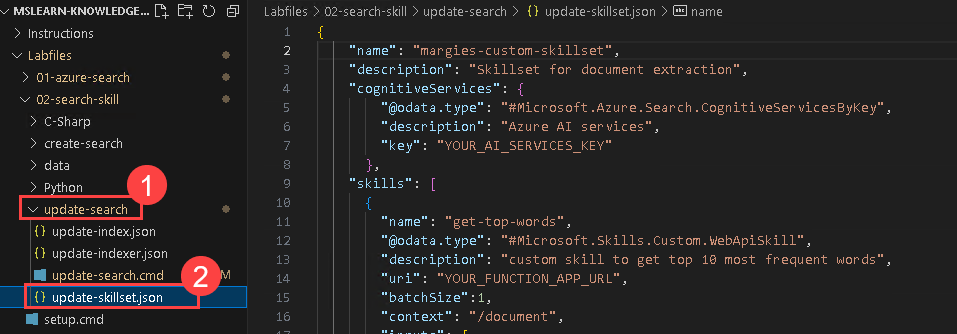
   
1. At the top of the skillset definition, note the **cognitiveServices** object, which is used to connect your Azure AI Services resource to the skillset.

1. In the Azure portal, search for Azure AI Services resource (<u>not</u> your Azure AI Search resource!)

      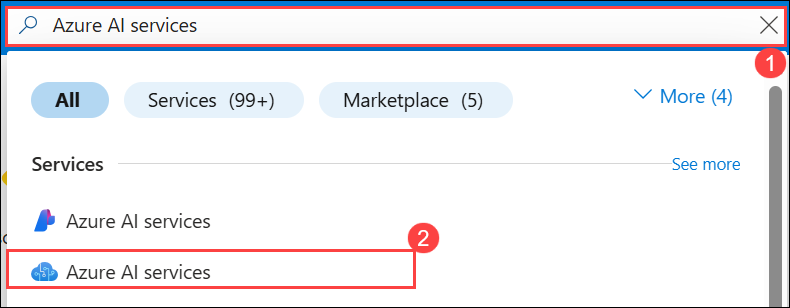

1. From the left navigate to Azure AI **Multi-Service-Account** and select the **challengeservice**.

      

1. On **Azure AI Multi-Services-Account** overview page, from the left navigation pane expand **Resource Management** select **Keys and Endpoints**. Then copy **Key 1** to the clipboard.

    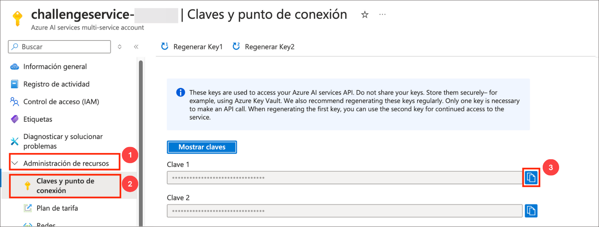
   
1. In Visual Studio Code, in **update-skillset.json**, replace the **YOUR_COGNITIVE_SERVICES_KEY** placeholder with the Azure AI Services key you copied to the clipboard.

   
   
1. Scroll through the JSON file, noting that it includes definitions for the skills you created using the Azure AI Search user interface in the Azure portal. At the bottom of the list of skills, an additional skill has been added with the following definition:

    ```
      {
        "@odata.type": "#Microsoft.Skills.Text.V3.SentimentSkill",
        "name": "get-sentiment",
        "description": "New skill to evaluate sentiment",
        "context": "/document",
        "defaultLanguageCode": "en",
        "inputs": [
          {
            "name": "text",
            "source": "/document/merged_content"
          },
          {
            "name": "languageCode",
            "source": "/document/language"
          }
        ],
        "outputs": [
          {
            "name": "sentiment",
            "targetName": "sentimentLabel"
          }
        ]
      }
    ```

   >**Note**: The new skill is named **get-sentiment**, and for each **document** level in a document, it will evaluate the text found in the **merged_content** field of the document being indexed (which includes the source content as well as any text extracted from images in the content). It uses the extracted **language** of the document (with a default of English) and evaluates a label for the sentiment of the content. Values for the sentiment label can be "positive", "negative", "neutral", or "mixed". This label is then output as a new field named **sentimentLabel**.

1. Save the changes you've made to **update-skillset.json**.

#### Task 6.3 : Review and modify the index

In this task, you will review the update-index.json file in Visual Studio Code which shows a JSON definition for **margies-custom-index**

1. In Visual Studio Code, in the **update-search** folder, open **update-index.json**. This shows a JSON definition for **margies-custom-index**.

     
   
1. Scroll through the index and view the field definitions. Some fields are based on metadata and content in the source document, and others are the results of skills in the skillset.
1. At the end of the list of fields that you defined in the Azure portal, note that two additional fields have been added:

    ```
    {
        "name": "sentiment",
        "type": "Edm.String",
        "facetable": false,
        "filterable": true,
        "retrievable": true,
        "sortable": true
    },
    {
        "name": "url",
        "type": "Edm.String",
        "facetable": false,
        "filterable": true,
        "retrievable": true,
        "searchable": false,
        "sortable": false
    }
    ```

1. The **sentiment** field will be used to add the output from the **get-sentiment** skill that was added to the skillset. The **url** field will be used to add the URL for each indexed document to the index, based on the **metadata_storage_path** value extracted from the data source. Note that the index already includes the **metadata_storage_path** field, but it's used as the index key and Base-64 encoded, making it efficient as a key but requiring client applications to decode it if they want to use the actual URL value as a field. Adding a second field for the unencoded value resolves this problem.

#### Task 6.4: Review and modify the indexer

In this task, you will review the **update-indexer.json** file in Visual Studio Code which shows a JSON definition for **margies-custom-indexer**

1. In Visual Studio Code, in the **update-search** folder, open **update-indexer.json**. This shows a JSON definition for **margies-custom-indexer**, which maps fields extracted from document content and metadata (in the **fieldMappings** section) and values extracted by skills in the skillset (in the **outputFieldMappings** section) to fields in the index.

     
    
1. In the **fieldMappings** list, note the mapping for the **metadata_storage_path** value to the base-64 encoded key field. This was created when you assigned the **metadata_storage_path** as the key and selected the option to encode the key in the Azure portal. Additionally, a new mapping explicitly maps the same value to the **url** field, but without the Base-64 encoding:

    ```
    {
        "sourceFieldName" : "metadata_storage_path",
        "targetFieldName" : "url"
    }
    
    ```

    > **Note**: All of the other metadata and content fields in the source document are implicitly mapped to fields of the same name in the index.

1. Review the **ouputFieldMappings** section, which maps outputs from the skills in the skillset to index fields. Most of these reflect the choices you made in the user interface, but the following mapping has been added to map the **sentimentLabel** value extracted by your sentiment skill to the **sentiment** field you added to the index:

    ```
    {
        "sourceFieldName": "/document/sentimentLabel",
        "targetFieldName": "sentiment"
    }
    ```

#### Task 6.5 : Use the REST API to update the search solution

In this task, you will update JSON definitions in Visual Studio Code for Azure AI Search to include new fields like sentiment analysis results and document URLs. Run modify-search.cmd to apply changes and start indexing. Monitor progress in Azure portal's Indexers section for completion and document size warnings during sentiment analysis.

1. Right-click the **update-search** folder and select **open an integrated terminal**.

     
   
1. In the terminal pane for the **update-search** folder, enter the following command to run the **update-search.cmd** script, which submits the JSON definitions to the REST interface and initiates the indexing.

    ```
    .\update-search
    ```

1. When the script has finished, return to the **Overview** page for your **Azure AI Search** from the left navigation pane expand **Search management** and select **Indexers**. Then periodically select **Refresh** to track the progress of the indexing operation. It may take a minute or so to complete.

   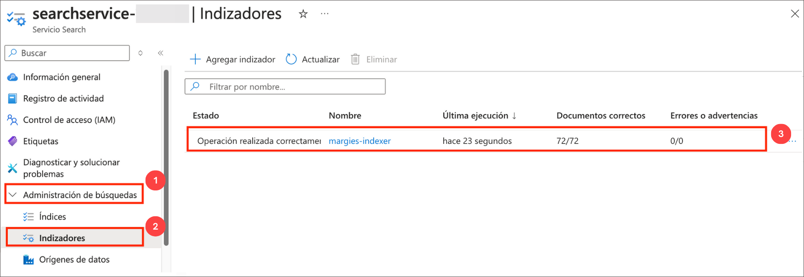

    >**Note**: There may be some warnings for a few documents that are too large to evaluate sentiment. Often, sentiment analysis is performed at the page or sentence level rather than the full document, but in this scenario, most of the documents, particularly the hotel reviews, are short enough for useful document-level sentiment scores to be evaluated.

#### Task 6.6 : Query the modified index
In this task, you'll perform a query in Azure AI Search to retrieve URLs, sentiment, and key phrases for documents mentioning "London" with positive sentiment, authored by "Reviewer".

1. At the top of the overview blade for your Azure AI Search resource, select **Search explorer**.
1. In Search explorer, in the **Query string** box, submit the following JSON query:

    ```json
    {
      "search": "London",
      "select": "url,sentiment,keyphrases",
      "filter": "metadata_author eq 'Reviewer' and sentiment eq 'positive'"
    }
    ```

   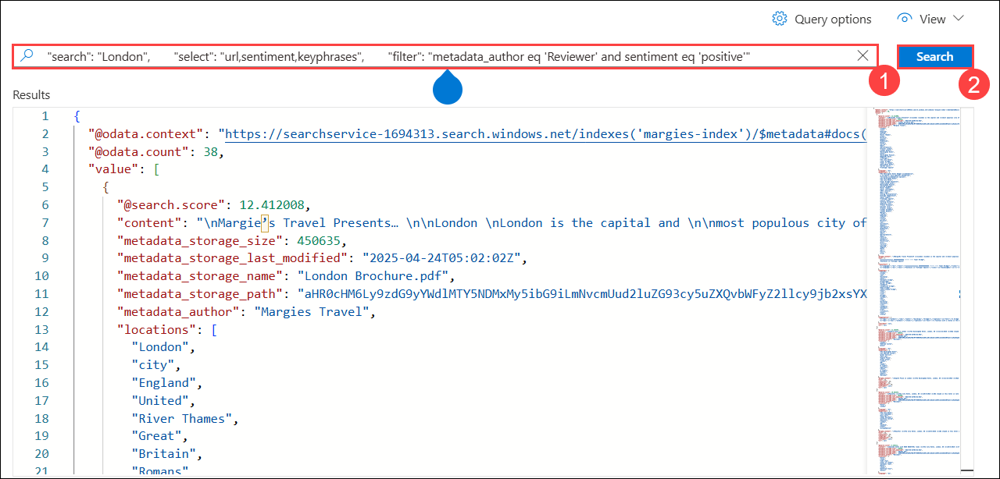

    This query retrieves the **url**, **sentiment**, and **keyphrases** for all documents that mention *London* authored by *Reviewer* that has a positive **sentiment** label (in other words, positive reviews that mention London).

1. Close the **Search explorer** page to return to the **Overview** page.

### Task 7: Create a search client application

Now that you have a useful index, you can use it from a client application. You can do this by consuming the REST interface, submitting requests, and receiving responses in JSON format over HTTP, or you can use the software development kit (SDK) for your preferred programming language. In this exercise, we'll use the SDK.

> **Note**: You can choose to use the SDK for either **C#** or **Python**. In the steps below, perform the actions appropriate for your preferred language.

#### Task 7.1 : Get the endpoint and keys for your search resource

In this task, you'll retrieve the endpoint URL and keys for your Azure AI Search resource from the Azure portal, essential for managing and querying your search resources in upcoming tasks.

1. In the Azure portal, navigate back to **Azure AI Search**. On the Overview page for the **Azure AI Search** resource, note the url value, which should be similar to **https://your_resource_name.search.windows.net**. Please record this value in Notepad as it will be required in upcoming tasks.

    
   
1. From the left navigation expand **Settings** select **Keys**, note that there are two **admin** keys and a single **Manage query keys** key.

   >**Note**: An *admin* key is used to create and manage search resources
   >**Note**: An *Manage query keys* key is used by client applications that only need to perform search queries.

    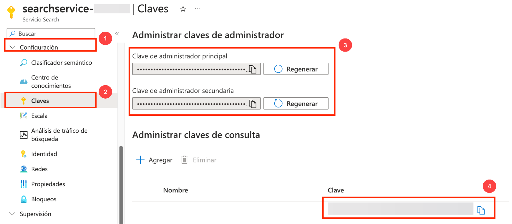

1.  Please copy the **Manage query keys** to the clipboard and record it in Notepad, as it will be needed for upcoming tasks.

     
    
#### Task 7.2 : Prepare to use the Azure AI Search SDK

In this task, you'll prepare your development environment in Visual Studio Code to integrate with Azure AI Search SDK by installing the necessary packages (Azure.Search.Documents for C# or azure-search-documents for Python) and configuring endpoint URL and query key in the respective configuration files.

1. In Visual Studio Code, in the **Explorer** pane, browse to the **22-create-a-search-solution** folder and expand the **C-Sharp** or **Python** folder depending on your language preference.
1. Right-click the **margies-travel** folder and open an integrated terminal. Then install the Azure AI Search SDK package by running the appropriate command for your language preference:
   > **Note**: Please ensure the necessary extensions are already installed in the VS Code.

    **C#**
    
    ```
    dotnet add package Azure.Search.Documents --version 11.1.1
    ```
    **Python**
    
    ```
    pip install azure-search-documents==11.0.0
    ```
    
1. View the contents of the **margies-travel** folder, and note that it contains a file for configuration settings:
    - **C#**: appsettings.json
    - **Python**: .env

1. Open the configuration file and update the **YOUR_SEARCH_ENDPOINT**  with the **Azure AI Search** *Endpoint URL* link and  **YOUR_SEARCH_QUERY_KEY** values with **Manage query keys** which you recorded in previous tasks and save the changes.

    - **C#**: appsettings.json

       

    - **Python**: .env
  
      

#### Task 7.3 : Explore code to search an index

In this task, you'll explore the code for a web application (C# ASP.NET Razor or Python Flask) within the margies-travel folder. You'll review how it interacts with Azure AI Search SDK to perform search queries, configure search clients, and manage search results, including filtering, sorting, and highlighting content fields.

The **margies-travel** folder contains code files for a web application (a Microsoft C# *ASP.NET Razor* web application or a Python *Flask* application), which includes search functionality.

1. Open the following code file in the web application, depending on your choice of programming language:
    - **C#**:Pages/Index.cshtml.cs
    - **Python**: app.py

1. Near the top of the code file, find the comment **Import search namespaces**, and note the namespaces that have been imported to work with the Azure AI Search SDK:

1. In the **search_query** function, find the comment **Create a search client**, and note that the code creates a **SearchClient** object using the endpoint and query key for your Azure AI Search resource:
   
1. In the **search_query** function, find the comment **Submit search query** and review the code to submit a search for the specified text with the following options:
    - A *search mode* that requires **all** of the individual words in the search text to be found.
    - The total number of documents found by the search is included in the results.
    - The results are filtered to include only documents that match the provided filter expression.
    - The results are sorted into the specified sort order.
    - Each discrete value of the **metadata_author** field is returned as a *facet* that can be used to display pre-defined values for filtering.
    - Up to three extracts of the **merged_content** and **imageCaption** fields with the search terms highlighted are included in the results.
    - The results include only the fields specified.

#### Task 7.4 : Explore code to render search results

In this task, you'll delve into the web application's code (either C# ASP.NET Razor or Python Flask) to understand how it presents search results:

The web app already includes code to process and render the search results.

1. Open the following code file in the web application, depending on your choice of programming language:
    - **C#**:Pages/Index.cshtml
    - **Python**: templates/search.html
1. Examine the code, which renders the page on which the search results are displayed. Observe that:
    - The page begins with a search form that the user can use to submit a new search (in the Python version of the application, this form is defined in the **base.html** template), which is referenced at the beginning of the page.
    - A second form is then rendered, enabling the user to refine the search results. The code for this form:
        - Retrieves and displays the count of documents from the search results.
        - Retrieves the facet values for the **metadata_author** field and displays them as an option list for filtering.
        - Creates a drop-down list of sort options for the results.
    - The code then iterates through the search results, rendering each result as follows:
        - Display the **metadata_storage_name** (file name) field as a link to the address in the **url** field.
        - Displaying *highlights* for search terms found in the **merged_content** and **imageCaption** fields to help show the search terms in context.
        - Display the **metadata_author**, **metadata_storage_size**, **metadata_storage_last_modified**, and **language** fields.
        - Display the **sentiment** label for the document. Can be positive, negative, neutral, or mixed.
        - Display the first five **keyphrases** (if any).
        - Display the first five **locations** (if any).
        - Display the first five **imageTags** (if any).

#### Task 7.5 : Run the web app

In this task, you'll be running the Margie's Travel web application locally, searching for specific terms like "London hotel" and "quiet hotel in New York", refining search results using filters and sorting options based on sentiment, observing keyword and location identification in documents.


 1. Return to the integrated terminal for the **margies-travel** folder and enter the following command to run the program:
    
    **C#**
    
    ```
    dotnet run
    ```
    > **Note:** If the command fails, click on the provided link in the error message to download the latest version of the Microsoft ASP.NET Core Shared Framework. After that, download and install .NET Core, and then run the command again.
        
    **Python**
     
    ```
    pip install flask
    flask run
    ```
    > **Note:** If the command fails, **run pip Install python-dotenv** command and then run the command again.

1. Open the another tab in edge browse following the link (*http://localhost:5000/* or *http://127.0.0.1:5000/*) to open the **Margie's Travel** site in a web browser.

    
   
1. On the **Margie's Travel** website, enter **London hotel (1)** into the search box and click **Search (2)**.

    
   
1. Review the search results. They include the file name (with a hyperlink to the file URL), an extract of the file content with the search terms (*London* and *hotel*) emphasized, and other attributes of the file from the index fields.

    
   
1. Observe that the results page includes some user interface elements that enable you to refine the results. These include:
    
    - A *Filter by author* based on a facet value for the **metadata_author** field. This demonstrates how you can use *facetable* fields to return a list of *facets* - fields with a small set of discrete values that can be displayed as potential filter values in the user interface.
    
    - A **Sort by** ability to *order* the results based on a specified field and sort direction (ascending or descending). The default order is based on *relevancy*, which is calculated as a **search.score()** value based on  a *scoring profile* that evaluates the frequency and importance of search terms in the index fields.

1. Select the **Reviewer** filter and the **Positive to negative** sort option, and then select **Refine Results**.

    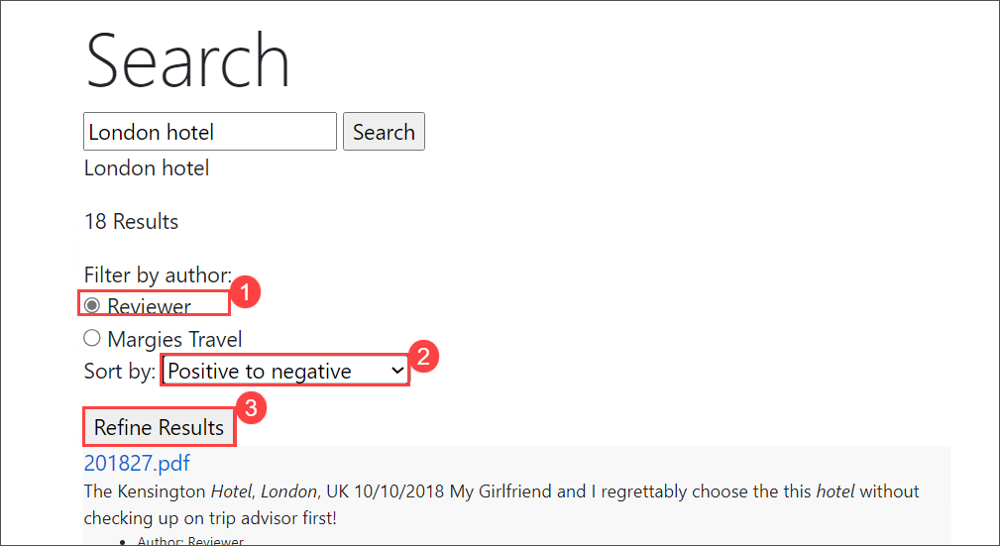
   
1. Observe that the results are filtered to include only reviews and sorted based on the sentiment label.
   
    
   
1. On the **Margie's Travel** website, enter **quiet hotel in New York (1)** into the search box and click **Search (2)**.

    
   
1. Try the following search terms:
    - **Tower of London** (observe that this term is identified as a *key phrase* in some documents).
    - **skyscraper** (observe that this word doesn't appear in the actual content of any documents but is found in the *image captions* and *image tags* that were generated for images in some documents).
    - **Mojave desert** (observe that this term is identified as a *location* in some documents).

1. Close the browser tab containing Margie's Travel website and return to Visual Studio Code. Then, in the Python terminal for the **margies-travel** folder (where the dotnet or flask application is running), enter Ctrl+C to stop the app.


## Success criteria:


To successfully complete this challenge, you must:

   - Deploy the Azure Search Service and Azure Storage Account.
   - Add data to the storage account.
   - Index the documents in Azure AI Search using the Azure portal.
   - Customize the index and configure the indexer in Azure AI Search.
   - Modify and explore search components using JSON definitions.
   - Utilize the Azure AI Search SDK to create a client application for search.
   - Run the web application locally, perform searches, and refine search results effectively.


## Additional Resources:

- Refer to [What is Azure AI Search](https://learn.microsoft.com/en-us/azure/search/search-what-is-azure-search) for reference.
- [What are Indexes in Azure AI Search?](https://learn.microsoft.com/en-us/azure/search/search-what-is-an-index)
- [Searching document text at scale using Azure Cognitive Search](https://benalexkeen.com/searching-document-text-at-scale-using-azure-cognitive-search/)

To learn more about Azure AI Search, see the [Azure AI Search documentation](https://docs.microsoft.com/azure/search/search-what-is-azure-search).

## Proceed with the next Challenge by clicking on **Next**>>.
