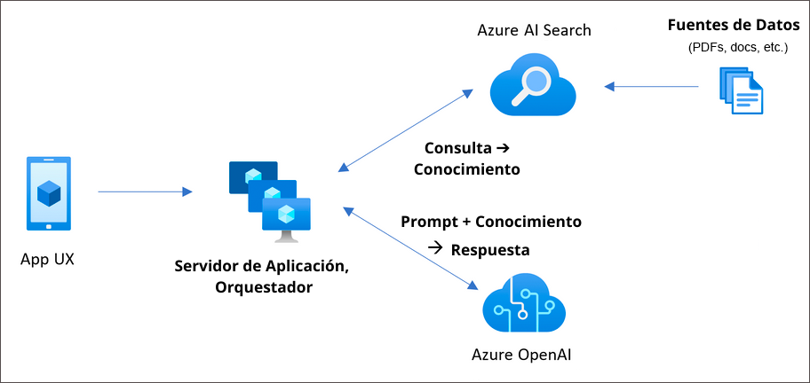
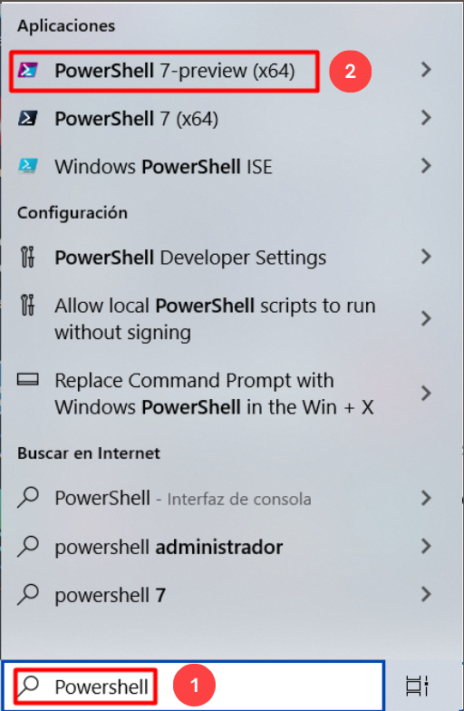

# Desafío 03: Implementar una Aplicación de Chat con Tecnología de IA

### Tiempo Estimado: 150 minutos

### Introducción:

En este desafío, implementará una aplicación de chat impulsada por IA diseñada específicamente para Contoso Electronics. Esta aplicación, creada con React para el frontend y Python para el backend, presenta funciones avanzadas como interfaces de chat y preguntas y respuestas (Q&A), todas ellas mejoradas con capacidades de IA. Es una excelente oportunidad para que explore la integración del Servicio Azure OpenAI con el modelo GPT-3.5 Turbo y Azure Cognitive Search para una indexación y recuperación de datos eficientes.

Esta aplicación de ejemplo es más que una interfaz de chat; demuestra el patrón de Generación Aumentada de Recuperación, ofreciendo una experiencia enriquecida similar a ChatGPT sobre los datos propios de Contoso. Entre las características de la aplicación se incluyen la evaluación de la confiabilidad de las respuestas con citas, el seguimiento de las fuentes de contenido, la preparación de datos, la construcción de prompts y la orquestación de la interacción entre el modelo ChatGPT y Cognitive Search. También encontrará configuraciones ajustables en la UX para la experimentación y el seguimiento y monitoreo del rendimiento opcional con Application Insights.

En este desafío, su tarea consiste en desplegar esta completa solución de chat para Contoso, permitiéndoles evaluar sus capacidades e integrarla en su entorno. El repositorio incluye datos de ejemplo que representan una solución integral lista para usar. Esta aplicación es una herramienta valiosa para que los empleados de Contoso consulten sobre los beneficios de la empresa, las políticas internas, las descripciones de los puestos y los roles.

Usará Terraform para implementar la aplicación de chat.

La aplicación de chat se integra perfectamente con diferentes servicios de Azure para brindar una experiencia de usuario inteligente. A continuación, se incluye una descripción general simple de cada servicio que utiliza la aplicación:

- **App Service:** Aloja la aplicación de chat, garantizando que pueda responder a los prompts enviados por los usuarios a partir de los datos relacionados cargados.
- **Application Insights:** Monitorea de manera proactiva el rendimiento de la aplicación, ocupándose de los problemas antes de que se vuelvan importantes.
- **Document Intelligence:** Utilizando IA, comprende el contenido de los documentos cargados, lo que hace que la información del usuario sea más perspicaz.
- **Azure OpenAI:** Mejora las capacidades de la aplicación con respuestas y comprensión del lenguaje natural.
- **Shared Dashboard:** Actúa como un eje central para la colaboración en equipo y el uso compartido de datos.
- **Smart Detector Alert Rule:** Supervisa el estado de salud de la aplicación, notificando al equipo si surge algún problema.
- **Search Service:** Brinda a los usuarios una funcionalidad de búsqueda dinámica y eficiente dentro de la aplicación.
- **Área de Trabajo de Log Analytics:** Rastrea y analiza la actividad de la aplicación, ofreciendo información y registros valiosos.
- **App Service Plan:** Optimiza la asignación de recursos para un rendimiento óptimo de la aplicación.
- **Cuenta de almacenamiento:** Almacena de forma segura los datos que utilizará el servicio Azure AI Search para proporcionar las entradas a la aplicación de chat.

Juntos, estos servicios crean una aplicación de chat con capacidad de respuesta que combina funciones de IA, capacidades de monitoreo y gestión de datos eficiente, lo que le brinda a Contoso una experiencia de usuario excepcional.

## Diagrama de arquitectura:



## Guía de Soluciones:

## Requisitos previos
   
1. Inicie Powershell 7 +.
   
2. Asegúrese de ejecutar `pwsh.exe` desde una terminal de PowerShell. Si esto falla, es probable que deba actualizar PowerShell.

## Tarea 1: Implementar la Aplicación de Chat con Tecnología de IA.

En esta tarea, aprenderá el proceso de Implementación de la infraestructura.

1. En **LabVM**, en la barra de Búsqueda de Windows, escriba **Powershell** y seleccione **PowerShell 7-preview (x64)** y, luego, **Ejecutar como administrador**.

    
   
1. Ejecute el siguiente comando para iniciar sesión en Azure:

   ```
   azd auth login
   ```

   - Después de ejecutar el comando anterior, se abrirá una pestaña del navegador web y se le solicitará que inicie sesión en Azure. Seleccione la cuenta de Azure en la que había iniciado sesión anteriormente o, si se le solicita, proporcione su nombre de usuario y contraseña de Azure. Una vez que se complete la autenticación, puede regresar a PowerShell 7.

   - Regrese a PowerShell 7, donde debería ver el mensaje **Logged in to Azure**.

     

1. Una vez que haya iniciado sesión correctamente, ejecute el siguiente comando para descargar el código del proyecto:

   ```
   azd init -t azure-search-openai-demo
   ```
   >**Nota**: El comando anterior inicializará un repositorio git, eliminando la necesidad de clonarlo posteriormente.

1. Cuando se le solicite **Continue iniatializing an app in `C:\Users\demouser`**, escriba **y / yes (1)**.

   

1. Si se le solicita **What would you like to do with these files?**, elija **Overwrite with versions from template**.

   

1. Ingrese un nuevo nombre de entorno:  **activategenai**

   >**Nota**: Esto creará una nueva carpeta en la carpeta `.azure` y la establecerá como el entorno activo para cualquier llamada posterior a azd.

   

1. Verifique que la inicialización del nuevo proyecto se haya realizado correctamente.

   
   
1. Ejecute el siguiente comando para aprovisionar recursos de Azure y desplegarlos, incluyendo la construcción del índice de búsqueda basado en los archivos que se encuentran en la carpeta `./data`

   ```
   azd up
   ```
   >**Nota**: En caso de que aparezca el mensaje **ERROR: not logged in, ejecute azd auth login para iniciar sesión** y seleccione su **Cuenta de Azure** nuevamente.

1. Agregue los siguientes detalles cuando se le solicite:

   - Seleccionar una suscripción de Azure para usar (Select an Azure Subscription to use): presione **Enter** para elegir la **suscripción predeterminada (1)**
   - Seleccione una Ubicación de Azure para usar (Select an Azure Location to use): **Seleccione cualquier ubicación que desee usar (2)**
   - Ingrese un valor para el parámetro de infraestructura 'documentIntelligenceResourceGroupLocation' (Enter a value for the 'documentIntelligenceResourceGroupLocation' infrastructure parameter): **Seleccione cualquier ubicación que desee usar (3)**
   - Ingrese un valor para el parámetro de infraestructura 'openAIResourceGroupLocation' (Enter a value for the 'openAIResourceGroupLocation' infrastructure parameter): **Seleccione cualquier ubicación que desee usar (4)**
     
      

      

1. Una vez que la aplicación se haya implementado correctamente, verá una URL impresa en la consola. Copie y explore la URL para interactuar con la aplicación en su navegador. Tendrá el siguiente aspecto:

    
    
 
    >**Nota**: Puede que transcurran 30 minutos desde que vea "SUCCESS" hasta que la aplicación se implemente por completo. Si ve una pantalla de bienvenida de "Python Developer" o una página de error, espere un momento y actualice la página.

## Criterios de Éxito:

- Implementación exitosa de Chat App.
- Valide si los siguientes servicios se implementaron correctamente en el RG (Grupo de recursos).
  - App Service
  - Document Intelligence
  - Azure OpenAI
  - Shared Dashboard
  - Smart Detector Alert Rule
  - Search Service
  - Área de Trabajo de Log Analytics (Log Analytics Workspace)
  - App Service Plan
  - Storage Account (Cuenta de Almacenamiento)
- Valide si los datos se insertan en el contenedor de almacenamiento denominado `content`.
- La aplicación de Chat debe ser accesible mediante Azure App Service.

## Recursos Adicionales:

- Consulte el [repositorio de GitHub de demostración de Azure Search OpenAI](https://github.com/cmendible/azure-search-openai-demo) para obtener información detallada sobre la arquitectura.
- [Azure copilot](https://learn.microsoft.com/en-us/azure/copilot/overview)

## Continúe con el próximo Desafío haciendo clic en **Siguiente**>>.
