# Challenge 05: Serverless Document Batch Processing 

## Introdução:

Bem-vindo a um desafio crucial em que a Contoso Ltd. visa aprimorar seu aplicativo de bate-papo com tecnologia de IA com um sistema de processamento de documentos robusto. Este desafio se concentra na criação de uma solução sem servidor para processar novos documentos, traduzi-los conforme necessário e armazená-los perfeitamente no Azure AI Search. Este sistema garantirá que esses documentos estejam continuamente disponíveis para consumo pelo Azure OpenAI, aprimorando a base de conhecimento e a precisão de resposta do aplicativo de bate-papo.

Com base em suas conquistas anteriores no balanceamento de carga de recursos do Azure OpenAI, você agora embarcará em uma jornada para otimizar o processamento de documentos. Isso envolve configurar um serviço de tradução, criar uma arquitetura sem servidor para processamento em lote usando serviços do Azure e aproveitar tecnologias como Form Recognizer e Azure AI Search. Sua tarefa é garantir que os documentos recém-adicionados sejam prontamente processados, analisados ​​e indexados, tornando-os prontamente disponíveis para a IA do aplicativo de bate-papo utilizar.

Este desafio se desdobra em três estágios principais: tradução de idioma, processamento em lote de documentos sem servidor usando serviços do Azure e aproveitamento de recursos avançados como Form Recognizer e pesquisa de IA. Começamos traduzindo arquivos para atender aos requisitos de idioma. Em seguida, você implanta uma arquitetura sem servidor, utilizando serviços do Azure, para processamento eficiente de documentos em lote. Você treina e testa nosso modelo, estabelece um pipeline para converter documentos em um formato Form Recognizer e traz o serviço de pesquisa de IA do Azure para verificar a presença de documentos específicos no conjunto de dados processados ​​de onde eles podem ser usados ​​pelo Azure OpenAI.

Você utilizará o Form Recognizer Service e o Business Process Automation (BPA) Accelerator para construir pipelines em vários serviços do Azure, criando uma solução de processamento de documentos perfeita. Este desafio é um passo em direção à concretização de uma solução de IA que pode se adaptar e crescer com as necessidades de negócios da Contoso.

# Solution Guide

### Tarefa 1: traduzir os documentos usando o Translate

Nesta tarefa, você configurará os recursos do Azure para o Azure AI Services. Isso inclui registrar provedores, criar um novo serviço do Azure AI, aceitar os termos do Responsible AI, bifurcar um repositório do GitHub, gerar um Personal Access Token (PAT) e implantar recursos no Azure por meio do repositório do GitHub usando parâmetros e configurações especificados.

1. Na página do Portal do Azure, na caixa Pesquisar recursos, serviços e documentos (G+/) na parte superior do portal, insira **Assinaturas (1)** e selecione **Assinaturas (2)** em serviços.

    

1. Selecione a **Assinatura** existente.

    

1. No painel de navegação esquerdo, expanda **Configurações (1)** e selecione **Provedores de Recursos (2)**, marque **O status do Microsoft DocumentDB** está marcado como **"Registrado" (3)**.Se marcado como **NãoRegistrado**, selecione **Microsoft DocumentDB** e clique em **Registrar** no menu superior.

    **Observação**: *Este processo pode levar vários segundos ou minutos; certifique-se de atualizar todo o navegador periodicamente.*

    

1. Na página do Portal do Azure, na caixa Pesquisar recursos, serviços e documentos (G+/) na parte superior do portal, insira **Conta multisserviço de serviços do Azure AI (1)** e selecione **Conta multisserviço de serviços do Azure AI (2)** em serviços.

    

1. Na lâmina **Azure Al services Azure Al services multi-service account**, clique em **Create**.

    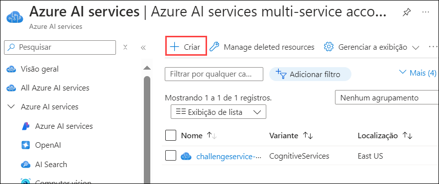

1. Especifique os seguintes detalhes para criar um **Azure AI service** e clique na aba **Review + create (7)**.

    | **Option** | **Value** |
    | ------------------ | ----------------------------------------------------- |
    | Subscription | Deixe o padrão **(1)** |
    | Resource Group | **ODL-GenAI-CL-xxxxxx-Activate-GenAI** **(2)** |
    | Name | *Digite um nome exclusivo* para seu serviço de pesquisa ou use o formato **AI-Service-xxxxxx** (substitua **xxxxxx** por ID de implantação **(3)** |
    | Localização | Use o mesmo local que o grupo de recursos **(4)** |
    | Nível de preço | Padrão S0 **(5)** |
    | Ao marcar esta caixa, reconheço que li e entendi todos os termos abaixo | Selecione a **Caixa de seleção** **(6)**|
    
    >**Observação**: aqui, xxxxxx se refere à ID de implantação

    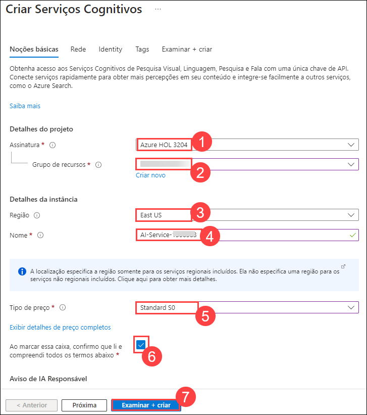

1. Assim que a validação for bem-sucedida na guia **Revisar + criar**, clique em **Criar** e aguarde a conclusão da implantação.

1. Para garantir que **Aceitamos os termos e condições para a IA responsável**: devemos iniciar a criação de uma **conta multisserviço do Azure AI Services** no portal do Azure para revisar e reconhecer os termos e condições.

    >**Observação**: Documento de referência: [Início rápido: criar um recurso de serviços cognitivos usando o portal do Azure](https://docs.microsoft.com/en-us/azure/cognitive-services/cognitive-services-apis-create-account?tabs=multiservice%2Cwindows). Depois de aceito, você pode criar recursos subsequentes usando qualquer ferramenta de implantação (SDK, CLI ou modelo ARM, etc.) na mesma assinatura do Azure.

1. Navegue até `https://github.com/CloudLabs-MOC/business-process-automation` e clique em **Entrar**, depois forneça seu **Nome de usuário do GitHub** e **Senha** pessoais e clique em **Entrar**.

    
    
    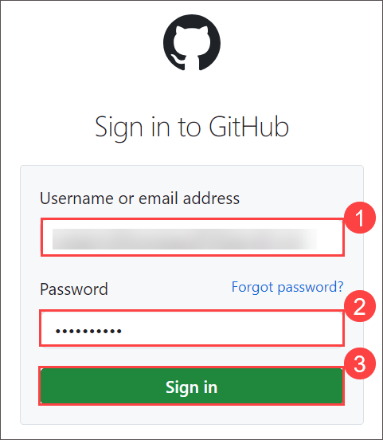

1. Depois de entrar, selecione **fork (1)** para bifurcar o repositório e, em **Criar um novo fork**, clique em **Criar fork (2)**.

    
    
    

1. Clique no seu **perfil**, que está no topo da sua mão direita, e selecione **Configurações**.

    

1. Role para baixo até o final e selecione **Configurações do desenvolvedor**.

    

1. No painel de navegação esquerdo, expanda **Tokens de acesso pessoal (1)** e selecione **Tokens (clássico) (2)**. Na página **Tokens de acesso pessoal**, clique em **Gerar novo token (3)** e escolha **Gerar novo token (clássico) (4)**.

    

1. Forneça os seguintes detalhes:

    - Nota: **PAT (1)**
    - Expiração: **7 dias (2)**
    
       

    - Selecione os escopos: Selecione todos os escopos **repo, workflow, write:packages, delete:packages, admin:org, admin:public_key, admin:repo_hook, admin:org_hook, gist,notifications, user, delete_repo, write:discussion, admin:enterprise, audit_log, codespace, copilot, project, admin:gpg_key, admin:ssh_signing_key** e clique em **Genearte token**.

       
    
       
    
       

       >**Link de referência**: [Obtenha um token de nível de fluxo de trabalho (clássico)](https://docs.github.com/en/authentication/keeping-your-account-and-data-secure/creating-a-personal-access-token)

1. Copie o **token PAT** e cole-o em um bloco de notas.

    

1. Clique no botão "Implantar no Azure" que corresponde ao seu ambiente.

    ### Com OpenAI
    

1. Lâmina de implantação personalizada, especifique o seguinte e outros parâmetros podem manter os valores padrão.

    - Grupo de recursos: **ODL-GenAI-CL-xxxxxx-Activate-GenAI**
    - Token do repositório: cole o token PAT que você criou e registrou na etapa anterior.
    - URL do repositório: cole a URL da **conta bifurcada do Github**
    
    

    >**Observação**: certifique-se de que a região primária esteja definida como EASTUS2
    
    

    >**Observação**: (você pode obter a URL clicando no perfil no canto direito e, em seguida, selecionar **Seus repositórios**, clicar em **business-process-automation** e, na barra superior, copiar a URL da **conta do Github**)
    
    

1. Clique em **Revisar + criar** e **Criar**.

1. Aguarde a conclusão da implantação e clique em **Ir para o grupo de recursos**.

1. Verifique se todos os recursos foram implantados sem problemas.

    
   
#### Task 1.2 - Create Azure Blob Storage containers

In this task, you'll learn how to create a container in an existing storage account where the documents that need to be searched are stored.

1. On Azure Portal page, in **Search resources, services and docs (G+/)** box at the top of the portal, enter **Storage account**, and then select **Storage account** under services.

1. Select the storage account that is created from the resources that were deployed in the previous task.

1. In the storage account overview blade, expand **Settings(1)** select **Configuration (2)**, **Enabled** the **Allow the blob anonymous access (3)** and click on **Save (4)**.

      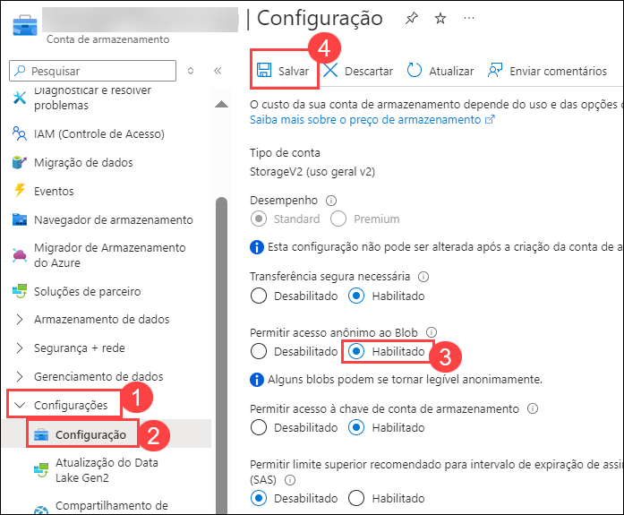

1. Expand **Data Storage (1)** select on **Containers (2)** from the left navigation pane, select **+ Container (3)**.

    
  
1. On the **New container** blade provide the name as **source (1)** then for **Anonymous access level** select **Blob (anonymous read access for blobs only) (2)** and click on **Create (3)**.

     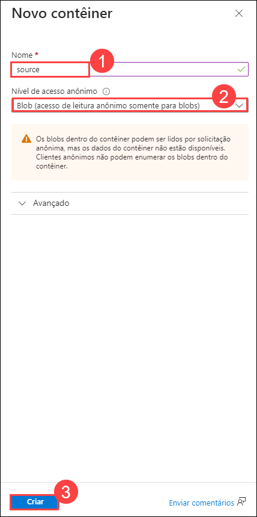

1. Click on the **source** container.

     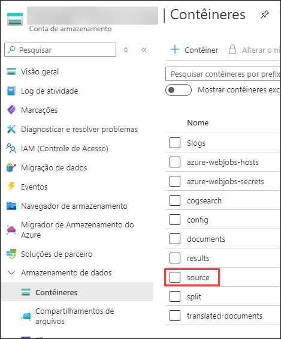
   
1. From the left navigation pane expand **Settings(1)** then select **Shared Access Tokens(2)**. From the **Permission** drop down select **Read(3)** and **List(4)** then click on **Generate SAS token and URL(5)**.

      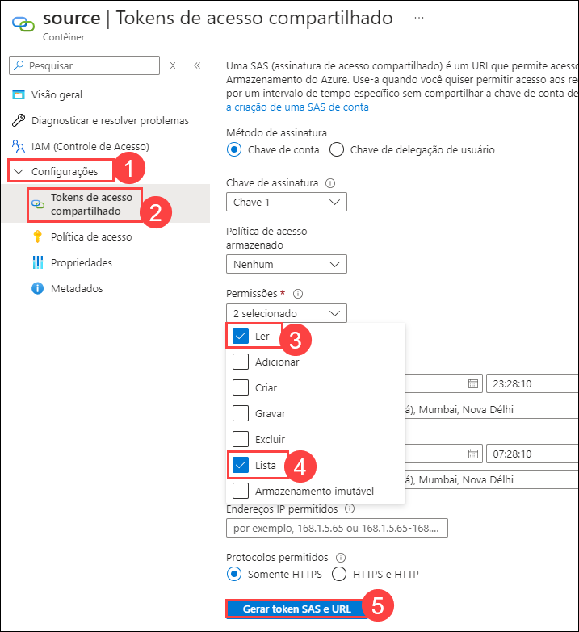

1. After clicking **Generate SAS token and URL** scroll down then copy the **Blob SAS URL**.

    
   
1. Repeat the same steps number from 1 - 8 by creating another container with name **target** by giving **Write** and **List** permissions.

1. Navigate to the source container and click on **Upload**.

   

1. Click on **Browse for files**.

    

1. Within in **File Explorer** navigate to `C:\LabFiles\Documents` and select **document-translation-sample** file click on **Open** to upload the file.

    

1. Back on **Upload blob** blade make sure **document-translation-sample** file is selected then click on **Upload**.

    

#### Task 1.3 - Set up your C#/.NET environment and install Newtonsoft.Json

In this task, we will set up a C#/.NET environment in Visual Studio 2022. We'll create a new console application named "document-translation-qs" using .NET 7.0 and install the Newtonsoft.Json package via NuGet for managing JSON operations within our project.
   
1. In the **LabVM**, in the Windows Search bar type Visual and select **Visual Studio 2022**.

   

   > **Note**: When prompted to sign in, select **Skip for now** then on the **Developement settings** click **Start Visual Studio**.

1. Please click on **Work or school Account** to sign in.

      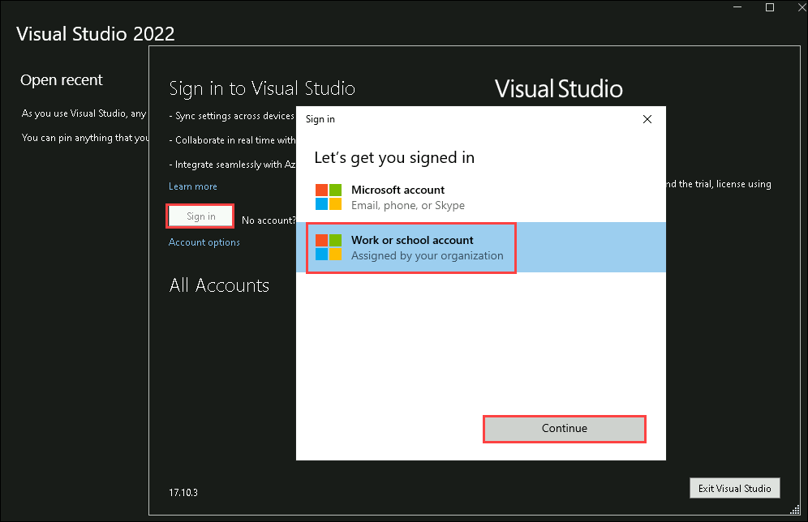   

      > **Note**: Navigate to the Environment Details tab to get the credentials.
      
1. On the Visual studio **Get Started** page, select **Create a New Project**.

   

1. On the **Create a new project** page, enter **console** in the search box. Choose the **Console Application** template, then choose **Next**.

    

1. In the **Configure your new project** dialog window, enter **document-translation-qs** in the Project name box. Then, choose **Next**.

    

1. In the **Additional information** dialog window, select **.NET 7.0**, and then select **Create**.

     
    
1. Right-click on your **document-translation-qs** project and select **Manage NuGet Packages**.

    

1. Select the **Browse** tab and type **NewtonsoftJson**.  Select the latest stable version from the drop-down menu

    
   
1. Click on **install** to install the package in your project.

    

1. Click on **Apply**.

    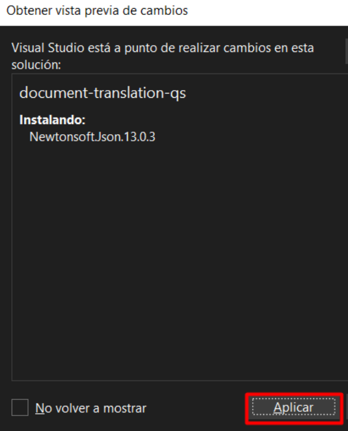
   
#### Task 1.4 -Translate all documents into a storage container and run your application

In this task, you'll set up a Translator resource in Azure Portal, obtain its keys and endpoint, and integrate them into a C# console application in Visual Studio 2022. This application will be configured to batch-translate documents stored in an Azure Storage container using Translator service APIs.

1. On Azure Portal page, in **Search resources, services and docs (G+/)** box at the top of the portal, enter **Translator**, and then select **Translator** under services.

   

1. Go to the Translator resource that is created, please get the resource keys by following the next step.
   
      
   
1. On the left navigation pane, under **Resource Management** section, select **Keys and Endpoint (1)**. Copy and paste your **Key 1 (2)** and **Document Translation (3)** endpoint in a convenient location, such as Microsoft Notepad. Only one key is necessary to make an API call.

     
   
1. Navigate back to Visual Studio 2022 and open the **Program.cs (1)** file. Delete the pre-existing code, including the line **Console.WriteLine("Hello World!") (2)**.

   

1. Open another tab in edge browse for [code sample](https://learn.microsoft.com/en-us/azure/ai-services/translator/document-translation/quickstarts/document-translation-rest-api?pivots=programming-language-csharp#code-sample) then navigate to **Start asynchronous batch translation** section copy the code.

    

1. Paste the copied code into the Program.cs file.
    

1. Within Program.cs file. make the following update  

    - Update **?api-version={date}** with **?api-version=2024-05-01**.
    - Update **{your-document-translation-endpoint}** and **{your-api-key}** with values of Translator instance which you recorded in the notepad.   
    - Also, update **"https://YOUR-SOURCE-URL-WITH-READ-LIST-ACCESS-SAS\"** and **"https://YOUR-TARGET-URL-WITH-WRITE-LIST-ACCESS-SAS\"** with values from your Storage account container instance which you recorded in notepad.
      
      
      
1. Once you've added the code sample to your application, choose the green Start button next to document-translation-qs to build and run your program, or press F5.
   
    
   
### Task 2: Creating a Form Recognizer Resource

In this task, you'll create a Form Recognizer resource in Azure Portal by setting up a new project in Document Intelligence Studio. This involves configuring project details, connecting to a training data source stored in an Azure Storage account, and validating your settings before creating the project.

1. On Azure Portal page, in Search resources, services, and docs (G+/) box at the top of the portal, enter **Azure AI services multi-service account (1)**, and then select **Azure AI services multi-service account(2)** under services.

   .png)

1. On the **Azure AI services multi-service account** blade, select the service that was deployed using the custom template.

     
   
1. On **Azure AI services multi-service account** blade, click on the **Document Intelligence (1)** tab and select **Go to studio (2)**.

    

1. In Document Intelligence Studio, scroll down to **Custom extraction models** and select **Get started**.

   

1. Under My Project, click on **+ Create a project**.

    

      > **Note**: Please sign in if prompted.

1. Enter the following details and click on **Continue**  **(3)**.
    
   - Project name: **testproject** **(1)**.
   - Description: **Custom model project** **(2)**.

      

1. Enter the following details under **Configure service resource** and click on **Continue** **(5)**.

   - Subscription: Select your **Default Subscription** **(1)**.
   - Resource group: **ODL-GenAI-CL-xxxxxx-Activate-GenAI**.
   - Form Recognizer or Cognitive Service Resource: Select the available Cognitive Service Form Recognizer name similar to **cogservicesbpass{suffix}** **(3)**.
   - API version: **2022-08-31 (3.0 General Availability)** **(4)**.

     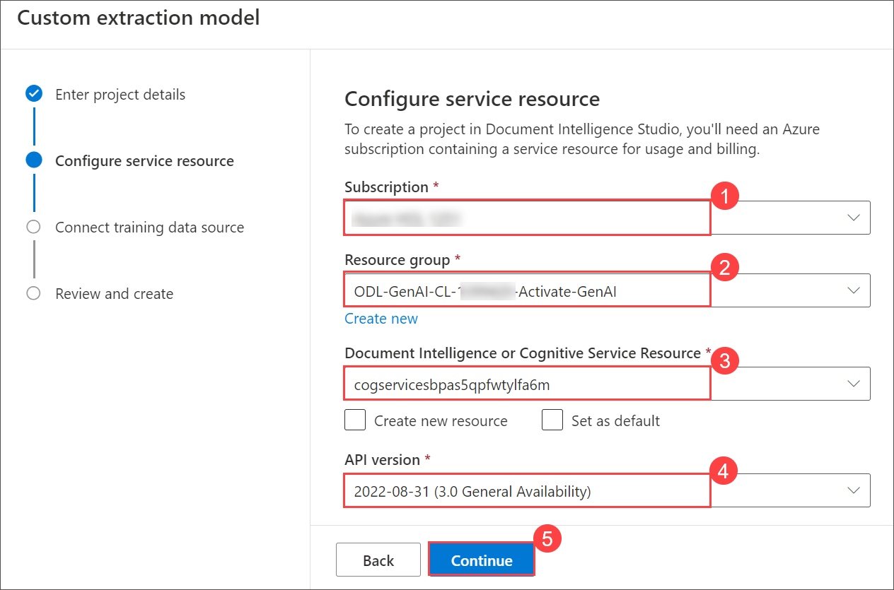

1. Enter the following details under **Connect training data source**. and click on **Continue** **(8)**.

   - Subscription: Select your **Default Subscription** **(1)**.
   - Resource group: **ODL-GenAI-CL-xxxxxx-Activate-GenAI** **(2)**.
   - Storage account name: **Select the existing storage account (3)**.
   - Blob container name: Click on **Create new (4)** and provide the name as **custommoduletext** **(5)** then click on **OK** **(6)**.
   - Review the settings then click on **Continue** **(7)**.
   
       
       
       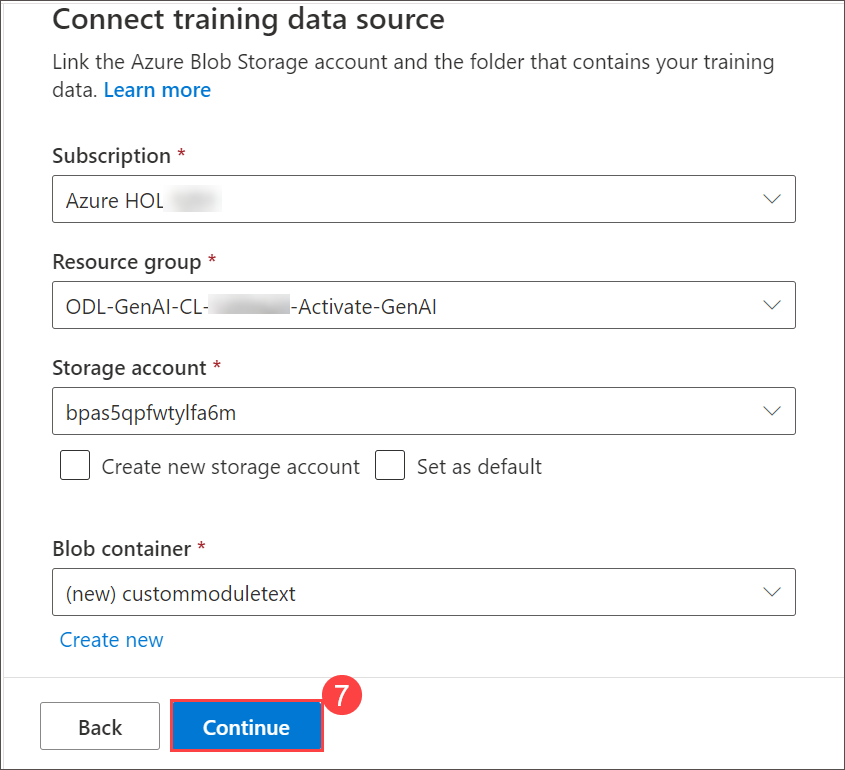

1. Validate the information and choose **Create project**.

      

### Task 3: Train and label data

In this task, you'll train a Form Recognizer model by uploading, labeling, training, and testing with sample data comprising 6 training documents.

1. Click on **Browse for files**.

      

1.  On the file explorer, navigate to `C:\LabFiles\Documents\Custom Model Sample` (1) path, select all train JPEG files **train1 to train6 (2)**, and hit **Open** **(3)**.

      

1. Once uploaded, choose **Run now** in the pop-up window under Run Layout.

     

1. Click on **+ Add a field** **(1)**, select **Field** **(2)**, enter the field name as **Organization_sample** **(3)**, and hit **enter**.

      

      

1. Label the new field added by selecting **CONTOSO LTD** in the top left of each document uploaded. Do this for all six documents.

    
   
1. Once all the documents are labeled, click on **Train** in the top-right corner.

     

1. Specify the model ID as **customfrs** **(1)**, the model description as **custom model** **(2)**, and from the drop-down, select **Template** **(3)** as Build Mode and click on **Train** **(4)**.

    

1. Click on **Go to Models**. 

   

1. Wait until the model status shows **succeeded**. Once the status is achieved, select the model **customfrs** **(2)** you created and choose **Test** **(3)**.

     

1. Select the model **customfrs** **(1)** you created and choose **Test** **(2)**.

      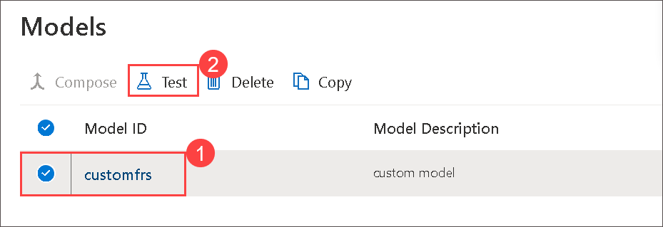
   
1. On the **Test model** window, click on **Browse for files**. 

      

1. On the file explorer, navigate to `C:\LabFiles\Document\Custom Model Sample` **(1)** path, select all test JPEG files **test1 and test2** **(2)**, and hit **Open** **(3)**.

     

1. Once uploaded, select **one test model (1)** and click on **Run analysis** **(2)**. 

     

1. Now you can see on the right-hand side that the model was able to detect the field **Organization_sample** we created in the last step, along with its confidence score.

    

### Task 4 : Build a new pipeline with the custom model module in BPA

In this task, you'll configure a new pipeline in the Business Process Automation Accelerator (BPA) to utilize a custom Form Recognizer model. This involves setting up the model ID within the pipeline stages and configuring document ingestion from specified file paths.

After you are satisfied with the custom model performance, you can retrieve the model ID and use it in a new BPA pipeline with the Custom Model module in the next step.

1. Navigate back to the Resource groups and select the resource group **ODL-GenAI-CL-xxxxxx-Activate-GenAI**.    

1. Go to the Resource group, search, and select the **Static Web App** resource type with a name similar to **webappbpa{suffix}**.

    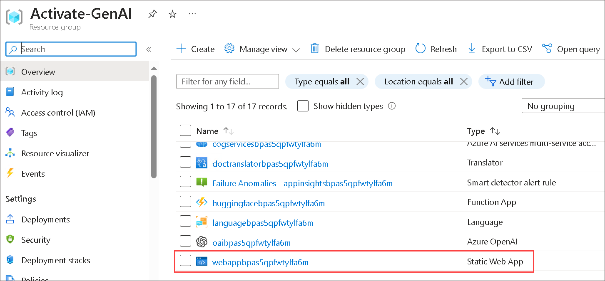

1. On the **Static Web App** page, click on **View app in browser**.

     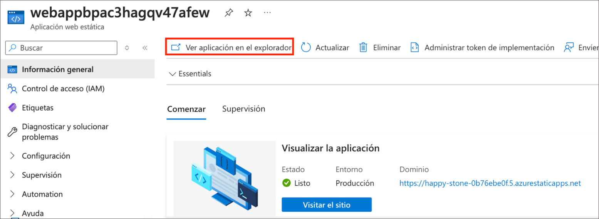

1. Once the **Business Process Automation Accelerator** page is loaded successfully, click on **Create/Update/Delete Pipelines**. 

   

1. On the **Create Or Select A Pipeline** page, enter the New Pipeline Name as **workshop** **(1)**, and click on the **Create Custom Pipeline** **(2)**. 

    

1. On the **Select a document type to get started** page, select **PDF Document**.

    

1. On the **Select a stage to add it to your pipeline configuration** page, search for and select **Form Recognizer Custom Model (Batch)**.

    
   
1. On the pop-up, enter the model ID as **customfrs** **(1)** and click on **Submit** **(2)**. 

    

1. On the **Select a stage to add it to your pipeline configuration** page, scroll down to review the **Pipeline Preview** and click on **Done**.

    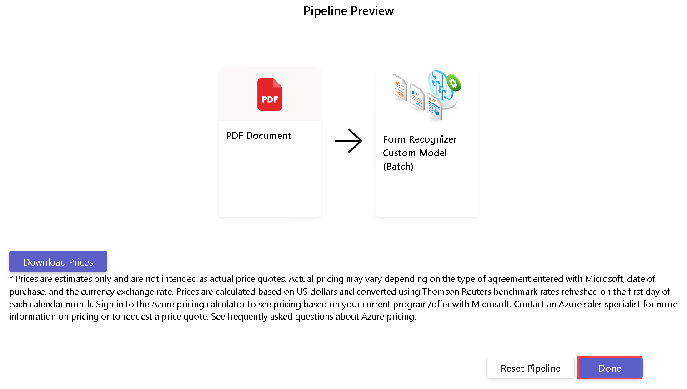

1. On the **Pipelines workshop** page, click on **Home**. 

      

1. On the **Business Process Automation Accelerator** page, click on **Ingest Documents**.

     

1. On the **Upload a document to Blob Storage** page, from the drop-down, select a pipeline with the name **workshop** **(1)** and click on **Upload or drop a file right here**.

      

1. For documents, enter the following `C:\LabFiles\Document\Lab 1 Step 3.7` **(1)** path and hit enter. You can upload multiple invoices one by one.

      

### Task 5: Configure Azure Cognitive Search 

In this task, you'll configure Azure Cognitive Search to connect with Azure Blob Storage. This includes setting up a data source, defining parsing options for JSON files, customizing a search index for data fields, and creating an indexer to automate data ingestion and indexing processes.

1. Navigate back to the resource group window, search, and select **Search Service** with a name similar to **bpa{suffix}**.

   

1. On the **Search service** page, click on **Import data**.

   

1. Enter the following details for **Connect to your data**.

   - Data Source: Select **Azure Blob Storage** **(1)**
   - Data Source Name: Enter **workshop** **(2)**.
   - Parsing mode: Select **JSON** **(3)**.
   - Subscription: Select the **existing one (4)**
   - Click on **Choose an existing connection** **(5)** under the Connection string.
  
     

1. On the **Storage accounts** page, select the storage account named similar to **bpass{suffix} (6)**. 

    

1. Select **results** **(7)** from the **Containers** page and click on **Select** **(8)**. It will redirect back to **Connect to your data** page.

     
  
1. On the **Connect to your data** page, for **Blob folder** enter  **workshop** **(9)** click on **Next : Add cognitive skills (Optional) (10)**.

    

1. On the **Add cognitive skills (Optional)**, click on **Skip to : Customize target index**.

1. On the **Customize target index**, enter the index name as **azureblob-index** **(1)**, make all fields **Retrievable** **(2)**, and **Searchable** **(3)**.

      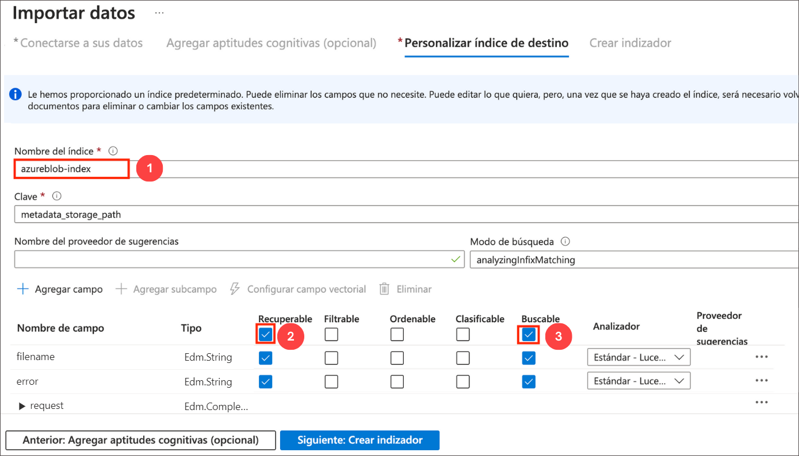

1. Expand the **aggregatedResults** **(1)** > **customFormRec (2)** > **documents** **(3)** > **fields** **(4)**. Under it, expand **Organization_sample (5)**. Make the three fields Facetable **(type, valueString, & content)** **(6)** and click on **Next: Create an indexer** **(7)**.

   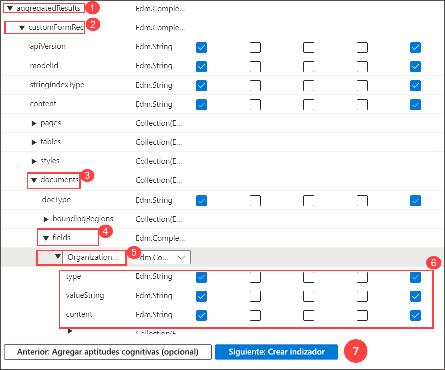

1. On the **Create an indexer** page, enter the name as **azureblob-indexer** **(1)** and click on **Submit** **(2)**.
   
    

## Success Criteria:

- Successful translation of documents and storage in the Azure Blob Storage target container.
- Effective setup and utilization of the Form Recognizer resource and BPA pipeline.
- Proper configuration of Azure Cognitive Search for processed documents.
- Validation of document processing and search functionality using the Sample Search Application in BPA.

## Additional Resources:

- Refer to [document translation](https://learn.microsoft.com/en-us/azure/ai-services/translator/document-translation/quickstarts/document-translation-rest-api?pivots=programming-language-csharp#code-sample) for sample code that will be used for document translation using C#.
- Refer to [Document Translation operations](https://learn.microsoft.com/en-us/azure/ai-services/translator/document-translation/reference/rest-api-guide) to understand the REST APIs that we utilize for document translation.

## Proceed with the next Challenge by clicking on **Next**>>.
