# Desafío 05: Procesamiento de Documentos por Lotes Sin Servidor

## Introducción:

Bienvenido a un desafío fundamental en el que Contoso Ltd. pretende mejorar su aplicación de chat impulsada por IA con un sólido sistema de procesamiento de documentos. Este desafío se centra en la creación de una solución sin servidor (serverless) para procesar nuevos documentos, traducirlos según sea necesario y almacenarlos sin problemas en Azure AI Search. Este sistema garantizará que estos documentos estén disponibles de forma continua para que Azure OpenAI los utilice, mejorando la base de conocimientos y la precisión de las respuestas de la aplicación de chat.

Basándose en sus logros anteriores en el balanceo de carga de los recursos de Azure OpenAI, ahora se embarcará en un viaje para optimizar el procesamiento de documentos. Esto implica configurar un servicio de traducción, crear una arquitectura sin servidor para el procesamiento por lotes mediante los servicios de Azure y aprovechar tecnologías como Form Recognizer y Azure AI Search. Su tarea consiste en garantizar que los documentos recién añadidos se procesen, analicen e indexen rápidamente, de modo que estén disponibles para que la IA de la aplicación de chat los utilice.

Este desafío se desarrolla en tres etapas principales: traducción de idiomas, procesamiento de documentos por lotes sin servidor mediante servicios de Azure y aprovechamiento de funciones avanzadas como Form Recognizer y AI Search. Comenzamos traduciendo archivos para cumplir con los requisitos del idioma. A continuación, implementa una arquitectura sin servidor, utilizando servicios de Azure, para un procesamiento eficiente de documentos por lotes. Entrena y prueba nuestro modelo, establece un pipeline para convertir documentos a un formato de Form Recognizer e incorpora el servicio de AI Search de Azure para verificar la presencia de documentos específicos en el conjunto de datos procesados ​​desde donde pueden ser utilizados por Azure OpenAI.

Utilizará el servicio Form Recognizer y el Acelerador de Automatización de Procesos Empresariales (BPA) para construir pipelines a través de varios servicios de Azure, creando una solución de procesamiento de documentos sin fisuras. Este desafío es un paso hacia la creación de una solución de IA que pueda adaptarse y crecer con las necesidades empresariales de Contoso.

# Guía de Soluciones

### Tarea 1: Traducir los documentos con Translate

En esta tarea, configurará los recursos de Azure para los servicios de IA de Azure. Esto incluye el registro de proveedores, la creación de un nuevo servicio de Azure AI, la aceptación de los términos de IA Responsable, la bifurcación (fork) de un repositorio de GitHub, la generación de un Token de Acceso Personal (PAT) y la implementación de recursos en Azure a través del repositorio de GitHub con los parámetros y configuraciones especificadas.

1. En la página del Portal de Azure, en el cuadro Buscar recursos, servicios y documentos (G+/) en la parte superior del portal, ingrese **Subscriptions (1)** y luego seleccione **Suscripciones (2)** en Servicios.

      

1. Seleccione la **Suscripción** existente.

    

1. En el panel de navegación izquierdo, expanda **Configuración (1)** y luego seleccione **Proveedores de recursos (2)**. Revise que el estado de **Microsoft.DocumentDB** esté marcado como **"Registrado" (3)**.
   Si está marcado como **No registrado**, seleccione **Microsoft.DocumentDB** y luego haga clic en **Registrarse** en el menú superior.

   **Nota**: *Este proceso puede tardar varios segundos o minutos; asegúrese de actualizar todo el navegador periódicamente.*

             

1. En la página del Portal de Azure, en el cuadro Buscar recursos, servicios y documentos (G+/) en la parte superior del portal, ingrese **Azure AI services multi-service account (1)** y luego seleccione **Azure AI services multi-service account (2)** en Servicios.

   .png)

1. En la hoja **Azure Al services | Azure Al services multi-service account**, haga clic en **Crear**.

   

1. Especifique los siguientes detalles para crear un **servicio de Azure AI** y luego haga clic en la pestaña **Revisar y crear (7)**.
   
     | **Opción**         | **Valor**                                              |
     | ------------------ | -----------------------------------------------------  |
     | Suscripción       | Deje el valor predeterminado  **(1)**                                 |
     | Grupo de recursos      | **ODL-GenAI-CL-xxxxxx-Activate-GenAI**  **(2)**        |
     | Nombre               | *Ingrese un nombre único* para su servicio de búsqueda o use el formato **AI-Service-xxxxxx** (reemplace **xxxxxx** con el valor Deployment ID **(3)** |
     | Región           | Utilice la misma ubicación que el grupo de recursos  **(4)**    |
     | Plan de tarifa       | Standard S0     **(5)**                                 |
     | Al marcar esta casilla, confirmo que he leído y comprendido todos los términos que aparecen a continuación | Seleccione la **Casilla de verificación** **(6)**| 

   >**Nota**: Aquí, xxxxxx hace referencia al valor DeploymentID

   

1. Una vez que la validación sea exitosa en la pestaña **Revisar y crear**, haga clic en **Crear** y espere a que se complete la implementación.

    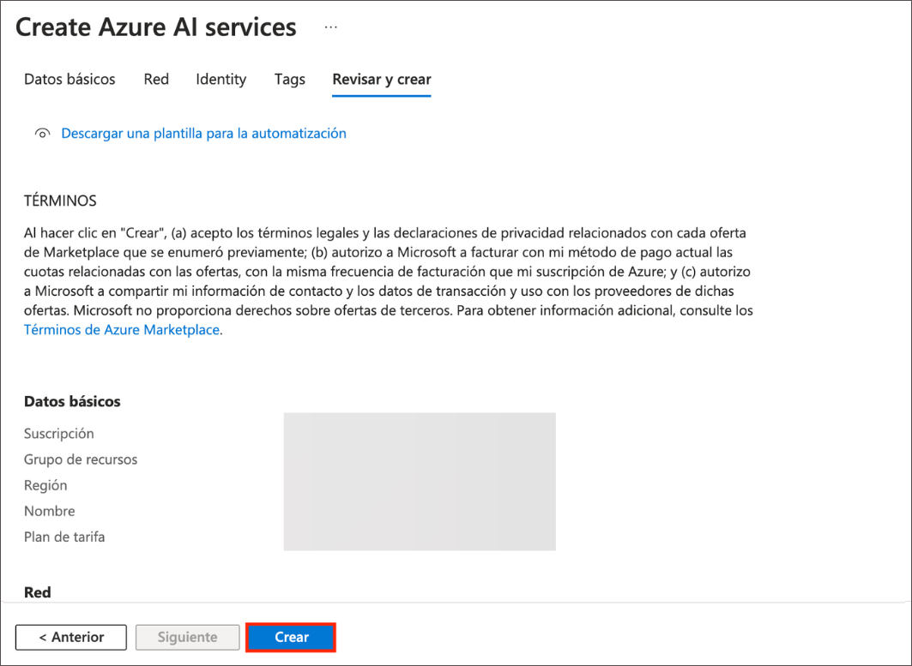

1. Para asegurarnos de que hemos **aceptado los términos y condiciones de IA Responsable**: Debemos iniciar la creación de un recurso **Cuenta multiservicio de Azure AI Services** desde el portal de Azure para revisar y aceptar los términos y condiciones.

    >**Nota**: Documento de referencia: [Inicio rápido: Creación de un recurso de Servicios Cognitivos utilizando el portal de Azure](https://docs.microsoft.com/en-us/azure/cognitive-services/cognitive-services-apis-create-account?tabs=multiservice%2Cwindows). Una vez aceptado, puede crear recursos posteriores utilizando cualquier herramienta de implementación (SDK, CLI o plantilla ARM, etc.) en la misma suscripción de Azure.

1. Navegue a `https://github.com/CloudLabs-MOC/business-process-automation` y haga clic en **Sign in**. Proporcione el **Nombre de Usuario de GitHub** y **Contraseña** de su cuenta personal. Finalmente, haga clic en **Sign in**.

    

    
    
1. Una vez que haya iniciado sesión, seleccione **fork (1)** para bifurcar el repositorio, luego en la página **Create a new fork**, haga clic en **Create fork (2)**.
   
    

   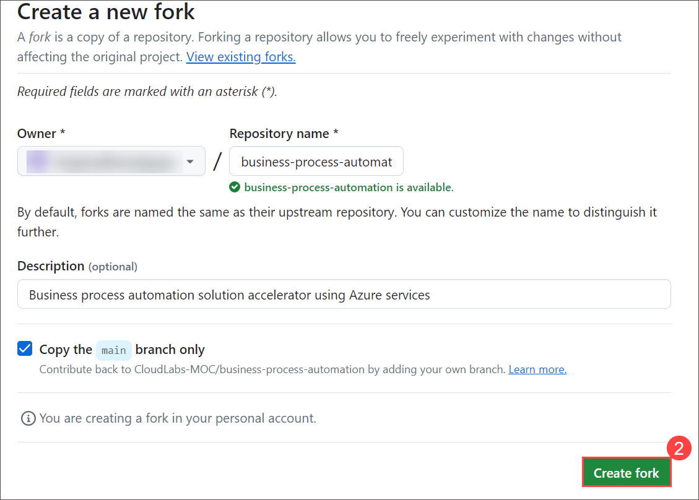

1. Haga clic en su **perfil**, que se encuentra en la parte superior derecha, y luego seleccione **Settings**.

    
   
1. Desplácese hasta el final y seleccione **Developer settings**.

    

1. En el panel de navegación izquierdo, expanda **Personal access tokens (1)** y seleccione **Tokens (classic) (2)**. En la página **Personal access tokens**, haga clic en **Generate new token (3)** y luego elija **Generate new token (classic) (4)**.

      

1. Proporcione los siguientes detalles:

   - Note: **PAT (1)**
   - Expiration: **7 days (2)**
     
     

   - En la sección Select scopes: seleccione todos los ámbitos **repo, workflow, write:packages, delete:packages, admin:org, admin:public_key, admin:repo_hook, admin:org_hook, gist,notifications, user, delete_repo, write:discussion, admin:enterprise, audit_log, codespace, copilot, project, admin:gpg_key, admin:ssh_signing_key** y haga clic en **Generate token**.

      

      

      

   >**Enlace de referencia**: [Obtener un Token de Nivel de Flujo de Trabajo (Clásico)](https://docs.github.com/en/authentication/keeping-your-account-and-data-secure/creating-a-personal-access-token)

1. Copie el **Token PAT** y péguelo en un bloc de notas.

      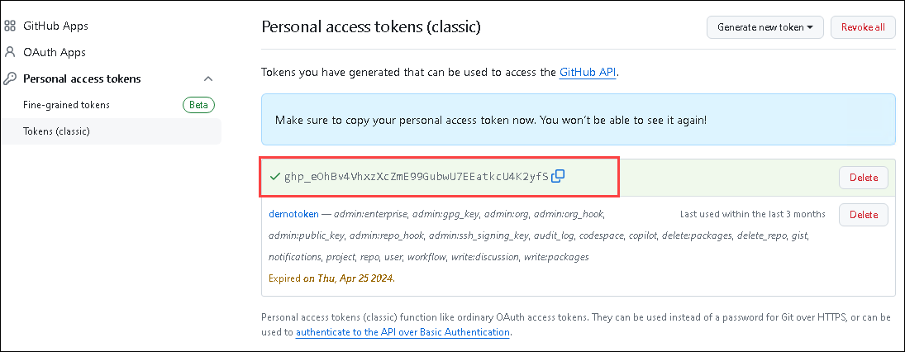
   
1. Haga clic en el botón "Deploy to Azure" que corresponda a su entorno.

     ### Con OpenAI
      

1. En la hoja de Implementación personalizada, especifique los siguientes parámetros; los demás pueden mantener los valores predeterminados.

   - Grupo de recursos : **ODL-GenAI-CL-xxxxxx-Activate-GenAI**
   - Repository Token : Pegue el token PAT que creó y registró en el paso anterior.
   - Repository Url : Pegue la URL del **Repositorio de GitHub bifurcado** en su cuenta personal.

      
  
      >**Nota**: Asegúrese de que la región principal (Primary Region) esté configurada en EASTUS2
      
       
     
     >**Nota**: (puede obtener la URL haciendo clic en su perfil en la esquina derecha, luego seleccione **Your repositories**, haga clic en **business-process-automation** y, desde la barra superior, copie la URL de la **cuenta de GitHub**)
     
     

1. Haga clic en **Revisar y crear**.

1. Espere a que se complete la implementación y haga clic en **Ir al grupo de recursos**.   

1. Verifique que todos los recursos se hayan implementado sin problemas.
   
   
   
#### Tarea 1.2 - Crear contenedores de Azure Blob Storage

En esta tarea, aprenderá a crear un contenedor en una cuenta de almacenamiento existente donde se almacenan los documentos que deben buscarse.

1. En la página del Portal de Azure, en el cuadro **Buscar recursos, servicios y documentos (G+/)** en la parte superior del portal, ingrese **Storage account** y, luego, seleccione **Cuentas de almacenamiento** en Servicios.

1. Seleccione la cuenta de almacenamiento creada a partir de los recursos desplegados en la tarea anterior.

1. En la hoja Información general de la cuenta de almacenamiento, expanda **Configuración (1)**, seleccione **Configuración (2)**. Para la opción **Permitir el acceso anónimo al blob (3)** márquelo como **Habilitado** y haga clic en **Guardar (4)**.

      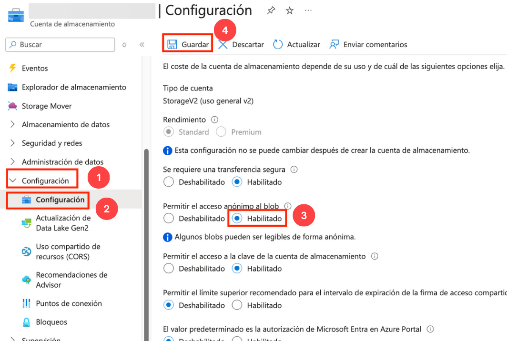

1. Expanda **Almacenamiento de datos (1)**, seleccione **Contenedores (2)** en el panel de navegación izquierdo y seleccione **+ Contenedor (3)**.

    
  
1. En la hoja **Nuevo contenedor**, establezca el nombre con el valor **source (1)**, luego para **Nivel de acceso anónimo** seleccione **Blob (acceso de lectura anónimo solo para blobs) (2)** y haga clic en **Crear (3)**.

     

1. Haga clic en el contenedor **source**.

     
   
1. Desde el panel de navegación izquierdo, expanda **Configuración(1)** y luego seleccione **Tokens de acceso compartido (2)**. Desde el menú desplegable **Permisos**, seleccione **Lectura(3)** y **Lista(4)** y luego haga clic en **Generar URL y token de SAS (5)**.

      

1. Después de hacer clic en **Generar URL y token de SAS**, desplácese hacia abajo y copie la **URL de SAS de Blob**.

    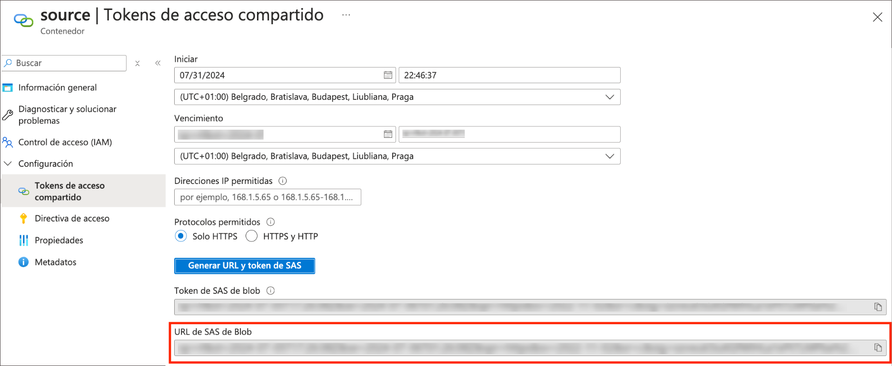
   
1. Repita los mismos pasos del 1 al 8 creando otro contenedor con el nombre **target** y otorgándole permisos **Write** y **List**.

1. Navegue hasta el contenedor source y haga clic en **Cargar**.

   

1. Haga clic en **Buscar archivos**.

    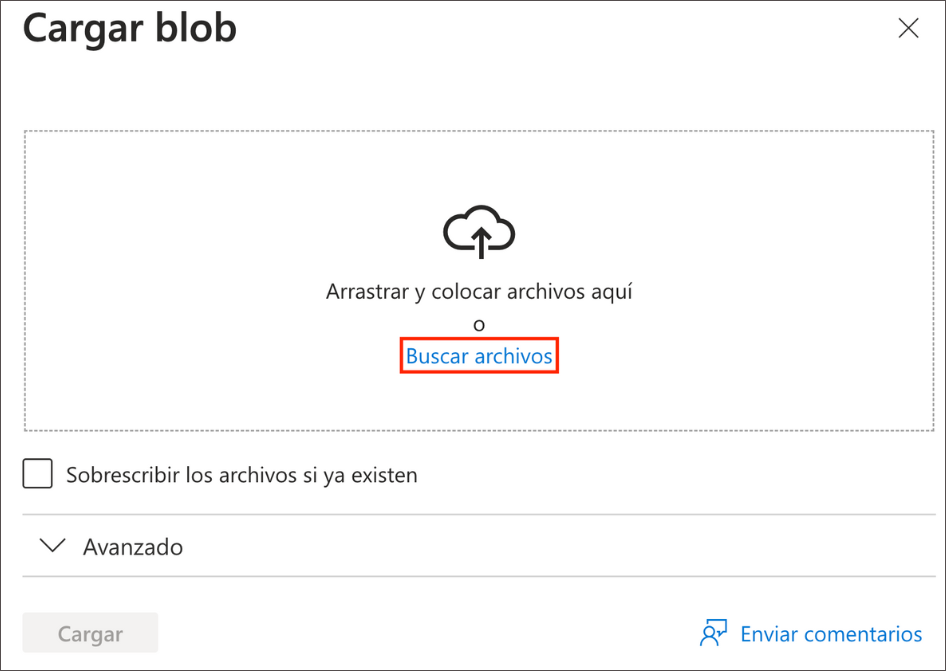

1. En el **Explorador de archivos**, navegue hasta `C:\LabFiles\Documents` y seleccione el archivo **document-translation-sample** y haga clic en **Abrir** para subir el archivo.

    

1. De nuevo en la hoja **Cargar blob**, asegúrese de que el archivo **document-translation-sample** esté seleccionado y luego haga clic en **Cargar**.

    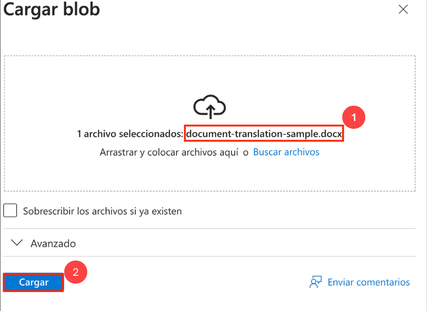

#### Tarea 1.3 - Configurar su entorno C#/.NET e instalar Newtonsoft.Json

En esta tarea, configuraremos un entorno C#/.NET en Visual Studio 2022. Crearemos una nueva aplicación de consola llamada "document-translation-qs" usando .NET 7.0 e instalaremos el paquete Newtonsoft.Json a través de NuGet para administrar las operaciones JSON dentro de nuestro proyecto.
   
1. En **LabVM**, en la barra de Búsqueda de Windows, escriba Visual y seleccione **Visual Studio 2022**.

   

   > **Nota**: Cuando se le solicite iniciar sesión, seleccione **Omitir por ahora** y, luego, en **Configuración de desarrollo**, haga clic en **Iniciar Visual Studio**.

1. En la página **Comenzar** de Visual Studio, seleccione **Crear un Nuevo Proyecto**.

   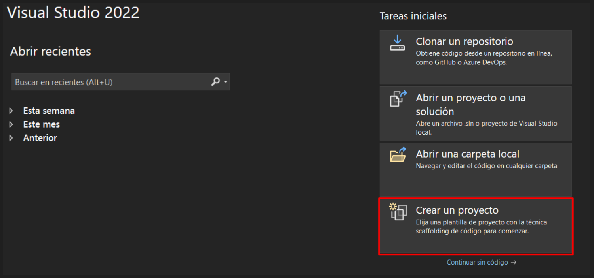

1. En la página **Crear un nuevo proyecto**, ingrese **console** en el cuadro de búsqueda. Elija la plantilla **Aplicación de Consola** y, luego de clic en **Siguiente**.

    

1. En la ventana de diálogo **Configure su nuevo proyecto**, ingrese **document-translation-qs** en el cuadro Nombre del proyecto. Luego, elija **Siguiente**.

    

1. En la ventana de diálogo **Información adicional**, seleccione **.NET 7.0** y, a continuación, seleccione **Crear**.

     
    
1. Haga clic derecho en el proyecto **document-translation-qs** y seleccione **Administrar Paquetes NuGet**.

    

1. Seleccione la pestaña **Examinar** tab y escriba **Newtonsoft.Json**. Seleccione la última versión estable en el menú desplegable.

    
   
1. Haga clic en **Instalar** para instalar el paquete en su proyecto.

    

1. Haga clic en **Aplicar**.

    
   
#### Tarea 1.4 - Traducir todos los documentos en un contenedor de almacenamiento y ejecutar su aplicación

En esta tarea, configurará un recurso Translator en el Portal de Azure, obtendrá sus claves y punto de conexión, y los integrará en una aplicación de consola de C# en Visual Studio 2022. Esta aplicación se configurará para traducir por lotes documentos almacenados en un contenedor de Azure Storage usando las APIs del servicio Translator.

1. En la página del Portal de Azure, en el cuadro **Buscar recursos, servicios y documentos (G+/)** en la parte superior del portal, ingrese **Traductor** (Translator) y, luego, seleccione **Traductores** (Translators) en Servicios.

   

1. Vaya al recurso Traductor que se creó y obtenga las claves de recursos siguiendo el paso mostrado a continuación.
   
      
   
1. En el panel de navegación izquierdo, en la sección **Administración de recursos**, seleccione **Claves y punto de conexión (1)**. Copie y pegue la **Clave 1 (2)** y el punto de conexión **Traducción de Documentos (3)** en una ubicación conveniente, tal como el Bloc de notas de Microsoft. Solo se necesita una clave para realizar una llamada de API.

     
   
1. Vuelva a Visual Studio 2022 y abra el archivo **Program.cs (1)**. Elimine el código preexistente, incluida la línea **Console.WriteLine("Hello World!") (2)**.

   

1. Abra otra pestaña en Edge y busque el [código de ejemplo](https://learn.microsoft.com/en-us/azure/ai-services/translator/document-translation/quickstarts/document-translation-rest-api?pivots=programming-language-csharp#code-sample); navegue hasta la sección **Start asynchronous batch translation** y copie el código.

    

1. Pegue el código copiado en el archivo Program.cs.
    

1. Dentro del archivo Program.cs, realice la siguiente actualización

    - Actualice **?api-version={date}** con **?api-version=2024-05-01**.
    - Actualice **{your-document-translation-endpoint}** y **{your-api-key}** con los valores de la instancia de Traductor que registró en el Bloc de notas. 
    - Además, actualice **"https://YOUR-SOURCE-URL-WITH-READ-LIST-ACCESS-SAS\"** and **"https://YOUR-TARGET-URL-WITH-WRITE-LIST-ACCESS-SAS\"** con los valores de la instancia de contenedor de su Cuenta de almacenamiento que registró en el bloc de notas. 
      
      
      
1. Una vez que haya agregado el código de ejemplo a su aplicación, de clic en el botón verde Iniciar junto a document-translation-qs para compilar y ejecutar su programa, o presione F5.
   
    
   
### Tarea 2: Creación de Recurso Form Recognizer

En esta tarea, creará un recurso Form Recognizer en el Portal de Azure configurando un nuevo proyecto en Document Intelligence Studio. Esto implica configurar los detalles del proyecto, conectarse a una fuente de datos de entrenamiento almacenada en una cuenta de Azure Storage y validar la configuración antes de crear el proyecto.

1. En la página del Portal de Azure, en el cuadro Buscar recursos, servicios y documentos (G+/) en la parte superior del portal, ingrese **Azure AI services multi-service account (1)** y, luego seleccione **Azure AI services multi-service account (2)** en Servicios.

   .png)

1. En la hoja **Azure AI services multi-service account**, seleccione el servicio que fue implementado usando la plantilla personalizada.

     
   
1. En la hoja **Azure AI services multi-service account**, haga clic en la pestaña **Document Intelligence (1)** y seleccione **Go to studio (2)**.

    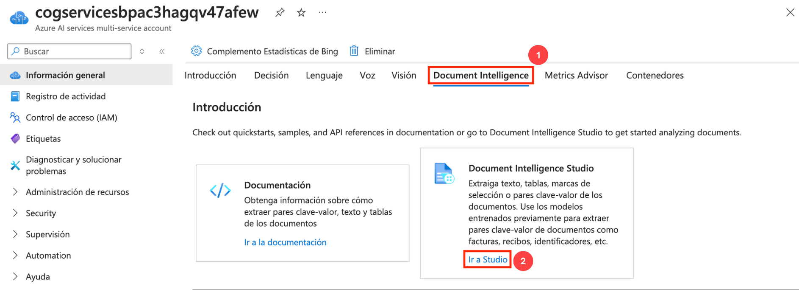

1. En Document Intelligence Studio, desplácese hacia abajo hasta **Custom extraction models** y seleccione **Get started**.

   

1. En My Project, haga clic en **+ Create a project**.

    

1. Ingrese los siguientes detalles y luego haga clic en **Continue**  **(3)**.
    
   - Project name: **testproject** **(1)**.
   - Description: **Custom model project** **(2)**.

      

1. Ingrese los siguientes detalles en **Configure service resource** y haga clic en **Continue** **(5)**.

   - Subscription: Seleccione su **Suscripción predeterminada** **(1)**
   - Resource group: **ODL-GenAI-CL-xxxxxx-Activate-GenAI**.
   - Form Recognizer or Cognitive Service Resource: Seleccione el nombre del recurso Cognitive Service Form Recognizer disponible similar a **cogservicesbpass{suffix}** **(3)**.
   - API version: **2022-08-31 (3.0 General Availability)** **(4)**.

     

1. Ingrese los siguientes detalles en **Connect training data source** y haga clic en **Continue** **(8)**.

   - Subscription: Seleccione su **Suscripción predeterminada** **(1)**
   - Resource group: **ODL-GenAI-CL-xxxxxx-Activate-GenAI** **(2)**.
   - Storage account name: **Seleccione la cuenta de almacenamiento existente (3)**.
   - Blob container name: Haga clic en **Create new (4)** y proporcione el nombre **custommoduletext** **(5)**, luego haga clic en **OK** **(6)**.
   - Revise la configuración y luego haga clic en **Continue** **(7)**.
   
       
       
       

1. Valide la información y seleccione **Create project**.

      

### Tarea 3: Entrenar y etiquetar datos

En esta tarea, entrenará un modelo de Form Recognizer cargando, etiquetando, entrenando y probando con datos de ejemplo que comprenden 6 documentos de entrenamiento.

1. Haga clic en **Browse for files**.

      

1. En el explorador de archivos, navegue hasta la ruta `C:\LabFiles\Documents\Custom Model Sample` (1), seleccione todos los archivos JPEG de entrenamiento **train1 a train6 (2)**, y presione **Abrir** **(3)**.

      

1. Una vez cargados, elija **Run now** en la ventana emergente debajo de Run Layout.

     

1. Haga clic en **+ Add a field** **(1)**, seleccione **Field** **(2)**, ingrese el nombre del campo como **Organization_sample** **(3)**, y presione **enter**.

      

      

1. Etiquete el nuevo campo agregado seleccionando **CONTOSO LTD** en la parte superior izquierda de cada documento cargado. Haga esto para los seis documentos.

    
   
1. Una vez que todos los documentos estén etiquetados, haga clic en **Train** en la esquina superior derecha.

     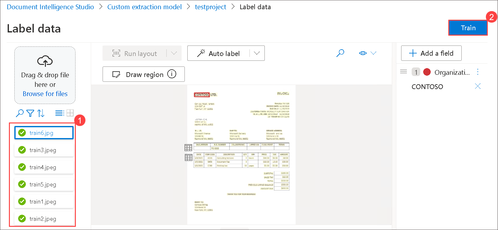

1. Especifique el valor de Model ID como **customfrs** **(1)**, en Model Description coloque **custom model** **(2)** y, en el menú desplegable Build Mode seleccione **Template** **(3)**. Haga clic en **Train** **(4)**.

    

1. Haga clic en **Go to Models**. 

   

1. Espere hasta que el estado del modelo muestre **succeeded**. 

     

1. Una vez que se alcance dicho estado, seleccione el modelo **customfrs** **(2)** que ha creado y elija **Test** **(3)**.

      
   
1. En la ventana **Test model**, haga clic en **Browse for files**.

      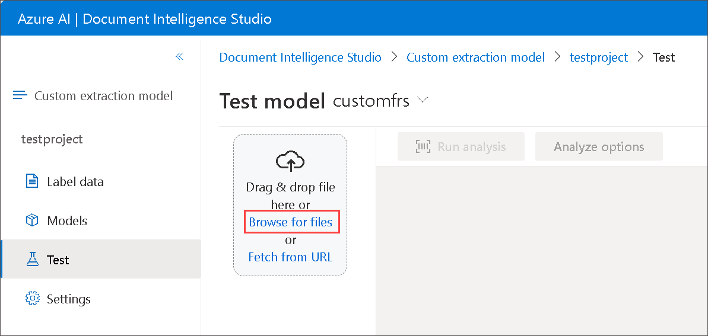

1. En el explorador de archivos, navegue hasta la ruta `C:\LabFiles\Document\Custom Model Sample` **(1)**, seleccione todos los archivos JPEG de prueba **test1 y test2** **(2)**, y presione **Abrir** **(3)**.

     

1. Una vez cargados, seleccione **one test model (1)** y haga clic en **Run analysis** **(2)**.

     

1. Ahora puede ver en el lado derecho que el modelo pudo detectar el campo **Organization_sample** que creamos en el último paso, junto con su puntuación de confianza.

    

### Tarea 4: Crear una nuevo pipeline con el módulo de modelo personalizado en BPA

En esta tarea, configurará un nuevo pipeline en Business Process Automation Accelerator (BPA) para utilizar un modelo personalizado de Form Recognizer. Esto implica configurar el ID del modelo dentro de las etapas de pipeline y configurar la ingesta de documentos desde las rutas de archivo específicas.

Una vez que esté satisfecho con el rendimiento del modelo personalizado, puede recuperar el ID del modelo y usarlo en un nuevo pipeline de BPA con el módulo de modelo personalizado en el siguiente paso.

1. Vuelva a los grupos de recursos y seleccione el grupo de recursos **ODL-GenAI-CL-xxxxxx-Activate-GenAI**.

1. Vaya al grupo de recursos, busque y seleccione el tipo de recurso **Aplicación web estática (Static Web App)** con un nombre similar a **webappbpa{suffix}**.

    

1. En la página **Aplicación web estática**, haga clic en **Ver aplicación en el navegador**.

     

1. Una vez que la página **Business Process Automation Accelerator** se haya cargado correctamente, haga clic en **Create/Update/Delete Pipelines**.

   

1. En la página **Create Or Select A Pipeline**, para New Pipeline Name ingrese el valor **workshop** **(1)**, y haga clic en el botón **Create Custom Pipeline** **(2)**. 

    

1. En la página **Select a document type to get started**, seleccione **PDF Document**.

    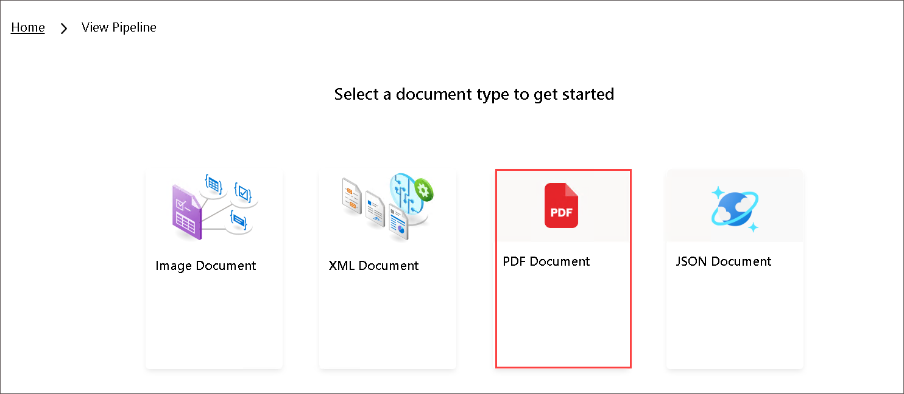

1. En la página **Select a stage to add it to your pipeline configuration**, busque y seleccione **Form Recognizer Custom Model (Batch)**.

    
   
1. En la ventana emergente, para model ID ingrese el valor **customfrs** **(1)** y haga clic en el botón **Submit** **(2)**. 

    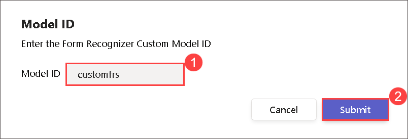

1. En la página **Select a stage to add it to your pipeline configuration**, desplácese hacia abajo para revisar la sección **Pipeline Preview** y haga clic en **Done**.

    

1. En la página **Pipelines workshop**, haga clic en **Home**. 

      

1. En la página **Business Process Automation Accelerator**, haga clic en **Ingest Documents**.

     

1. En la página **Upload a document to Blob Storage**, en el menú desplegable, seleccione un pipeline con el nombre **workshop** **(1)** y haga clic en **Upload or drop a file right here**.

      

1. Para documents, ingrese la ruta `C:\LabFiles\Document\Lab 1 Step 3.7` **(1)** y presione enter. Puede cargar varias facturas una por una.

      

### Tarea 5: Configurar Azure Cognitive Search

En esta tarea, configurará Azure Cognitive Search para conectarse con Azure Blob Storage. Esto incluye configurar una fuente de datos, definir opciones de análisis para archivos JSON, personalizar un índice de búsqueda para campos de datos y crear un indexador para automatizar los procesos de ingesta e indexación de datos.

1. Vuelva a la ventana del grupo de recursos, busque y seleccione el **Servicio Search** con un nombre similar a **bpa{suffix}**.

   

1. En la página **Servicio Search**, haga clic en **Importación de datos**.

   

1. Ingrese los siguientes detalles para **Conectarse a sus datos**.

   - Origen de datos: Seleccione **Almacenamiento de blobs de Azure (Azure Blob Storage)** **(1)**
   - Nombre del origen de datos: Ingrese **workshop** **(2)**.
   - Modo de análisis: Seleccione **JSON** **(3)**.
   - Suscripción: Seleccione la **existente (4)**
   - Haga clic en **Elegir una conexión existente** **(5)** debajo de la Cadena de conexión.
  
     

1. En la página **Cuentas de almacenamiento**, seleccione la cuenta de almacenamiento con un nombre similar a **bpass{suffix} (6)**. 

    

1. Seleccione **results** **(7)** de la página **Contenedores** y haga clic en **Seleccionar** **(8)**. Se le redireccionará a la página **Conectarse a sus datos**. 

     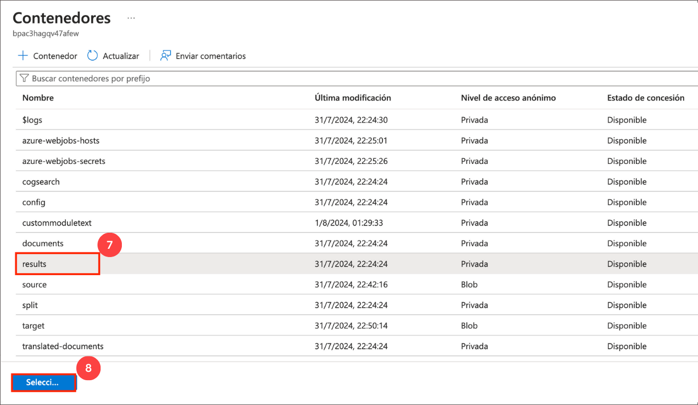
  
1. En la página **Conectarse a sus datos**, para **Carpeta de blobs** ingrese  **workshop** **(9)**, haga clic en **Siguiente : Agregar aptitudes cognitivas (opcional) (10)**.

    

1. En **Agregar aptitudes cognitivas (opcional)**, haga clic en **Omitir: Personalizar índice de destino**.

1. En **Personalizar índice de destino**, establezca el nombre de índice en **azureblob-index** **(1)**, marque todos los campos como **Recuperable (Retrievable)** **(2)**, y **Se puede buscar (Searchable)** **(3)**.

      

1. Expanda **aggregatedResults** **(1)** > **customFormRec (2)** > **documents** **(3)** > **fields** **(4)**. Debajo de este, expanda **Organization_sample (5)**. Haga que los tres campos sean Clasificable (Facetable) **(type, valueString, & content)** **(6)** y haga clic en **Siguiente: Crear un indexador** **(7)**.

   

1. En la página **Crear un indexador**, ingrese el nombre **azureblob-indexer** **(1)** y haga clic en **Enviar** **(2)**.
   
    

## Criterios de Éxito:

- Traducción satisfactoria de documentos y almacenamiento en el contenedor de destino de Azure Blob Storage.
- Configuración y utilización efectivas del recurso Form Recognizer y del pipeline de BPA.
- Configuración adecuada de Azure Cognitive Search para los documentos procesados.
- Validación de la funcionalidad de búsqueda y procesamiento de documentos utilizando la aplicación de búsqueda de ejemplo en BPA.

## Recursos Adicionales:

- Consulte [traducción de documentos](https://learn.microsoft.com/en-us/azure/ai-services/translator/document-translation/quickstarts/document-translation-rest-api?pivots=programming-language-csharp#code-sample) para ver un código de ejemplo que se utilizará para la traducción de documentos con C#.
- Consulte [operaciones de Traducción de Documentos](https://learn.microsoft.com/en-us/azure/ai-services/translator/document-translation/reference/rest-api-guide) para comprender las API REST que utilizamos para la traducción de documentos.

## Continúe con el próximo Desafío haciendo clic en **Siguiente**>>.
