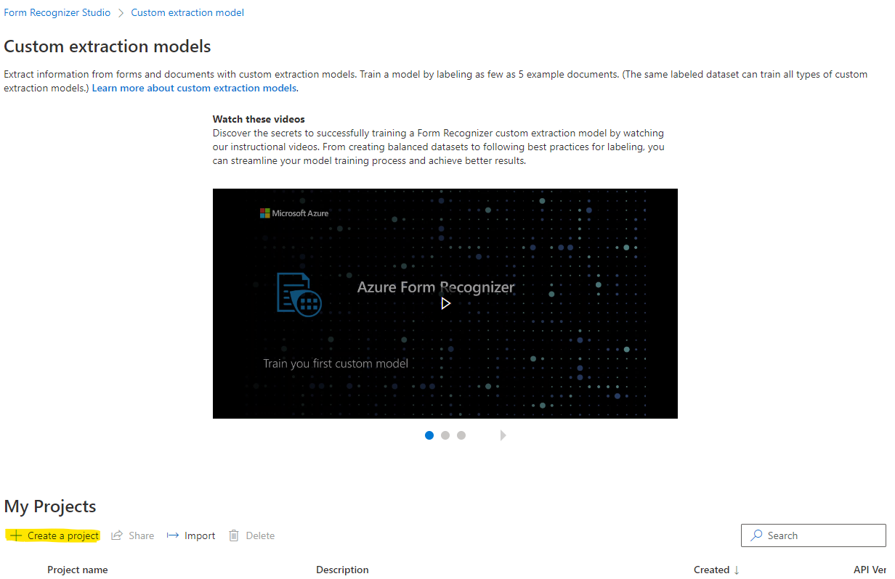
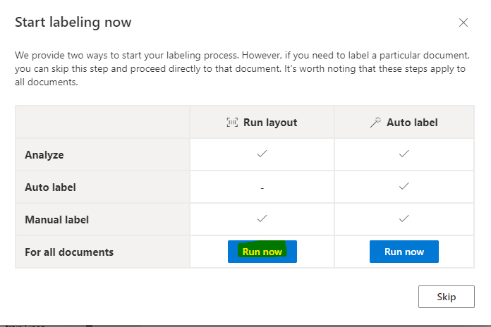
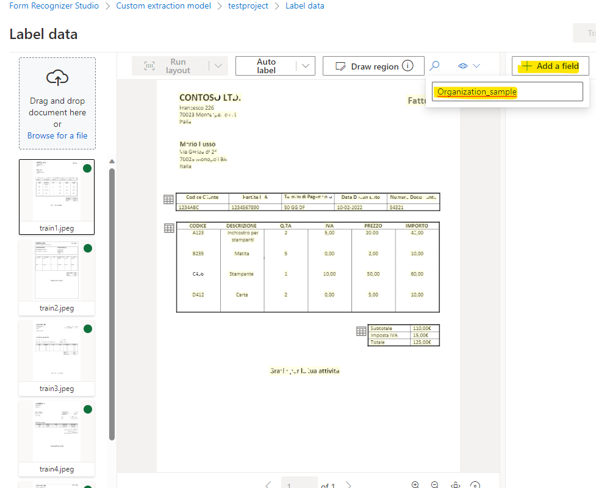

# Challenge 06: Serverless Document Batch Processing 

### Lab Scenario
In this lab, we've equipped you with the essential artifacts to explore the capabilities of the Form Recognizer Service, OpenAI, and the Business Process Automation Accelerator. Our goal is to empower you to gain insights into utilizing the accelerator for building pipelines across various services, creating AI solutions tailored to your business requirements. 

### Pre-requisites
* The accelerator is deployed and ready in the resource group
* You have an Azure subscription and permission to create a Form Recognizer Resource
* You have access to the sample invoices folder with the invoices to upload

# Solution Guide

### Task 1 - Translate the documents using Language Studio

1. Sign into the [language studio](https://aka.ms/dt-language-studio) using Azure credentials.

1. Configure by choosing Translator resource & Azure Storage account.
   
1. Select source & target language(s).
   
1. Choose the source document(s) from your local file system or blob storage and choose the destination for the translated files. 

### Task 2 - Creating a Form Recognizer Resource

1. Go to the Resource group, search, and select the "**Azure AI services multi-service account**" resource type with the name similar **cogservicesbpa{suffix}**

   

2. Click on the Document Intelligence tab and select "**Go to Studio**"

   

3. In Document Intelligence Studio, scroll down to Custom Models and choose **Create new**.

   

4. Under My Project click on  **+ Create a project**

   

5. Enter the following details and click on **Continue**  **(3)**.
    
   - Project name : **testproject** **(1)**.
   - Description : **Custom model project** **(2)**.

     

6. Enter the following details **configuring service resource** and click on **Continue** **(5)**.

   - Subscription : **Default Subscription** **(1)**.
   - Resource group : **business-process-<inject key="Deployment ID" enableCopy="false"/>** **(2)**.
   - Form Recognizer or Cognitive Service Resource: Select the available Cognitive Service Form Recognizer name similar to **cogservicesbpass{suffic}** **(3)**.
   - API version : **2022-08-31 (3.0 General Availability)** **(4)**.

     

7. Enter the following details **Connect training data source** and click on **Continue** **(8)**.

   - Subscription : **Default Subscription** **(1)**.
   - Resource group : **business-process-<inject key="Deployment ID" enableCopy="false"/>** **(2)**.
   - Check the box to **Create new storage account** **(3)**
   - Storage account name : **formrecognizer<inject key="Deployment ID" enableCopy="false"/>** **(4)**.
   - Location : **East US** **(5)**.
   - Pricing tier : **Standard_LRS Standard** **(6)**.
   - Blob container name : **custommoduletext** **(7)**.
   
        

8. validate the information and choose **create project**

    

### Task 3: Train and Label data
In this step, you will upload 5 training documents to train the model.

1.Use the data folder on VM desktop and go to [Custom Model Sample](/SampleInvoices/Custom%20Model%20Sample/) files and pick 5 files marked as train. Once uploaded, choose Run now in the pop-up window under Run Layout.

   

2.Add a field

   

3.Label the new field added by selecting the CONTOSO LTD in the top left of each document uploaded. Do this for all the five documents.

4. Once all the documents are labelled, choose Train in the top right corner

5. Specify a model ID and choose Template for the Build Mode. Save this Model ID somewhere as you will be needing it in next steps.

6. Go to Models. Wait till the model status shows succeeded.

Select the model you created and choose Test.

7. In the Test model window, use the sample files marked as test from the [same location](/SampleInvoices/Custom%20Model%20Sample/) where you picked the files for training. Once uploaded, choose Run all analysis.

8. Now you can see on the right hand side, the model was able to detect the field "Organization_sample" we created in the last step along with its confidence score

### Step 3 Build new pipeline with custom model module in BPA

After you are sastified with the custom model performance, you can retrieve the model ID and use it in a new BPA pipeline with the Cusom Model module in the next step.

#### 3.1 Launch BPA Accelerator

Navigate to the Resource Group and select the resource group which is already created for you.

#### 3.2 Select the static web app and click on the URL

#### 3.3 Choose Create/Update/Delete Pipelines option and create a new pipeline by specifying a name

#### 3.4 Select PDF Document

#### 3.5 Select Form Recognizer custom model (batch) option and specify the model ID you gave in Step 2. 

Click on Done

#### 3.6 Now you will be ingesting documents by going to the Home page of BPA and choosing Ingest Documents option.

#### 3.7 From the Select a pipeline drop-down, select the pipeline you just created and click on upload under upload a single document

#### 3.8 For documents, go to [Lab 1 Step 3.7](/SampleInvoices/Lab%201%20Step%203.7/) folder. You can upload multiple invoice one-by-one.

### Step 4 Configure Azure Cognitive Search 

#### 4.1 Fo back to the resource group window and select Search service

#### 4.2 Click on Import data and select Azure Blog Storage for the Data source option

For connection string, choose an existing connection and select the storage account which was created for you already. Within that, select the results container. For Blob folder, specify the name of the pipeline you created in Step 3 in BPA.

#### 4.3 Click on Add congnitive skills and skip to customize target index. Make all fields Retrievable and Searchable. Expand the documents field and under it, expand fields to make the three fields facetable (type, valueString & content).

#### 4.4 Provide a name for the indexer if not already given and select Submit. You will get a notification that the import is successfully configured

### Step 5 Use Sample Search Application

#### 5.1 Now go back to the BPA webpage and select Sample Search Application

You can now filter and search on items and other fields configured.

## More Resources  
Getting Started with Form Recognizer Studio - https://learn.microsoft.com/en-us/azure/applied-ai-services/form-recognizer/form-recognizer-studio-overview?view=form-recog-3.0.0  
Form Recognizer Documentation - https://learn.microsoft.com/en-us/azure/applied-ai-services/form-recognizer/concept-invoice?view=form-recog-3.0.0
