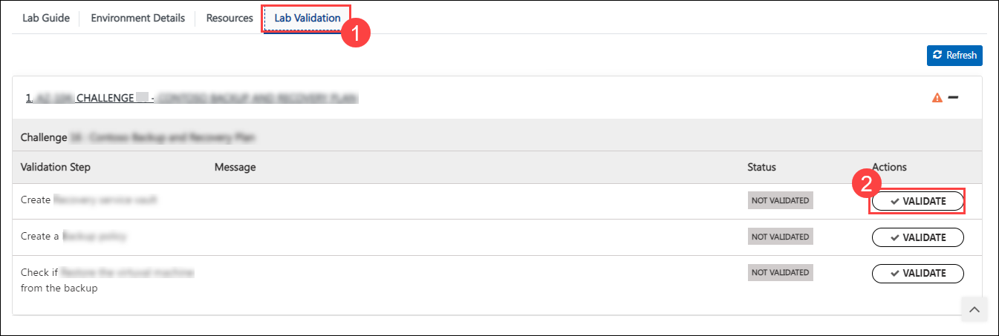

# Challenge 01: Deploy Azure OpenAI Service and LLM Models

### Estimated Time: 30 minutes

## Introduction

Welcome to the Challenge of Deploy Azure OpenAI Service and LLM Models ! The objective of this challenge is to evaluate your proficiency in setting up and deploying Azure OpenAI Service along with its Large Language Models (LLM).

Contoso Ltd, a leading technological firm, is seeking to enhance its product support operations using AI technology. In this challenge, the team will learn how to use Azure OpenAI services and its large language models. They'll set up these tools, ask the AI questions, and see how it responds. The focus will be on using models like `gpt-3.5-turbo` and `text-embedding-ada-002` to make customer service better. The goal is to understand how to use these advanced tools well and make them work for Contoso's needs.

As a Developer, your task is to assist Contoso Ltd in setting up and deploying the Azure OpenAI Service and the LLMs such as **gpt-35-turbo** and **text-embedding-ada-002**. 

## Accessing Azure portal

1. To access the Azure portal, open the edge browser from inside the environment and navigate to **[Azure Portal](https://portal.azure.com)**.

1. On the **Sign in to Microsoft Azure** tab, you will see a login screen. Enter the following email/username and then click on **Next**. 
   * Email/Username: <inject key="AzureAdUserEmail"></inject>
        
1. Now enter the following password and click on **Sign in**.
   * Password: <inject key="AzureAdUserPassword"></inject>
     
1. If you see the pop-up **Stay Signed in?**, click No.

1. If you see the pop-up **You have free Azure Advisor recommendations!**, close the window to continue the lab.

1. If a **Welcome to Microsoft Azure** pop-up window appears, click **Maybe Later** to skip the tour.
   
1. Now you will see the Azure Portal Dashboard. Click on **Resource groups** from the Navigate panel to see the resource groups.
  
1. Confirm you have a resource group **Activate-GenAI** present, as shown in the below screenshot. You need to use the **<inject key="Resource Group Name"/>** resource group throughout this challenge.

## Challenge Objectives

1. **Azure OpenAI Service Deployment:**
   - Set up an Azure OpenAI Service instance with SKU size Standard `S0` in your Azure portal.
   - Obtain the necessary Azure OpenAI Key and Endpoint.

2. **Deploy Azure OpenAI's Large Language Models (LLM):**
   - Azure OpenAI provides a web-based portal named **Azure OpenAI Studio** that you can use to deploy, manage, and explore models. You'll start your exploration of Azure OpenAI by using Azure OpenAI Studio to deploy a model.
   - Launch Azure OpeanAI Studio from the overview pane and deploy two OpenAI Models, i.e, `gpt-35-turbo` and `text-embedding-ada-002` with a TPM capacity of 40k.

## Success Criteria

To complete this challenge successfully, you should be able to:

- Verify that Azure OpenAI Service is successfully deployed.
- Verify that the Large Language Models (LLM), `gpt-35-turbo` and `text-embedding-ada-002`, are successfully deployed with the Azure OpenAI Service.

## Learning Resources

- Refer to the [Azure OpenAI Service documentation](https://learn.microsoft.com/en-us/azure/ai-services/openai/) for guidance on deploying the service.

## Challenge Validation
 
1. After completing the challenge, you need to visit the **Lab Validation (1)** tab and click on the **VALIDATE (2)** button under Actions to perform the validation steps. Verify that you have met the success criteria of the challenge. 
 
    
 
1. If the validation status displays **Success** for all the validation steps, **congratulations!**. This means that you have completed the challenge and have unlocked the next challenge.
 
     

1. If the validation status displays **Fail**, **don't worry!** This could mean that you did not perform the challenge correctly.
 
     
 
1. Hover your mouse over the `i` **(1)** icon to see the error message and determine the root cause of the failure. Based on the error message, revisit the challenge as necessary, and redo the validation by clicking on the **VALIDATE (3)** button again.

   
 
1. If you are still having trouble, you can reach out to the support team via `labs-support@spektrasystems.com` for further assistance. The support team is available to help you to troubleshoot and resolve any technical issues or validation issues that may arise while the lab environment is live.
