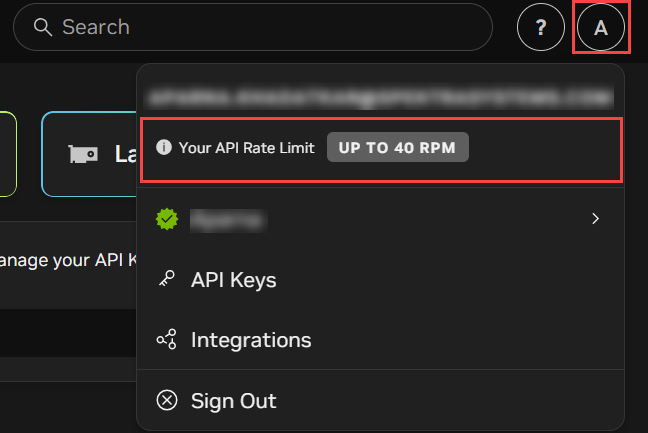
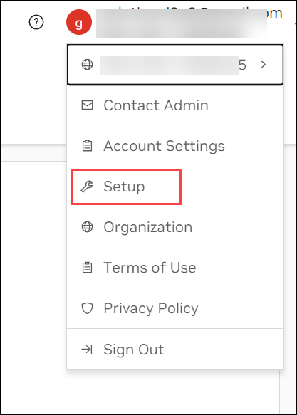
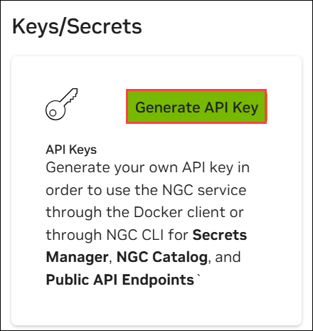
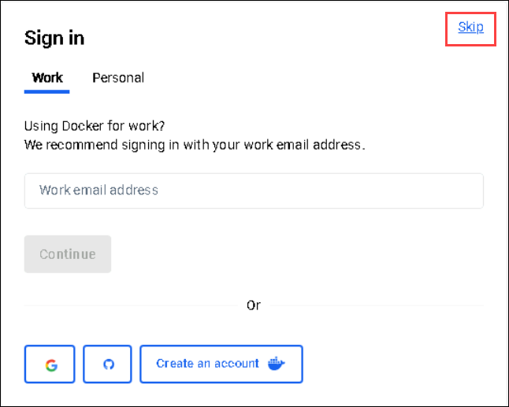
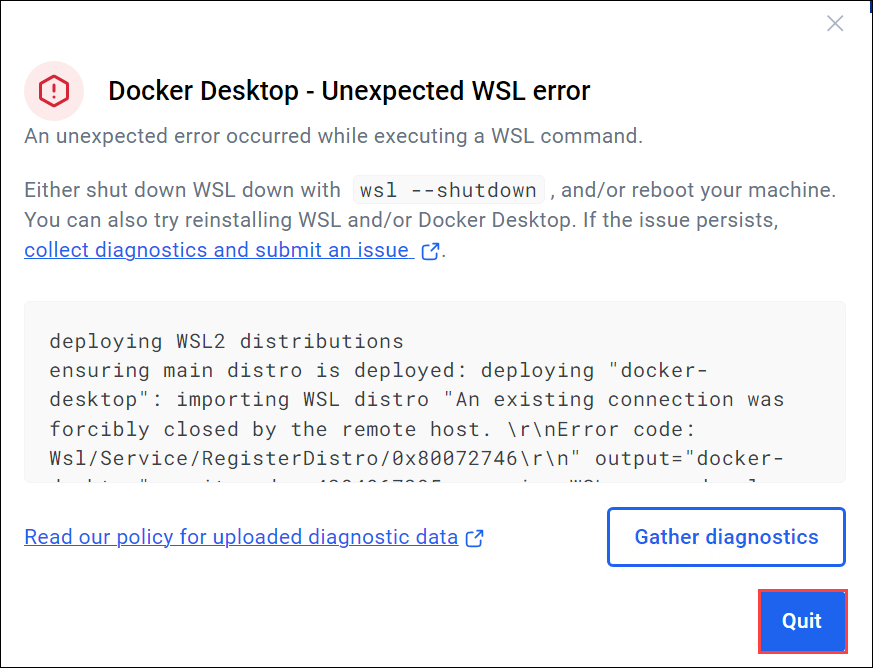
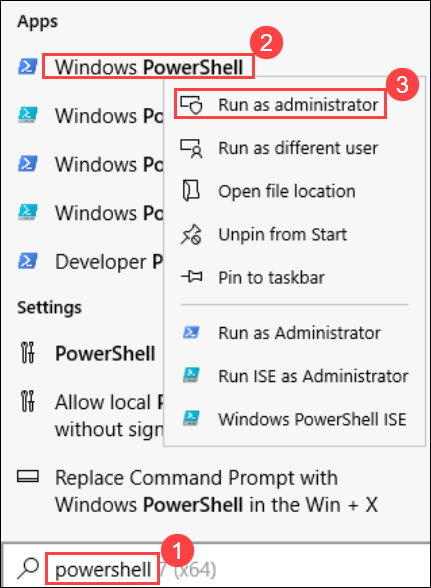
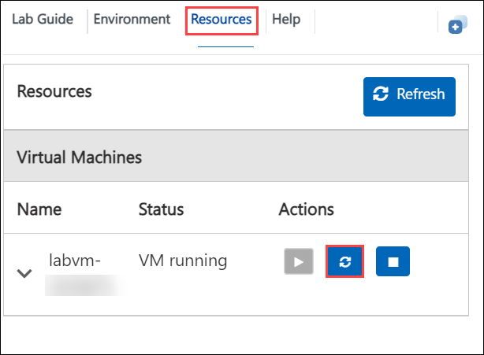

# Challenge 03: Deploy NVIDIA NIM on Azure

### Estimated Time: 120 minutes

## Introduction

In the last challenge, you deployed models using Azure OpenAI. Now, in Challenge 3, you'll shift focus to deploying NVIDIA NIM on Azure.

NVIDIA NIM is a suite of highly optimized microservices designed to simplify and accelerate the deployment of generative AI models across the cloud, data centers, and workstations. Each NIM is packaged as a container image on a per model or model family basis, such as `meta/llama3-8b-instruct`, and can run on any NVIDIA GPU with sufficient memory. NIMs leverage a runtime that intelligently selects the best model version for the available hardware, ensuring optimal performance.

NIMs are distributed as Docker containers via the NVIDIA NGC Catalog, with each container including built-in security features, such as CVE monitoring and security scanning reports. NIMs offer flexible, scalable deployment options and are compatible with a wide range of NVIDIA GPUs, making it the fastest solution for AI inference.

You need to deploy NVIDIA NIM on one of the following services for Challenge 3:

- **Azure ML** - Deploy as a managed online endpoint
  

## Scenario

**Contoso Ltd.**, a leading technology firm, is seeking to enhance its product support operations. They receive a large volume of queries daily, resulting in longer waiting times and decreased customer satisfaction. To address this, Contoso plans to use fully optimized NVIDIA models to improve performance.

They have decided to deploy NIM to Azure alongside its Large Language Models (LLMs), such as `llama-3-8b-instruct`. These models excel at processing and generating human-like text, making them ideal for improving customer support.

Your task in this challenge is to create an NIM endpoint on Azure by deploying **llama-3-8b-instruct** NIM in the Azure environment of your choice.

### Accessing the Azure Portal

1. To access the Azure portal, open a private/incognito window in your browser and navigate to the Azure Portal.

1. On the **Sign in to Microsoft Azure** tab, you will see a login screen. Enter the following email/username and click **Next**.

   - **Email/Username:** <inject key="AzureAdUserEmail"></inject>

1. Enter the following password and click **Sign in**.

   - **Password:** <inject key="AzureAdUserPassword"></inject>

1. If you see the **Stay Signed in?** pop-up, click **No**.

1. Close any pop-ups like **You have free Azure Advisor recommendations!** or **Action Required** by clicking **Ask Later** or **Cancel** to skip the tour.

## Prerequisites

Ensure you have the following from the CloudLabs-provided integrated environment:

> **Note:** Prerequisites are pre-configured in the CloudLabs environment. If you're using your personal computer or laptop, ensure all essential prerequisites are installed.

- [Azure Subscription](https://azure.microsoft.com/en-us/free/)
- [NVAIE license](./Getting-NVAIE-License.md)

## Challenge Objectives:

Deploy **llama-3.1-8b-instruct** NIM in one of the following places:

1. **Generate NGC API KEY**

   - Log in or create an Nvidia account 

   - Navigate to https://build.nvidia.com/ and log in using your personal email ID. If not, create an account.

   - Complete account verification to gain API access. Once verified, your rate limit will increase to 40 requests per minute (RPM).

       
   
   -  Navigate to [Nvidia](https://ngc.nvidia.com/signin) account using your credentials to proceed and Click on the **join**.
    
   - Once your account is created or you've successfully logged in.

   - You will see a pop-up. On the **Update Email Preferences** page, you can either **close** it or click **Update Email Preferences** to receive updates regarding security, announcements, and maintenance for all your services.

      


   - Navigate back to your **NVIDIA Account**. From **Organization**, click **Subscriptions** on the left. Here, you will see the **Active** status for the NVIDIA Developer Program.

      

   - Click on **Account** at the top of the page and navigate to the **Setup** section.

      

   - Click on **Generate API Key** to create a new key for accessing the necessary services.

      

   - From the top, click on **+ Generate Personal Key** to create a new API key.

      


   - Carefully copy your generated API key, essential for accessing various services and features paste the API key in the notebook. Ensure you store it securely, as it may not be displayed again after you leave the page.

1. **Docker Start**

   - From the taskbar, search for **Docker Desktop** and open it.

   - Click on **Accept** on the Docker Subscription Service Agreement.

      

   - Select Use recommended setting(requires administrator password) and click on **Finish**.

      

   - Click **Skip** on the Welcome to Docker page.

      

   - Click **Skip** on the Welcome Survey page.

      

   - Click **Skip** on the Sign in page.

      

   - Minimize Docker Desktop and continue with the next steps.

      

      >**Note:** If you encounter an error such as **"Docker Desktop - Unexpected WSL error"**, click **Quit** to close Docker and follow below steps:

      

   - Search for the PowerShell in your LabVM, right-click on the PowerShell, and select run as administrator.
     
     
     
   - Run the below command:
      ```
      #Check if 'docker-users' group exists before adding to 'Administrators'
       $dockerUsersGroupExists = Get-LocalGroup -Name 'docker-users' -ErrorAction SilentlyContinue
       $CurrentUser = "demouser"
       if ($dockerUsersGroupExists -ne $null) {
           Add-LocalGroupMember -Group 'docker-users' -Member $CurrentUser -Verbose
           Write-Host "User '$CurrentUser' added to the 'docker-users' group."
       } else {
           Write-Host "'docker-users' group does not exist. Skipping adding the user to 'docker-users'."
     
        }
       ```

      >**Note:** If you get an error `demouser is already a member of group docker-users`, ignore and proceed further
      
   - Once the command is executed, from the resources tab, restart the Virtual machine.

     
  
   - Once the VM is restarted, reopen the **Docker Desktop**.

      >**Note:** If an error occurs indicating that **WSL needs updating**, open **Windows PowerShell as Administrator** and run the following command:

      ```
      wsl --update
      ```
      Once the update is complete, **reopen Docker Desktop** to continue working smoothly.

1. **Deploy Container registries**

   - Deploy a Container registry with the following details.

     | Setting | Action |
     | --- | --- |
     | **Subscription** | Default |
     | **Resource Group** | Select the ****<inject key="Resource Group Name"/>**** resource group |
     | **Domain name label scope** | **No Reuse** |     
     | **Registry name** | Enter **amlregistry<inject key="Deployment ID" />** |
     | **Location** | Choose the location as per the resource group  |
     | **Pricing plan** | **Standard** |

   - Copy the `Subscription ID` and `Container registries` name into a notepad.

3. **Setup Git Bash Environment**

   - Run the configuration in Git Bash.
   
   - Downloads the latest version of **jq**  file, a lightweight and flexible command-line JSON processor, and saves it as an executable file named `jq-win64.exe` in the `/usr/bin/jq.exe` directory

     > **Note:** You can use https://github.com/jqlang/jq/releases url 

     >**Note:** If `jq` is not found or fails to download, open PowerShell and run `choco install jq` to install it.

   - Install the az CLI by navigating to the link below:

       ```
      $ProgressPreference = 'SilentlyContinue'; Invoke-WebRequest -Uri https://azcliprod.blob.core.windows.net/msi/azure-cli-2.51.0.msi -OutFile .\AzureCLI.msi; Start-Process msiexec.exe -Wait -ArgumentList '/I AzureCLI.msi /quiet'; Remove-Item .\AzureCLI.msi
      ```

       > **Note:** Run the above command in PowerShell.

   - Install the `az ml` stable extension.

   - Clone the following repo.

      ```
      https://github.com/CloudLabsAI-Azure/nim-deploy.git
      ```

5. **Configure the config.sh**

   - Open the folder where you have cloned the repo from VS Code.
   - Update the `config.sh` file with the necessary details located in the `nim-deploy\cloud-service-providers\azure\azureml\cli` directory.
   - Update resource group as <inject key="Resource Group Name"/> and image name as `llama-3-8b-instruct:1.8.3`.

      - Detailed instructions can be found [here](https://github.com/NVIDIA/nim-deploy/tree/main/cloud-service-providers/azure/azureml/cli).

6. **Create AzureML Deployment of the NIM Container**

   - **Configuration and Login to Azure**

      - From the Git Bash, change directory `nim-deploy\cloud-service-providers\azure\azureml\cli`.
      - Configuration settings defined in `config.sh`. 
      - Provide a unique name for **workspace**.
      - **location**: Choose the same as the  resource group.
      - **ngc_api_key**:	Provide the NGC key
      - **email_address**: Enter the email from the Environmental Details tab
      - Provide **acr_registry_name**, utilizing **amlregistry<inject key="Deployment ID" />** as a suffix.
      -  Provide a **endpoint_name** as **llama-3-8b-nim-endpoint<inject key="Deployment ID" />** 
      - Provide a **deployment_name** as **llama3-8b-nim-dep<inject key="Deployment ID" />** 
      - This step is crucial for loading environment variables, paths, or any other configuration before running dependent commands.
      - Log in to the Azure portal using the CLI command.

        > **Note:** Refer to the list of available regions where StandardNCADSA100v4Family Quota is available: <inject key="StandardNCADSA100v4Family Quota" enableCopy="false" />. Ensure to add one of these for location in your config.sh file.
        
        > **Note:** Please use any one of the NGC keys provided below.

           ```
           NThncmgwMGEzY2YydXVrdHYzaXFpZjd1Mmg6Mzc2ZDMyMTUtNTVhYi00YzQ4LWFkOTctOTQyYjQ0NmIwNDY1
           ```

           ```
           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
           ```
      
   - **Setup AzureML Workspace**

      - Execute the `1_set_credentials.sh` file to create a new `AzureML workspace` with the "Azure ML Secrets Reader" role assignment.
      - Verify the AzureML workspace is created in the azure-ml resource group.

   - **Store NGC API Key for Use in the AzureML Deployment**

      - Run the `2_provide_ngc_connection.sh` script to configure this and verify the connection.
   
   - **Save NIM Container in Your Container Registry**

       - Run the `./3_save_nim_container.sh` script to push the NIM container in your container registry.
       - Verify that the NIM container has been published in the container registry by checking the `Repositories`.
       - Copy the `Repositories` endpoint.

   - **Create Managed Online Endpoint**

       - Run the `./4_create_endpoint.sh` script to create a managed online endpoint.
   
   - **Role Assignment**
       
       - Provide `AcrPull` role assignment to the Machine Learning Online endpoint managed identity.

   - **Create AzureML Deployment of the NIM Container**

        - Run the `./5_create_deployment.sh` to create an AzureML deployment of the NIM container.
   
   - **Verify the Connection**

     - Navigate to `Machine learning Endpoint` in `Azure Machine Learning workspace` and select the deployed **Endpoint**.
     
     - Copy the `endpoint` and `Primary Key` under Consume.
     
     - Update the `test_chat_completions.sh` file with the necessary details located in the `nim-deploy\cloud-service-providers\azure\azureml\cli` directory.
       
       > **Hint:** Use the values from the `config.sh` file.
  
       > **Note:** Ensure to append `/v1/chat/completions` to the end of the endpoint.
      
      - Run `test_chat_completions.sh` file to verify the Connection


## Success Criteria:

- Verify that the endpoint is accessible from outside:
  
## Additional Resources:

- Refer to the [NVIDIA NIM documentation](https://docs.nvidia.com/nim/large-language-models/latest/introduction.html) for guidance on deploying the service.

### Conclusion

In this challenge, you successfully validated the Azure OpenAI service and deployed LLM models. In the next challenge, you will learn about Semantic Kernel, which is used for building intelligent apps while leveraging Azure OpenAI models.
