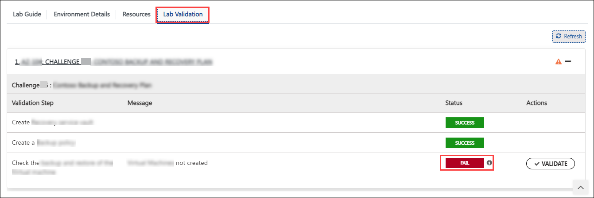

# Challenge 06: Serverless Document Batch Processing 

### Estimated Time: 90 minutes

## Introduction:

Contoso Ltd aims to improve product support with a user-friendly chat application, leveraging AI technology and at the same time efficiently handling loads of documents without slowing down its systems. In this challenge, our team is diving into serverless document batch processing, like having a digital helper that quickly organizes and understands new documents without causing any hassles.

Our goal here is pure efficiency. We're figuring out how to seamlessly integrate this system with our chat app, using smart tools to translate and organize new documents without making things complicated or slow.

After mastering load balancing among Azure OpenAI resources in various regions in the previous challenge, our current focus is exploring the accelerator's capabilities to build pipelines across diverse services for AI solutions tailored to our business needs.

This challenge unfolds in three main stages: language translation, serverless document batch processing using Azure services, and leveraging advanced features like Form Recognizer and AI search. We kick things off by translating files to meet language requirements. Next, we deploy a serverless architecture, utilizing Azure services, for efficient batch processing of documents. We train and test our model, establish a pipeline to convert documents into a Form Recognizer format, and bring in Azure's AI search service to verify the presence of specific documents in the processed dataset.

## Challenge Objectives:

> **Important**: When deploying services in this challenge, please make sure to use the resource group named 
**<inject key="Resource Group Name"/>**.  !

1) **Set up a translator within Azure AI services.**

1) **Key and Endpoint Retrieval and Azure Blob Storage Container Creation:**

    - Set up Document Translation efficiently, secure key and endpoint, integrate credentials for API authentication, and create mandatory source and target containers in Azure Blob Storage previously utilized.

1) **Prepare your C#/.NET environment:**

    - Begin a new Visual Studio project by selecting "Create a new project" and opting for the Console Application template. Specify a name for your project with .NET 6.0 before finalizing.

1) **Install Newtonsoft.Json, Translate and run your application :**

    - Add NewtonsoftJson to your project via NuGet Packages, replace code in Program.cs with the document translation sample, update URLs, and start the program by clicking the green button or pressing F5.

**Using Doc Intelligence:**

1) Set up the Document Intelligent service, navigate to the studio, and confirm project creation and initiation by choosing "Doc Intelligence."

1) Forge a pipeline using a static web app, designate a document type for transformation into a Form Recognizer model, and guarantee smooth document ingestion for thorough processing.

1) Optimize data import with advanced indexing in the search service. Utilize the BPA Accelerator's search app for precise document retrieval.

## Success Criteria:

- Successfully executing the POST method yields a 202 Accepted response, indicating the service created the batch request. Translated documents are then available in your target container, with the Operation-Location value in response headers essential for subsequent GET request  
- Make sure the project is established by configuring the service resource and linking the training data source effectively.
- Successfully identified the respective field created in the preceding step, providing its confidence score.
- Ensure the accurate selection of the "Select a stage to add it to your pipeline configuration" option to align with the specific requirements of your pipeline configured
- The file retrieval operation was executed successfully, and the relevant document is displayed in the search results.

## Additional Resources:

- Refer to the provided [GitHub repository](https://github.com/MSUSAzureAccelerators/Azure-OpenAI-and-Form-Recognizer-Workshop/blob/main/README.md) for detailed information.
- Refer [Github repository](https://learn.microsoft.com/en-us/azure/ai-services/translator/document-translation/quickstarts/document-translation-rest-api?pivots=programming-language-csharp#code-sample) for sample code that will be used for document translation using C#.

## Challenge Validation
 
1. After completing the challenge, you need to visit the **Lab Validation (1)** tab and click on the **VALIDATE (2)** button under Actions to perform the validation steps. Verify that you have met the success criteria of the challenge. 
 
    
 
1. If the validation status displays **Success** for all the validation steps, **congratulations!**. This means that you have completed the challenge and have unlocked the next challenge.
 
     

1. If the validation status displays **Fail**, **don't worry!** This could mean that you did not perform the challenge correctly.
 
     
 
1. Hover your mouse over the `i` **(1)** icon to see the error message and determine the root cause of the failure. Based on the error message, revisit the challenge as necessary, and redo the validation by clicking on the **VALIDATE (3)** button again.

   
 
1. If you are still having trouble, you can reach out to the support team via `labs-support@spektrasystems.com` for further assistance. The support team is available to help you to troubleshoot and resolve any technical issues or validation issues that may arise while the lab environment is live.
